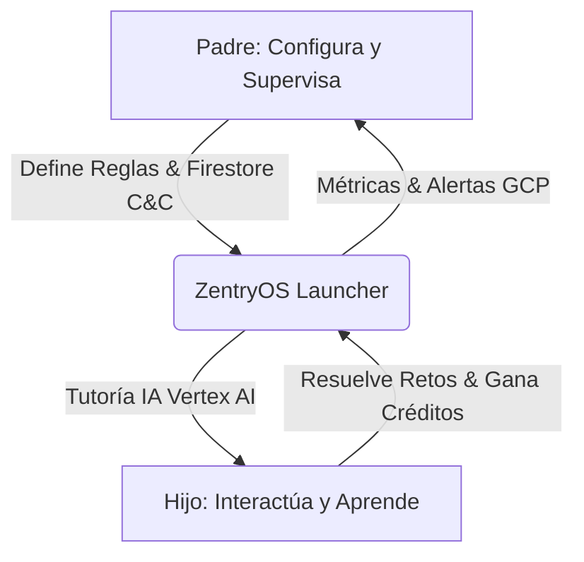

# 🌌 ZentryOS - MANIFIESTO DE CONTEXTO: 01. VISIÓN Y PRODUCTO

Este documento contiene la recopilación unificada y específica para la vertical **01. Visión y Producto** de ZentryOS.
Diseñado para alimentar a agentes y asistentes de IA especializados en esta área.

---

## 📋 ÍNDICE DE LA VERTICAL
1. [01-vision-y-producto/README.md](#-archivo-01-vision-y-producto-README-md)
2. [01-vision-y-producto/problema-algoritmico.md](#-archivo-01-vision-y-producto-problema-algoritmico-md)
3. [01-vision-y-producto/ludopatia-y-adiccion.md](#-archivo-01-vision-y-producto-ludopatia-y-adiccion-md)
4. [01-vision-y-producto/solucion-bilateral.md](#-archivo-01-vision-y-producto-solucion-bilateral-md)
5. [01-vision-y-producto/segmentacion-etaria.md](#-archivo-01-vision-y-producto-segmentacion-etaria-md)

---

---

# 📂 ARCHIVO: `01-vision-y-producto/README.md`

---
title: "Visión y Producto: Índice y Estrategia"
date: 2026-06-04
status: "approved"
progress: 40%
deadline: 2026-08-30
tags: ["producto", "vision", "estrategia"]
---

# 🎨 Vertical 1: Visión y Producto

Esta vertical detalla las bases conceptuales, neurológicas y comerciales que sustentan la creación de **ZentryOS**. A diferencia de los launchers de control parental genéricos (que se basan únicamente en la restricción punitiva), ZentryOS propone un **paradigma educativo interactivo** respaldado por IA Generativa.

---

## 📂 Contenido del Módulo

1.  **[Problema Algorítmico](./problema-algoritmico.md)**: Análisis del secuestro de la atención infantil por parte de plataformas de contenido masivo (TikTok, YouTube Shorts, Reels) y la necesidad de una barrera defensiva.
2.  **[Ludopatía y Adicción Digital](./ludopatia-y-adiccion.md)**: El modelo del loop de dopamina intermitente y el impacto neurológico en menores de 2 a 20 años.
3.  **[Solución Bilateral](./solucion-bilateral.md)**: Estructura del valor dual. Paz mental y control remoto para los padres; gamificación, IA tutora y libertad supervisada para los hijos.
4.  **[Segmentación Etaria](./segmentacion-etaria.md)**: Estrategia de adaptación de la UI/UX y reglas de control según el ciclo de desarrollo (2-6 años, 7-12 años y 13-20 años).

---

## 🎯 Declaración de Propósito

> "ZentryOS no es una cárcel digital; es un santuario cognitivo. Nuestra misión es interceptar el consumo pasivo de dopamina artificial y transformarlo en un motor de curiosidad y aprendizaje mediante Inteligencia Artificial adaptativa."

### Pilares del Producto:
*   **Interceptación Activa**: Impedir el acceso físico a redes sociales y plataformas de estimulación algorítmica sin provocar frustración excesiva.
*   **Gamificación Cognitiva**: Reemplazar el tiempo libre del dispositivo con retos intelectuales dinámicos que se resuelven conversando con un tutor IA.
*   **Telemetría No Invasiva**: Medición constante del progreso escolar y del bienestar emocional del menor a partir de sus conversaciones con el sistema operativo, enviando informes semanales al padre.

---

## 🎨 Lineamientos de Diseño (Contexto Breve)

Para asegurar la consistencia estética en todas las iniciativas de ZentryOS, el diseño visual debe respetar estrictamente las siguientes pautas:

*   **Paleta Cromática Oficial**:
    *   **Púrpura Zentry (`#533B87`)**: Identidad de marca, toggles y títulos principales.
    *   **Lavanda Zentry (`#D6C8FA`)**: Fondo de botones primarios ("Get Started") e interactividad.
    *   **Verde Menta (`#C2F4E7`)**: Progreso, éxitos y estados activos.
    *   **Blanco Glacial (`#EBF1F5`)**: Base de fondo y contenedores translúcidos (glassmorphism).
    *   **Gris Neutro Oscuro (`#4A5160`)**: Texto principal, subtítulos y legibilidad general.
*   **Enfoque Visual**:
    *   **NO es una Dark Tech UI**: El fondo debe ser claro (Blanco Glacial) con marmoleados y degradados suaves de lila (Lavanda) y verde (Verde Menta). Se deben evitar creativos oscuros o diseños fuera de la línea visual.
    *   **Efecto Cristal (Glassmorphism)**: Tarjetas flotantes y paneles con fondo translúcido (`rgba(255, 255, 255, 0.4)`), bordes sutiles y desenfoque (`blur(25px)`).
*   **Tipografía**:
    *   **Outfit**: Para títulos y elementos destacados.
    *   **Inter**: Para cuerpo de lectura y textos explicativos.

---

# 📂 ARCHIVO: `01-vision-y-producto/problema-algoritmico.md`

---
title: "El Problema Algorítmico en la Infancia y Adolescencia"
date: 2026-06-04
status: "approved"
progress: 70%
deadline: 2026-08-30
tags: ["producto", "neurobiologia", "algoritmos"]
---

# 🧠 El Problema Algorítmico

El principal adversario de la salud mental de los niños y jóvenes modernos no es el dispositivo físico, sino el **diseño de optimización algorítmica** de las redes sociales y plataformas de video de consumo rápido (TikTok, YouTube Shorts, Instagram Reels). 

---

## 🚨 Anatomía del Secuestro Cognitivo

Las plataformas modernas utilizan algoritmos de aprendizaje por refuerzo profundo (Deep Reinforcement Learning) para maximizar la métrica de **tiempo de retención (Watch Time)** y **tasa de interacción (Engagement Rate)**. Esto genera tres problemas críticos en el cerebro en desarrollo:

### 1. Estimulación Hiper-Fragmentada
Los videos de 15 a 30 segundos bombardean al menor con ráfagas visuales y auditivas constantes. Esto acostumbra al lóbulo frontal (encargado del control de impulsos y concentración) a recibir recompensas sin esfuerzo en lapsos de tiempo extremadamente cortos.
*   **Consecuencia**: Reducción drástica del período de atención (*attention span*) y problemas de concentración en el entorno escolar.

### 2. El Algoritmo Caja-Negra
Los motores de recomendación analizan micro-movimientos, pausas de milisegundos en el scroll y reacciones táctiles. Crean un perfil psicológico en tiempo real que predice con exactitud qué tipo de contenido mantendrá al niño enganchado, a menudo escalando hacia narrativas extremas o hiper-sensacionalistas para evitar el aburrimiento.

### 3. Falta de Barreras Naturales
El "scroll infinito" elimina las señales físicas de detención (como el fin de un capítulo de un libro o los créditos de una serie). El cerebro del menor entra en un estado de **hipnosis interactiva**, perdiendo la noción del tiempo y postergando funciones fisiológicas esenciales (sueño, alimentación, ejercicio).

---

## 🛡️ La Interceptación ZentryOS

ZentryOS actúa como un **filtro o amortiguador cognitivo**. Al tomar posesión del dispositivo como Launcher por defecto a nivel de sistema operativo:

1.  **Bloqueo de Capa 0**: Deshabilita la instalación o ejecución de apps con feeds algorítmicos infinitos (TikTok, Instagram, etc.).
2.  **Sustitución de Estímulos**: En lugar de mostrar un feed aleatorio, el menor ve una interfaz limpia e interactiva donde la única forma de desbloquear tiempo de recreo o funciones adicionales es superando **desafíos lógicos y matemáticos** presentados por una IA amigable.
3.  **Feed Finito y Dirigido**: Si se consume contenido web o multimedia, se realiza bajo canales curados y validados por ZentryOS, donde el flujo de visualización requiere pausas activas evaluadas por telemetría.

---

# 📂 ARCHIVO: `01-vision-y-producto/ludopatia-y-adiccion.md`

---
title: "Ludopatía Digital y Adicción a las Pantallas"
date: 2026-06-04
status: "approved"
progress: 65%
deadline: 2026-08-30
tags: ["producto", "neurobiologia", "adicciones"]
---

# 🎮 Ludopatía Digital y Adicción a las Pantallas

La adicción a los smartphones en la infancia y adolescencia comparte el mismo sustrato neurobiológico que la **ludopatía en adultos**: el secuestro del sistema de recompensa del cerebro mediante **refuerzo variable e intermitente**.

---

## ⚡ El Loop de Dopamina Intermitente

La dopamina no se libera principalmente cuando obtenemos una recompensa, sino durante la **anticipación** de la misma. Las mecánicas de las aplicaciones comerciales imitan a las máquinas tragamonedas:

*   **Pull-to-Refresh / Infinite Scroll**: El gesto físico de deslizar hacia abajo para actualizar crea la expectativa de "¿qué aparecerá ahora?". La recompensa es impredecible (un video gracioso, un meme, o nada relevante), lo que dispara niveles masivos de dopamina.
*   **Mecánicas de Gamificación Invasiva**: Streaks (rachas) en Snapchat/Duolingo, likes instantáneos, notificaciones automáticas y recompensas diarias obligan al cerebro a volver a la aplicación por miedo a perder estatus social o progreso virtual (*FOMO*).

En menores de 2 a 12 años, la corteza prefrontal no está completamente mielinizada. Carecen de la capacidad biológica para autorregularse frente a estos estímulos de diseño persuasivo. En el nicho de adolescentes y jóvenes (hasta 20 años), esta vulnerabilidad es explotada de formas alarmantes:

### El Peligro de las Cajas de Botín y Skins
La adicción digital actual no solo se expresa en el tiempo de pantalla, sino en la **ludopatía financiera camuflada**. Videojuegos populares inducen al menor a comprar elementos cosméticos ("skins", diamantes, sobres de cartas) mediante refuerzo intermitente aleatorio, lo que genera una carga de dopamina idéntica al juego de azar en adultos. 
*   **Caso Andrés Salas (Streamer Peruano)**: El paso de consumir transmisiones de videojuegos competitivos a apostar en casinos patrocinados se ha vuelto un puente común para miles de jóvenes peruanos seguidores de influencers locales.

### El Abandono de la Lectura y Pérdida de la Narrativa Propia
La influencia algorítmica constante desvía el potencial intelectual. Al reemplazar la lectura estructurada (ej. libros entre los 15 y 18 años) por el consumo pasivo de videos cortos, streams y podcasts rápidos, el cerebro adopta una narrativa impuesta desde el exterior. El menor pierde la capacidad de estructurar sus propios pensamientos y metas a largo plazo, cayendo en el *"cementerio de los potenciales no realizados"* por falta de foco.

---

## 🔄 Reingeniería del Sistema de Recompensa en ZentryOS

ZentryOS no elimina las mecánicas de gamificación, sino que las **redirige** hacia objetivos de desarrollo cognitivo:

### 1. Recompensa Fija vs. Esfuerzo Proporcional
Para acceder a actividades de ocio (por ejemplo, 15 minutos de un videojuego educativo o navegación web permitida), el menor debe "pagar" con créditos obtenidos a través de la resolución de retos intelectuales. La dopamina se asocia al **logro y la superación**, no al consumo pasivo.

### 2. Desvanecimiento de Notificaciones (Dampening)
ZentryOS silencia y agrupa de manera inteligente las alertas del sistema. No se permiten notificaciones intrusivas que interrumpan el foco de atención del menor. Las alertas se transforman en tareas diarias consolidadas en el panel de control del Launcher.

### 3. Modulación Emocional vía Chat Tutor (IA)
Si el sistema operativo detecta un patrón de uso compulsivo (múltiples intentos fallidos de abrir apps restringidas, gestos bruscos sobre la pantalla), la IA de ZentryOS interviene de manera amigable:
*   Abre una interfaz conversacional personalizada.
*   Pregunta sobre su estado de ánimo.
*   Propone un minijuego de respiración o un reto lógico adaptado para romper el ciclo de frustración digital.

---

# 📂 ARCHIVO: `01-vision-y-producto/solucion-bilateral.md`

---
title: "La Solución Bilateral: Padres vs Hijos"
date: 2026-06-04
status: "approved"
progress: 80%
deadline: 2026-08-30
tags: ["producto", "negocio", "ux"]
---

# ⚖️ La Solución Bilateral

El fracaso de la mayoría de las soluciones de control parental tradicionales radica en que son **unilaterales**: benefician exclusivamente al padre mediante la imposición, lo que genera rechazo y rebeldía en el menor. ZentryOS se concibe bajo una estructura de **propuesta de valor bilateral**.

---

## 👨‍👩‍👧‍👦 Dinámica de la Propuesta Bilateral

---

## 🛡️ Vertical del Padre: Paz Mental, Seguridad y Telemetría

Para el tutor legal, ZentryOS es una herramienta de gobernanza del dispositivo móvil que garantiza que la tecnología actúe como un aliado de crianza y no como una fuente de conflicto.

### Características Clave:
*   **Consola de Mando Remoto (Kill-Switch)**: Utilizando Firebase Firestore en tiempo real, el padre puede bloquear instantáneamente el dispositivo con un solo toque desde su propio teléfono, sin importar dónde se encuentre el niño.
*   **Filtro de Contenido Dinámico**: Gestión de listas blancas de URLs y aplicaciones autorizadas para el estudio y ocio regulado.
*   **Reportes de Telemetría Cognitiva**: Informes semanales generados por IA a partir de las interacciones del niño con el tutor virtual. El padre no recibe un historial crudo de navegación (que vulnera la privacidad), sino un resumen estructurado:
    *   *Temas de interés detectados (ej: astronomía, dinosaurios).*
    *   *Nivel de comprensión lógica e idiomas.*
    *   *Estado de ánimo y posibles patrones de ansiedad.*

---

## 🚀 Vertical del Menor: Gamificación, Libertad Regulada y Tutoría IA

Para el niño o adolescente, ZentryOS no se presenta como un bloqueo, sino como un **portal interactivo personalizado (un "sistema de juego")** donde es el protagonista de su aprendizaje.

### Características Clave:
*   **El Tutor Zentry**: Un avatar de Inteligencia Artificial que no juzga ni califica, sino que conversa, responde preguntas existenciales, ayuda con las tareas escolares y cuenta historias personalizadas según las preferencias del menor.
*   **Economía de Créditos**: Un sistema transparente de recompensa. El tiempo de uso libre en Internet o videojuegos no se otorga por defecto; se "gana" completando retos de matemáticas, lectura o idiomas. Esto empodera al menor enseñándole el valor del esfuerzo y la autogestión del tiempo.
*   **Personalización Estética**: Posibilidad de desbloquear temas visuales, avatares y elementos decorativos mediante el progreso educativo en la app.
*   **Modo Compañero**: La interfaz para jóvenes de 12 a 20 años cambia su estética "infantil" hacia un panel de productividad estilo *cyberpunk* o minimalista, actuando como un asistente de enfoque (*Focus Mode*) y gestión del tiempo de estudio.

---

# 📂 ARCHIVO: `01-vision-y-producto/segmentacion-etaria.md`

---
title: "Segmentación Etaria: Adaptación del Ecosistema"
date: 2026-06-04
status: "approved"
progress: 50%
deadline: 2026-08-30
tags: ["producto", "ux", "segmentacion"]
---

# 👶 Segmentación Etaria (2 a 20 Años)

Para atender con éxito un rango demográfico tan amplio, ZentryOS adapta de forma dinámica su **interfaz gráfica**, el **tono del tutor de Inteligencia Artificial** y las **políticas de control de seguridad**. El sistema opera bajo tres cohortes principales.

---

## 📊 Matriz de Adaptabilidad por Cohorte

| Cohorte | Rango de Edad | Estilo de UI/UX | Tono del Tutor IA | Modelo de Control (MDM) |
| :--- | :--- | :--- | :--- | :--- |
| **Early Childhood** | 2 - 6 años | Iconografía gigante, basada en audio/voz, colores vibrantes. | Lúdico, narrativo, explicativo (estilo caricatura). | **Kiosk Duro**: Bloqueo total. Solo apps de dibujo e historias aprobadas. |
| **Middle Childhood** | 7 - 12 años | Gamificado, avatares personalizables, progresión de niveles. | Mentor interactivo, retos de lógica y matemáticas. | **Kiosk Híbrido**: Acceso condicionado por economía de créditos. |
| **Teen & Productivity** | 13 - 20 años | Minimalista, modo oscuro, enfocado en productividad. | Asistente de estudio, tutor de programación/ciencias. | **Soft Control / Focus Mode**: Autogestión supervisada, bloqueo de apps específicas durante el estudio. |

---

## 🔍 Detalles por Cohorte de Desarrollo

### 1. Cohorte Early (2 - 6 Años)
*   **Problema principal**: No saben escribir ni leer fluidamente. Son propensos a la estimulación visual puramente pasiva (videos cortos).
*   **Estrategia ZentryOS**: 
    *   La navegación elimina casi todo el texto y se basa en colores e interacción por voz.
    *   El tutor IA actúa a través de comandos de voz interactivos (*Text-To-Speech* y *Speech-To-Text*). Le narra cuentos infantiles donde el niño toma decisiones sencillas presionando iconos en pantalla.
    *   Bloqueo absoluto de navegadores web externos.

### 2. Cohorte Middle (7 - 12 Años) - *Nicho Núcleo del MVP*
*   **Problema principal**: Primer contacto directo con redes sociales y videojuegos competitivos multijugador. Presión de grupo.
*   **Estrategia ZentryOS**:
    *   Uso de la **Economía de Créditos**: Superar retos lógicos de matemáticas y gramática da acceso a 15-30 minutos de juego supervisado.
    *   El tutor IA ayuda activamente con las tareas del colegio, respondiendo dudas paso a paso sin dar la respuesta final directamente, fomentando el pensamiento crítico.
    *   La app se presenta como un videojuego donde el avatar sube de nivel y desbloquea skins visuales a medida que el niño resuelve desafíos intelectuales.

### 3. Cohorte Teen (13 - 20 Años) - *Nicho Ampliado*
*   **Problema principal**: Pérdida de foco por notificaciones, procrastinación digital y necesidad de privacidad. El control de Kiosk estricto genera rechazo absoluto.
*   **Estrategia ZentryOS**:
    *   La interfaz abandona el look infantil y se convierte en un **Dashboard de Productividad** estilo KANBAN o Pomodoro.
    *   El control MDM no bloquea el dispositivo de manera punitiva; en su lugar, el adolescente programa sus bloques de estudio. ZentryOS silencia distractores y restringe Instagram/TikTok durante esas horas.
    *   El tutor IA se especializa en resolver dudas complejas (cálculo, física, codificación de software) e impulsa proyectos personales mediante prompts técnicos de Vertex AI.
    *   Se incluye una consola de telemetría personal para que el joven aprenda a autorregular sus propios tiempos de pantalla mediante gráficos interactivos.

