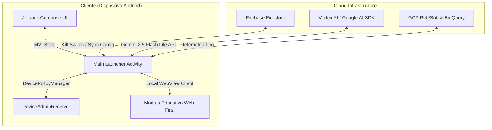

# 🌌 ZentryOS - MANIFIESTO DE CONTEXTO: 02. ARQUITECTURA TÉCNICA MVP

Este documento contiene la recopilación unificada y específica para la vertical **02. Arquitectura Técnica MVP** de ZentryOS.
Diseñado para alimentar a agentes y asistentes de IA especializados en esta área.

---

## 📋 ÍNDICE DE LA VERTICAL
1. [02-arquitectura-tecnica/README.md](#-archivo-02-arquitectura-tecnica-README-md)
2. [02-arquitectura-tecnica/paradigma-web-first.md](#-archivo-02-arquitectura-tecnica-paradigma-web-first-md)
3. [02-arquitectura-tecnica/control-dispositivo-abm.md](#-archivo-02-arquitectura-tecnica-control-dispositivo-abm-md)
4. [02-arquitectura-tecnica/telemetria-gcp-ai.md](#-archivo-02-arquitectura-tecnica-telemetria-gcp-ai-md)
5. [02-arquitectura-tecnica/interfaz-compose.md](#-archivo-02-arquitectura-tecnica-interfaz-compose-md)
6. [02-arquitectura-tecnica/analisis-de-brechas.md](#-archivo-02-arquitectura-tecnica-analisis-de-brechas-md)

---


---

<a name="-archivo-02-arquitectura-tecnica-README-md"></a>
# 📂 ARCHIVO: `02-arquitectura-tecnica/README.md`

---
title: "Arquitectura Técnica MVP: Índice y Stack"
date: 2026-06-04
status: "approved"
progress: 30%
deadline: 2026-08-30
tags: ["arquitectura", "android", "gcp"]
---

# 💻 Vertical 2: Arquitectura Técnica MVP

Esta sección describe los cimientos tecnológicos, patrones de diseño de software e integración de servicios cloud que conforman el ecosistema técnico de **ZentryOS**. 

---

## 📂 Contenido del Módulo

1.  **[Paradigma Web-First](./paradigma-web-first.md)**: El uso estratégico de WebViews optimizadas y Progressive Web Apps (PWAs) para acelerar el desarrollo de módulos educativos e interfaces secundarias.
2.  **[Control del Dispositivo & ABM](./control-dispositivo-abm.md)**: Implementación de privilegios de administrador de dispositivo (*Device Owner*), integración Android Enterprise y escalabilidad hacia iOS (Apple Business Manager).
3.  **[Telemetría y GCP/Vertex AI](./telemetria-gcp-ai.md)**: Conectividad con la API de IA Generativa de Google, canalización de logs a Google Cloud Platform y persistencia del Kill-Switch en Firebase Firestore.
4.  **[Interfaz Compose](./interfaz-compose.md)**: Estructuración visual en Android Nativo con Jetpack Compose, flujo MVI de estados y animaciones de nivel premium.
5.  **[Análisis de Brechas (Gap Analysis)](./analisis-de-brechas.md)**: Detalle del plan para evolucionar del prototipo funcional actual (5%) hacia un sistema operativo de seguridad robusto a nivel de kernel e infraestructura (100%).

---

## 🛠️ Stack Tecnológico Oficial (MVP)



### Componentes de Software:
*   **Lenguaje Primario**: Kotlin (Corrutinas y Flow para concurrencia reactiva).
*   **Seguridad y MDM**: APIs de `DevicePolicyManager` para restricción de sistema.
*   **Comando y Control (C&C)**: Firebase Firestore para escucha remota en tiempo real.
*   **Inteligencia Artificial**: Google Generative AI Client SDK (`generativeai:0.9.0`), empleando `gemini-2.5-flash-lite` para respuestas rápidas y rentables de texto y análisis multimodal.

---

## 🎨 Lineamientos de Diseño (Contexto Breve)

Para asegurar la consistencia estética en todas las iniciativas de ZentryOS, el diseño visual debe respetar estrictamente las siguientes pautas:

*   **Paleta Cromática Oficial**:
    *   **Púrpura Zentry (`#533B87`)**: Identidad de marca, toggles y títulos principales.
    *   **Lavanda Zentry (`#D6C8FA`)**: Fondo de botones primarios ("Get Started") e interactividad.
    *   **Verde Menta (`#C2F4E7`)**: Progreso, éxitos y estados activos.
    *   **Blanco Glacial (`#EBF1F5`)**: Base de fondo y contenedores translúcidos (glassmorphism).
    *   **Gris Neutro Oscuro (`#4A5160`)**: Texto principal, subtítulos y legibilidad general.
*   **Enfoque Visual**:
    *   **NO es una Dark Tech UI**: El fondo debe ser claro (Blanco Glacial) con marmoleados y degradados suaves de lila (Lavanda) y verde (Verde Menta). Se deben evitar creativos oscuros o diseños fuera de la línea visual.
    *   **Efecto Cristal (Glassmorphism)**: Tarjetas flotantes y paneles con fondo translúcido (`rgba(255, 255, 255, 0.4)`), bordes sutiles y desenfoque (`blur(25px)`).
*   **Tipografía**:
    *   **Outfit**: Para títulos y elementos destacados.
    *   **Inter**: Para cuerpo de lectura y textos explicativos.


---

<a name="-archivo-02-arquitectura-tecnica-paradigma-web-first-md"></a>
# 📂 ARCHIVO: `02-arquitectura-tecnica/paradigma-web-first.md`

---
title: "Paradigma Web-First en ZentryOS"
date: 2026-06-04
status: "approved"
progress: 40%
deadline: 2026-08-30
tags: ["arquitectura", "webview", "hibrido"]
---

# 🌐 El Paradigma Web-First

Para lograr un ciclo de desarrollo ágil que permita desplegar minijuegos educativos, interfaces interactivas y herramientas de estudio dinámicas sin forzar al usuario a descargar actualizaciones pesadas de la app base, ZentryOS implementa una **arquitectura híbrida Web-First**.

---

## 🏗️ Estructura del Modelo Híbrido

El núcleo de seguridad (MDM, control de botones, geolocalización, servicio de persistencia y telemetría de red) se ejecuta de forma **100% nativa en Kotlin/Java**. Sin embargo, las pantallas de contenido educativo, los retos interactivos y el portal del estudiante se cargan mediante un **WebView optimizado**.

```text
+-------------------------------------------------------------+
|                     Jetpack Compose UI                      |
| (Pantalla de Bloqueo, Panel de Configuración, Avatar Nativo)|
+-------------------------------------------------------------+
|                       JS Bridge Interface                   |
|  [Kotlin Native API]  <=================>  [Web Application]|
+-------------------------------------------------------------+
|               WebView Contenedor (Chrome Engine)             |
|   - Caché local persistente (SQLite / Cache API)            |
|   - Ejecución sin conexión (Offline Mode via ServiceWorker) |
+-------------------------------------------------------------+
```

---

## 🛠️ Optimización y Seguridad de la WebView

Las implementaciones comunes de WebView sufren de lentitud de renderizado (*input lag*) y brechas de seguridad. ZentryOS implementa las siguientes directrices de ingeniería:

### 1. JavaScript Bridge Seguro
Se utiliza un puente bidireccional mediante `@JavascriptInterface` para permitir que el código web interactúe con el hardware del dispositivo (ej: vibración hágica al completar un reto, encender la cámara para análisis multimodal de IA).
```kotlin
// Android Native Bridge
class ZentryWebInterface(private val context: Context) {
    @JavascriptInterface
    fun triggerHapticFeedback(patternType: String) {
        val vibrator = context.getSystemService(Context.VIBRATOR_SERVICE) as Vibrator
        // Lógica de vibración personalizada
    }
}
```
*   **Regla de Seguridad**: Se restringen los dominios permitidos mediante `shouldOverrideUrlLoading` en `WebViewClient` para evitar ataques de redirección o Cross-Site Scripting (XSS).

### 2. Caché y Service Workers
Para garantizar que ZentryOS sea funcional sin conectividad a Internet (por ejemplo, en el colegio o en transporte público):
*   Se activa la base de datos interna `WebSettings.LOAD_CACHE_ELSE_NETWORK`.
*   La aplicación web utiliza un **Service Worker** que descarga previamente los recursos estáticos (HTML, JS, CSS, imágenes) y los sirve localmente desde el almacenamiento interno del dispositivo.

### 3. Viewport y Aceleración por Hardware
Se habilita la aceleración por hardware en la Activity contenedora para asegurar transiciones a 60 FPS. El viewport web está fijado a la escala nativa del dispositivo:
```html
<meta name="viewport" content="width=device-width, initial-scale=1.0, maximum-scale=1.0, user-scalable=no, viewport-fit=cover">
```
Esto elimina el retardo de 300ms al hacer clic y asegura que la web se comporte como una interfaz nativa premium.


---

<a name="-archivo-02-arquitectura-tecnica-control-dispositivo-abm-md"></a>
# 📂 ARCHIVO: `02-arquitectura-tecnica/control-dispositivo-abm.md`

---
title: "Control del Dispositivo: Device Owner y Apple Business Manager (ABM)"
date: 2026-06-04
status: "approved"
progress: 25%
deadline: 2026-08-30
tags: ["arquitectura", "seguridad", "mdm", "android-enterprise"]
---

# 🔒 Control de Dispositivo e Integración MDM

Para evitar que el menor evada el sistema operativo mediante gestos de navegación, menús de depuración de hardware o reinicios en Modo Seguro, ZentryOS requiere el máximo nivel de privilegios del sistema.

---

## 🤖 Capa Android: Arquitectura Device Owner

En el sistema operativo Android, la aplicación base de ZentryOS debe ser aprovisionada como **Device Owner (Propietario del Dispositivo)** durante el primer inicio de fábrica del hardware. Esto permite omitir las APIs de control parental estándar y acceder a controles de bajo nivel mediante `DevicePolicyManager`.

```text
[Hardware Android (Samsung, Honor, Xiaomi)]
    |
[System ROM / Android Framework]
    |
[ZentryOS (Device Owner Privileges)] <====== Habilitado vía ADB o NFC Provisioning
    |
    +--> Deshabilita Barra de Estado (System UI Status Bar)
    +--> Deshabilita Depuración USB (ADB Debugging)
    +--> Controla Barra de Navegación y Botones Físicos (Volumen/Encendido)
    +--> Habilita Kiosk Mode Persistente (LockTaskMode)
```

### Mecanismos de Aprovisionamiento (Fase de Fábrica/Distribución):
1.  **ADB (Android Debug Bridge)**: Utilizado para pruebas de laboratorio y el MVP inicial:
    ```bash
    adb shell dpm set-device-owner com.zentryos.launcher/.receiver.ZentryDeviceAdminReceiver
    ```
2.  **QR Code Provisioning (Android Enterprise)**: Para la fase de producción comercial. Al encender un dispositivo nuevo de fábrica, golpear 6 veces la pantalla inicial activa la cámara para escanear un código QR con la configuración de aprovisionamiento de ZentryOS, instalando la app como propietaria de forma automática.
3.  **Samsung Knox / OEM Config**: Integración con SDKs específicos de fabricantes (Samsung Knox, OEMConfig de Honor) para deshabilitar físicamente el botón de encendido (Power Off Menu) y bloquear el acceso al cargador de arranque (Bootloader).

---

## 🍏 Capa iOS: Integración Apple Business Manager (ABM)

Para el nicho ampliado de adolescentes (12 a 20 años) que utilizan iPhones, el control parental estándar de Apple es sumamente limitado. ZentryOS define una arquitectura de aprovisionamiento empresarial a través de la infraestructura de Apple:

```text
[Apple Business Manager (ABM)] <---> [ZentryOS MDM Server (GCP)] <---> [iPhone (Supervised Mode)]
```

### Proceso de Bloqueo en iOS:
1.  **Modo Supervisado**: El iPhone debe estar marcado como "Supervisado" en ABM (adquirido directamente de distribuidores autorizados o registrado con Apple Configurator 2 en Mac).
2.  **Perfil MDM (Mobile Device Management)**: ZentryOS actúa como un servidor MDM. Al registrarse en ABM, el iPhone descarga un perfil de configuración encriptado e ineliminable por el usuario.
3.  **Restricciones de Perfil**:
    *   **Single App Mode**: Configura el iPhone para ejecutar exclusivamente la aplicación ZentryOS sin posibilidad de salir a la pantalla de inicio (equivalente a LockTaskMode).
    *   **Content Filtering**: Fuerza el tráfico DNS/HTTP del dispositivo a pasar por los túneles seguros de ZentryOS alojados en GCP.
    *   **Bloqueo de Restablecimiento**: Impide que el menor formatee el iPhone de fábrica desde los ajustes del sistema.


---

<a name="-archivo-02-arquitectura-tecnica-telemetria-gcp-ai-md"></a>
# 📂 ARCHIVO: `02-arquitectura-tecnica/telemetria-gcp-ai.md`

---
title: "Telemetría y Conectividad AI: GCP y Vertex AI"
date: 2026-06-04
status: "approved"
progress: 35%
deadline: 2026-08-30
tags: ["arquitectura", "gcp", "vertex-ai", "firebase"]
---

# 📊 Telemetría Cloud e Integración de Inteligencia Artificial

ZentryOS requiere una infraestructura en la nube robusta para gestionar la lógica de Inteligencia Artificial, procesar los logs de comportamiento y responder a comandos remotos en milisegundos.

---

## 📡 Arquitectura de Conectividad Cloud

```text
[Dispositivo Cliente]
   |
   +---(Escucha en tiempo real)--------> [Firebase Firestore (Kill-Switch / Bloqueo)]
   |
   +---(Consultas de Texto / Audio)---> [Vertex AI / Gemini 2.5-flash-lite]
   |
   +---(Logs de Comportamiento)--------> [GCP Pub/Sub] ---> [BigQuery] ---> [Reporte Semanal Padres]
```

---

## 🤖 Integración de Inteligencia Artificial (Vertex AI / Gemini)

El tutor inteligente está integrado directamente en el ciclo de vida del Launcher. 

*   **SDK Utilizado**: `com.google.ai.client.generativeai:0.9.0`
*   **Modelo de Producción**: `gemini-2.5-flash-lite` (seleccionado por su bajísima latencia de respuesta y coste óptimo para flujos continuos de conversación).
*   **Contexto de Sistema (System Instructions)**:
    El modelo recibe instrucciones estrictas para actuar como un educador socrático adaptado a la edad del menor. Tiene terminantemente prohibido resolver tareas escolares de manera directa. En su lugar, guía al usuario planteando preguntas complementarias.
*   **Prompt de Sistema (Simplificado)**:
    ```text
    Actúa como Zentry, el tutor personal del menor. Tienes prohibido dar respuestas directas a problemas escolares. Guía al estudiante usando el método socrático. Adapta tu vocabulario a un niño de {Edad} años. Si el usuario muestra signos de tristeza o frustración digital, interviene con una actividad lúdica o de respiración.
    ```

---

## 🛰️ Control Remoto en Tiempo Real (Firebase Firestore)

Para garantizar que el bloqueo del dispositivo solicitado por el padre ocurra al instante, ZentryOS implementa un canal de Comando y Control (C&C) a través de Firebase Firestore con escuchas activas (`addSnapshotListener`).

### Estructura de Datos del Documento de Control (`/devices/{deviceId}`):
```json
{
  "isLocked": true,
  "lockReason": "Hora de cenar",
  "allowedApps": ["com.zentryos.launcher", "com.google.android.calculator"],
  "dailyLimitMinutes": 120,
  "timestamp": "2026-06-04T03:31:00Z"
}
```
*   **Comportamiento del Launcher**: Al cambiar `isLocked` a `true` en Firestore, la app cliente recibe la notificación de forma reactiva y ejecuta `startLockTask()` en la actividad nativa, bloqueando toda la UI de forma inmediata e ineludible.

---

## 📈 Pipeline de Telemetría (GCP BigQuery)

Para medir el rendimiento cognitivo del menor y generar los reportes para padres, ZentryOS transmite eventos cifrados de telemetría a través de GCP Pub/Sub:

1.  **Eventos Capturados**:
    *   `logic_challenge_resolved`: Tiempo empleado, intentos fallidos, nivel de dificultad del reto de lógica.
    *   `chat_sentiment_index`: Análisis sintáctico local en Compose para detectar frustración, cansancio o agresividad verbal.
    *   `screen_time_distribution`: Minutos exactos por categoría de aplicación permitida.
2.  **Procesamiento**: Pub/Sub envía los datos en streaming a **BigQuery**, donde modelos de datos agregados analizan las tendencias cognitivas del menor.
3.  **Entrega**: Vertex AI procesa semanalmente los datos consolidados en BigQuery y redacta de manera automatizada el **Reporte Semanal para Padres**, que se envía vía email o app móvil complementaria.

---

## 📅 Roadmap de Infraestructura AI Inferred (Keep)

De las propuestas capturadas en Google Keep, se derivan los siguientes componentes de arquitectura en la nube:

1. **Inteligencia Matriz de Coordinación Multi-dispositivo [TEC-04]**:
   - Una arquitectura en GCP que registra los estados y coordina dinámicamente las experiencias de juego creativo entre múltiples pantallas (TV conectada a Tablet y Móvil actuando como centro de control/mando).
   - Control centralizado del ciclo de vida de la sesión de juego a través de WebSockets en GCP.
2. **Motor de Reportes de Inteligencias Múltiples [TEC-06]**:
   - Agente de IA entrenado pedagógicamente que analiza las creaciones de rol del menor (mensajes de voz, fotos de creaciones o interacciones lógicas) y genera perfiles de inteligencias múltiples (musical, creativa, lógica, emocional) para reportar de forma constructiva a los padres.


---

<a name="-archivo-02-arquitectura-tecnica-interfaz-compose-md"></a>
# 📂 ARCHIVO: `02-arquitectura-tecnica/interfaz-compose.md`

---
title: "Interfaz de Usuario Premium: Jetpack Compose y MVI"
date: 2026-06-04
status: "approved"
progress: 45%
deadline: 2026-08-30
tags: ["arquitectura", "compose", "mvi", "ui-ux"]
---

# 🎨 Interfaz de Usuario Premium en Jetpack Compose

Para ganarse la adopción de los niños y jóvenes, ZentryOS no puede verse como una aplicación aburrida de configuración del sistema. La interfaz debe transmitir una sensación visual fluida y viva.

---

## 🌀 Patrón Arquitectónico MVI (Model-View-Intent)

ZentryOS utiliza una arquitectura MVI para gestionar el estado de la interfaz de usuario en Compose de forma predecible e inmutable:

```text
[Compose View] --(Intent: User action/event)--> [ViewModel]
      ^                                              |
      |--------(State: Immutable UI State)-----------+
```

### Componentes MVI:
*   **UI State**: Objeto inmutable que define la representación visual exacta en un momento dado (ej: cargando respuesta de IA, mostrando error, bloqueado).
*   **UI Intent**: Acciones del usuario traducidas a eventos (ej: `SendMessage`, `SolveChallenge`, `RequestHelp`).
*   **ViewModel**: Procesa los Intents en corrutinas de Kotlin, interactúa con repositorios locales/remotos y emite un nuevo `UI State` a través de un `StateFlow`.

---

## ⚡ Gestión de Estado y Compose Compiler

Para evitar recomposiciones innecesarias que degraden el rendimiento de la batería del smartphone:
*   El estado del chat y el historial se gestiona mediante listas mutables optimizadas para Compose:
    ```kotlin
    val chatHistory = mutableStateListOf<ChatMessage>()
    ```
*   Se utiliza la anotación `@Stable` en los modelos de datos para indicarle al compilador de Compose que sus propiedades no cambiarán de forma impredecible fuera del ciclo reactivo.

---

## 🚀 Animaciones Premium e Interactividad

El "Factor WOW" de ZentryOS se logra a través de micro-interacciones suaves y físicas:

### 1. Transición de Pantalla Fluida
Se evita el salto brusco entre interfaces utilizando `AnimatedContent` con transiciones personalizadas de entrada/salida (*slide-in* y *fade-out*) que simulan capas tridimensionales:
```kotlin
AnimatedContent(
    targetState = currentScreen,
    transitionSpec = {
        slideInHorizontally { width -> width } + fadeIn() togetherWith
        slideOutHorizontally { width -> -width } + fadeOut()
    }
) { screen ->
    when(screen) {
        Screen.Launcher -> LauncherHome()
        Screen.TutorChat -> TutorChatView()
        Screen.Challenge -> LogicChallengeView()
    }
}
```

### 2. Avatar de IA Interactivo
El avatar del tutor Zentry (renderizado mediante Compose Vector Animations o Lottie) reacciona físicamente mientras el niño interactúa:
*   **Estado Idle**: Parpadeo ocasional y respiración suave.
*   **Estado Pensando**: El avatar mira hacia arriba y genera ondas de carga en colores pastel (efecto *shimmer*).
*   **Estado Explicando**: Sincronización labial básica basada en la amplitud del sintetizador de voz (TTS).

### 3. Glassmorphic Design (Efecto Cristal)
Se implementa un estilo visual moderno de "vidrio esmerilado" en los diálogos de retos lógicos y recompensas, utilizando filtros de desenfoque nativos en Android 12+ (`RenderEffect.createBlurEffect`) y degradados de color HSL curados para dar una estética limpia y sofisticada.

---

## 📅 Roadmap de UI y Componentes Inferred (Keep)

Para materializar las ideas y requerimientos operativos capturados en el banco de ideas, la interfaz Compose incorporará los siguientes elementos:

1. **Barra de Tiempo Circadiana (Timer UI Overlay) [TEC-01]**:
   - Una barra flotante o superpuesta persistente en la parte superior de la pantalla de entretenimiento que indica visualmente el tiempo restante de uso al menor.
   - El diseño debe adaptarse al ciclo circadiano (límites dinámicos mañana/tarde/noche) mediante sutiles transiciones de color (ej. tonos cálidos y ámbar para la noche y fríos/brillantes para el día).
2. **Formulario de Onboarding de Personalidad [TEC-05]**:
   - Una interfaz secuencial autoguiada durante la instalación donde el menor responde preguntas dinámicas para configurar el Launcher con sus gustos e intereses iniciales, permitiendo una experiencia ultrapersonalizada desde el primer inicio.


---

<a name="-archivo-02-arquitectura-tecnica-analisis-de-brechas-md"></a>
# 📂 ARCHIVO: `02-arquitectura-tecnica/analisis-de-brechas.md`

---
title: "Análisis de Brechas: Del Prototipo MVP (5%) al Producto Final (100%)"
date: 2026-06-04
status: "approved"
progress: 10%
deadline: 2026-08-30
tags: ["arquitectura", "seguridad", "roadmap-tecnico"]
---

# 📉 Análisis de Brechas (Gap Analysis)

El prototipo funcional actual de ZentryOS representa aproximadamente el **5% de la visión final del producto**. Si bien se han validado con éxito las bases de conectividad de IA, la interfaz reactiva en Compose y el registro básico de Launcher, existe una brecha considerable en términos de seguridad, robustez y profundidad funcional respecto a un producto listo para el mercado de consumo.

---

## 🔍 Matriz de Brechas y Ruta de Mitigación

| Hito Técnico | Estado del Prototipo (5%) | Requisito de Producción (100%) | Plan de Mitigación y Acción |
| :--- | :--- | :--- | :--- |
| **Aislamiento de Apps** | Inexistente. El menor puede abrir cualquier aplicación instalada si conoce los gestos. | **White-listing Dinámico**: Bloqueo absoluto de procesos no autorizados en segundo plano. | Implementar un servicio de monitoreo en ejecución (`UsageStatsManager` y `ActivityManager`) para interceptar y cerrar instantáneamente tareas de apps bloqueadas. |
| **Persistencia de Boot** | El sistema operativo Android por defecto puede demorar varios segundos en iniciar ZentryOS tras encender el móvil. | **Bloqueo Inmediato**: ZentryOS debe iniciarse antes de que la pantalla de bloqueo nativa sea interactiva. | Registrar un `BroadcastReceiver` de prioridad máxima para `ACTION_BOOT_COMPLETED` y `ACTION_LOCKED_BOOT_COMPLETED` (Direct Boot Mode). |
| **Memoria de la IA** | Sin memoria a largo plazo. Cada sesión de conversación con Gemini es aislada. | **Tutor con RAG**: Memoria persistente del perfil de aprendizaje del niño a lo largo de meses. | Implementar una base de datos vectorial local (como ObjectBox o Realm) e integraciones con Google Cloud Vertex AI Vector Search para inyectar contexto previo del estudiante al prompt. |
| **Seguridad de Nivel 2** | La barra de estado superior (notificaciones, ajustes rápidos) sigue siendo desplegable. | **Hard Lockdown**: Deshabilitación absoluta del panel de notificaciones y gestos del sistema. | Aprovechar privilegios de **Device Owner** para llamar a `setStatusBarDisabled()` y `setKeyguardDisabled()` de la API `DevicePolicyManager`. |
| **Optimización de Batería** | Lógica concentrada en una sola `Activity` monolítica que consume recursos activos. | **Ecosistema Modular**: Procesos optimizados mediante Servicios en segundo plano ligeros. | Migrar la escucha de telemetría y Firestore a un `WorkManager` y `Foreground Service` optimizados para bajo consumo energético. |

---

## 🛠️ Detalle Técnico de Acciones Inmediatas

### 1. Implementación de Direct Boot (Seguridad de Encendido)
Para evitar que el menor desinstale la app en el lapso entre el encendido del hardware y la carga de Android, el código de ZentryOS debe ser compatible con **Direct Boot**. 
*   **Acción**: Marcar la aplicación con `android:directBootAware="true"` en el `AndroidManifest.xml`.
*   **Impacto**: Permite que el sistema lea la base de datos de seguridad encriptada del dispositivo antes de que el usuario ingrese su contraseña de descifrado inicial.

### 2. Bloqueo de Barra de Estado mediante Device Owner
En la versión comercial, se inyectará el siguiente control en la inicialización de la pantalla principal para evitar fugas de interfaz:
```kotlin
val dpm = context.getSystemService(Context.DEVICE_POLICY_SERVICE) as DevicePolicyManager
val adminComponent = ComponentName(context, ZentryDeviceAdminReceiver::class.java)

if (dpm.isDeviceOwnerApp(context.packageName)) {
    // Deshabilita la barra de estado superior
    dpm.setStatusBarDisabled(adminComponent, true)
    // Deshabilita la creación de nuevos usuarios en el terminal
    dpm.addUserRestriction(adminComponent, UserManager.DISALLOW_ADD_USER)
    // Impide el restablecimiento de fábrica por hardware
    dpm.addUserRestriction(adminComponent, UserManager.DISALLOW_FACTORY_RESET)
}
```
Esto eleva la seguridad de ZentryOS de un estándar puramente estético a una **capa de seguridad empresarial militarizada**.

