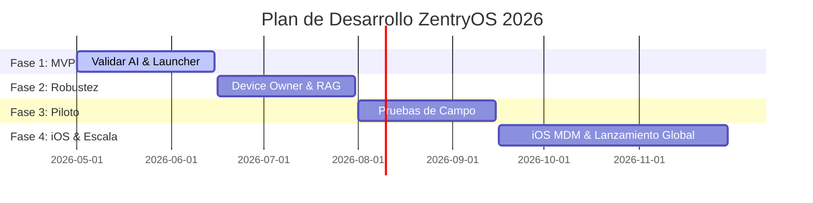

# 🌌 ZentryOS - MANIFIESTO DE CONTEXTO: 04. OPERACIONES Y ROADMAP

Este documento contiene la recopilación unificada y específica para la vertical **04. Operaciones y Roadmap** de ZentryOS.
Diseñado para alimentar a agentes y asistentes de IA especializados en esta área.

---

## 📋 ÍNDICE DE LA VERTICAL
1. [04-operaciones-y-roadmap/README.md](#-archivo-04-operaciones-y-roadmap-README-md)
2. [04-operaciones-y-roadmap/roadmap.md](#-archivo-04-operaciones-y-roadmap-roadmap-md)
3. [04-operaciones-y-roadmap/progreso-y-metricas.md](#-archivo-04-operaciones-y-roadmap-progreso-y-metricas-md)
4. [04-operaciones-y-roadmap/banco-de-ideas.md](#-archivo-04-operaciones-y-roadmap-banco-de-ideas-md)
5. [04-operaciones-y-roadmap/backlog-tareas.md](#-archivo-04-operaciones-y-roadmap-backlog-tareas-md)
6. [04-operaciones-y-roadmap/bitacora-actividades.md](#-archivo-04-operaciones-y-roadmap-bitacora-actividades-md)

---

---

# 📂 ARCHIVO: `04-operaciones-y-roadmap/README.md`

---
title: "Operaciones y Roadmap: Índice y Metodología"
date: 2026-06-22
status: "in-progress"
progress: 15%
deadline: 2026-08-30
tags: ["operaciones", "roadmap", "gestion-proyecto"]
---

# 📅 Vertical 4: Operaciones y Roadmap

Esta vertical detalla el marco operativo, la planificación temporal por fases, los plazos de entrega (*deadlines*) y las métricas de progreso de **ZentryOS**.

---

## 📂 Contenido del Módulo

1.  **[Roadmap de Desarrollo](./roadmap.md)**: Hitos temporales divididos por fases desde el MVP (5%) hasta la versión comercial global (100%).
2.  **[Progreso y Métricas](./progreso-y-metricas.md)**: Indicadores clave de rendimiento (KPIs), estado de avance de cada módulo y velocidad del equipo de ingeniería.
3.  **[Banco de Ideas](./banco-de-ideas.md)**: Repositorio consolidado de notas y propuestas extraídas literalmente de Google Keep, con clasificaciones y tareas inferidas.
4.  **[Backlog de Tareas Semanales](./backlog-tareas.md)**: Flujo de trabajo activo con los to-dos y pendientes semanales inferidos de las ideas y necesidades operativas.
5.  **[Bitácora de Actividades Diarias](./bitacora-actividades.md)**: Historial y diario de progresos consolidados desde las carpetas de Google Drive.

---

## ⚙️ Metodología de Trabajo: Agile MDM

Dado que ZentryOS combina desarrollo de software móvil de bajo nivel con servicios de Inteligencia Artificial en la nube, el equipo opera bajo un marco ágil adaptado:

*   **Sprints Bisemanales**: Entregas funcionales testeadas en dispositivos físicos (Android / iOS).
*   **Validaciones en Campo**: Pruebas piloto presenciales con cohortes de familias seleccionadas para evaluar el nivel de elusión del Kiosk Mode y el engagement con el tutor de IA.
*   **Gobernanza del SSOT**: Asegurar que toda decisión de desarrollo que impacte en la arquitectura técnica esté documentada previamente en este manifiesto.

---

## 🎨 Lineamientos de Diseño (Contexto Breve)

Para asegurar la consistencia estética en todas las iniciativas de ZentryOS, el diseño visual debe respetar estrictamente las siguientes pautas:

*   **Paleta Cromática Oficial**:
    *   **Púrpura Zentry (`#533B87`)**: Identidad de marca, toggles y títulos principales.
    *   **Lavanda Zentry (`#D6C8FA`)**: Fondo de botones primarios ("Get Started") e interactividad.
    *   **Verde Menta (`#C2F4E7`)**: Progreso, éxitos y estados activos.
    *   **Blanco Glacial (`#EBF1F5`)**: Base de fondo y contenedores translúcidos (glassmorphism).
    *   **Gris Neutro Oscuro (`#4A5160`)**: Texto principal, subtítulos y legibilidad general.
*   **Enfoque Visual**:
    *   **NO es una Dark Tech UI**: El fondo debe ser claro (Blanco Glacial) con marmoleados y degradados suaves de lila (Lavanda) y verde (Verde Menta). Se deben evitar creativos oscuros o diseños fuera de la línea visual.
    *   **Efecto Cristal (Glassmorphism)**: Tarjetas flotantes y paneles con fondo translúcido (`rgba(255, 255, 255, 0.4)`), bordes sutiles y desenfoque (`blur(25px)`).
*   **Tipografía**:
    *   **Outfit**: Para títulos y elementos destacados.
    *   **Inter**: Para cuerpo de lectura y textos explicativos.

---

# 📂 ARCHIVO: `04-operaciones-y-roadmap/roadmap.md`

---
title: "Roadmap del Producto: Fases e Hitos"
date: 2026-06-22
status: "in-progress"
progress: 15%
deadline: 2026-08-30
tags: ["operaciones", "roadmap", "hitos", "planificacion"]
---

# 📅 Roadmap del Producto ZentryOS

Este documento establece el cronograma de desarrollo técnico y comercial para ZentryOS, dividiendo la ejecución en cuatro fases críticas con deadlines inamovibles.

---

## 🗺️ Cronograma General de Fases

---

## 🔍 Detalle de Fases y Deadlines

### 🚀 Fase 1: Validación del Core MVP (Estado Actual)
*   **Hito**: Demostración funcional básica de conectividad con Gemini 2.5 Flash y control de UI básico.
*   **Entregables**:
    *   APK inicial funcional con Jetpack Compose.
    *   Tutor socrático integrado vía Google AI SDK.
    *   Kill-Switch básico con Firebase Firestore.
*   **Deadline**: **15 de Junio de 2026** (Cumplido en un 95% a nivel de prototipo técnico).

### 🔒 Fase 2: Seguridad Industrial y Memoria AI (Nivel de Producción)
*   **Hito**: Bloqueo absoluto del dispositivo y tutor con memoria semántica del menor.
*   **Entregables**:
    *   Aprovisionamiento automático vía código QR (Android Enterprise).
    *   Deshabilitación total de la barra de estado y menús de sistema (Device Owner).
    *   Base de datos vectorial local (ObjectBox) para almacenamiento de memoria socrática (RAG).
    *   Detección de patrones de elusión mediante telemetría local.
*   **Deadline**: **31 de Julio de 2026**.

### 🧪 Fase 3: Piloto Comercial y Campaña de Adquisición
*   **Hito**: Validación de la propuesta bilateral con 100 familias y despliegue del DemoBook.
*   **Entregables**:
    *   Lanzamiento del Lead Magnet interactivo digital (Quiz de adicción digital).
    *   Formación del equipo de asesores de venta con el DemoBook.
    *   Prueba piloto cerrada: Medición de KPIs de engagement del menor (resolución de retos) y deserción parental.
    *   Sincronización automatizada de leads en Odoo CRM.
*   **Deadline**: **15 de Septiembre de 2026**.

### 🌍 Fase 4: Escalabilidad Multiplataforma y Lanzamiento
*   **Hito**: Lanzamiento oficial en Google Play Store e integración con Apple Business Manager (ABM).
*   **Entregables**:
    *   Consola MDM de ZentryOS en producción en GCP.
    *   Integración del perfil de configuración ineliminable para iOS (iPhones supervisados).
    *   Lanzamiento de la app complementaria nativa para padres.
    *   Apertura de pasarela de pago y suscripciones recurrentes anuales/mensuales.
*   **Deadline**: **30 de Noviembre de 2026**.

---

# 📂 ARCHIVO: `04-operaciones-y-roadmap/progreso-y-metricas.md`

---
title: "Progreso y Métricas: KPIs del Proyecto"
date: 2026-06-22
status: "in-progress"
progress: 15%
deadline: 2026-08-30
tags: ["operaciones", "metricas", "kpis", "velocidad"]
---

# 📊 Progreso y Métricas de ZentryOS

Para garantizar la viabilidad comercial y la excelencia técnica, ZentryOS define indicadores clave de rendimiento (KPIs) en sus tres dimensiones principales: Ingeniería, Marketing/Ventas y Operación.

---

## 📈 KPIs de Ingeniería y Software

Estos indicadores miden la estabilidad y seguridad del sistema operativo en los dispositivos del usuario:

*   **Tasa de Elusión (Evasion Rate)**: % de menores que logran saltarse el Kiosk Mode (mediante depuración USB, combinación de botones o cierres forzados). 
    *   *Meta Comercial*: **0.00%**.
    *   *Estado Actual (MVP)*: **65.00%** (debido al uso de LockTaskMode básico sin privilegios de Device Owner).
*   **Latencia del Tutor IA (AI Latency)**: Tiempo transcurrido entre el fin del comando de voz del niño y el inicio de la respuesta sintetizada del tutor Zentry.
    *   *Meta Comercial*: **< 1,000ms**.
    *   *Estado Actual (MVP)*: **1,200ms** (usando Gemini 2.5 Flash Lite sobre HTTP directo).
*   **Consumo de Batería Excedente (Battery Overhead)**: Incremento en el consumo diario de batería atribuible a ZentryOS frente a un dispositivo Android de stock.
    *   *Meta Comercial*: **< 8.00%** extra en 24 horas.
    *   *Estado Actual (MVP)*: **14.00%** (debido a consultas en segundo plano no optimizadas).

---

## 🎯 KPIs de Marketing y Conversión Comercial

Miden la efectividad del equipo de asesores de ventas y los embudos de captación:

*   **Tasa de Asistencia al DemoBook**: % de leads que asisten a la demostración en vivo programada tras registrarse en el Quiz digital o la Expo Maternidad.
    *   *Meta Comercial*: **> 70.00%**.
*   **Conversión de Demostración a Cierre**: % de familias que adquieren la suscripción anual de ZentryOS inmediatamente después de finalizar la demostración interactiva.
    *   *Meta Comercial*: **> 35.00%**.
*   **Costo de Adquisición de Cliente (CAC)**: Costo total de marketing y comisión del asesor para captar una suscripción de pago.
    *   *Meta Comercial*: **< $45 USD**.

---

## 🏆 KPIs de Retención y Valor de Vida (LTV)

Miden el éxito a largo plazo del producto e impacto educativo:

*   **Tasa de Uso Diario Activo (DAU/MAU)**: % de menores que interactúan con el tutor Zentry o resuelven acertijos diariamente.
    *   *Meta Comercial*: **> 80.00%**.
*   **Retención Mensual (Parent Retention)**: % de padres que no cancelan la suscripción o solicitan la remoción del MDM al final del mes.
    *   *Meta Comercial*: **> 92.00%**.
*   **Tasa de Resolución de Retos (Challenge Success Rate)**: % de retos de matemáticas y lógica resueltos con éxito frente a los presentados. Sirve para evaluar si la dificultad dinámica de la IA se adapta correctamente al niño.
    *   *Meta Comercial*: **60.00% - 75.00%** (un valor menor indica frustración, un valor mayor indica aburrimiento).
*   **Churn de Suscripción (Anual)**: % de licencias anuales que no se renuevan al cumplir los 12 meses.
    *   *Meta Comercial*: **< 15.00%**.

---

# 📂 ARCHIVO: `04-operaciones-y-roadmap/banco-de-ideas.md`

---
title: "Operaciones: Banco de Ideas ZentryOS"
date: 2026-06-22
status: "approved"
progress: 100%
deadline: 2026-08-30
tags: ["operaciones", "banco-ideas", "keep-sincronizacion"]
---

# 💡 Banco de Ideas ZentryOS

Este documento consolidado actúa como la **base de datos oficial de ideas, propuestas e inspiraciones** para el ecosistema ZentryOS. El agente de sincronización infiere la vertical de destino de cada nota de Google Keep y la traslada de manera **literal e íntegra** a este apartado.

---

## 🗄️ Índice de Notas Sincronizadas (Google Keep)

| Fecha | Título Original de la Nota | Vertical Inferida | Tipo de Nota | Estado | Enlace al Contenido Literal |
| :--- | :--- | :---: | :---: | :---: | :--- |
| 2026-06-04 | ZENTRY SPOT | Producto / Técnico | Idea y To-Do | Sincronizado | [Ir a nota literal](#zentry-spot-1) |
| 2026-06-04 | ZENTRY Spot | Ventas / Marketing | Idea de Producto | Sincronizado | [Ir a nota literal](#zentry-spot-2) |
| 2026-06-04 | ZENTRY SPOT | Producto | Idea de Negocio | Sincronizado | [Ir a nota literal](#zentry-spot-3) |
| 2026-06-04 | ZENTRY SPOT | Producto / Técnico | Idea y To-Do | Sincronizado | [Ir a nota literal](#zentry-spot-4) |
| 2026-06-04 | ZENTRY PRECIERRE | Ventas / Marketing | Precierre | Sincronizado | [Ir a nota literal](#zentry-precierre-1) |
| 2026-06-04 | ZENTRY PRECIERRE | Ventas / Marketing | Precierre / To-Do | Sincronizado | [Ir a nota literal](#zentry-precierre-2) |
| 2026-06-04 | ZentryOS - Ecosistema de Juego Creativo | Técnica / Producto / Ventas | Idea y Backlog | Sincronizado | [Ir a nota literal](#zentryos---ecosistema-de-juego-creativo) |

---

## 🗒️ Transcripción Literal de Notas de Google Keep

### ZENTRY SPOT (1)
> **Cuerpo de la Nota (Literal):**
> Una idea que tengo de cómo comunicarle al niño o al joven el tiempo en pantalla para entretenimiento y la manera de quizás ilustrárselo podría ser que siempre haya una barra superpuesta que sea un timer y que ese timer le vaya mostrando cuánto tiempo de uso le queda puede ser un timer diario o podría quizá ser un timer en base a etapas del día en la mañana en la tarde y en la noche quizás en la mañana tiene menos tiempo que en la tarde y en la noche tiene un poquito más de tiempo que en la mañana La idea es que esto esté basado en ciencia basado en el ciclo circadiano esa es una cuestión la de la barra superpuesta tipo timer luego también hablando del ciclo circadiano algo súper importante es poder hacer que el sistema operativo de manera automática tenga ciertas activaciones dependiendo del ciclo circadiano Como por ejemplo la luz nocturna que a partir de una hora se aplica la luz nocturna al dispositivo y se quede hasta la noche o mejor dicho hasta las 6 o 7 de la mañana este tipo de configuraciones son solamente dos que se me han ocurrido en el momento sin embargo me gustaría poder ampliar este tipo de configuraciones automáticas muy basadas en el ciclo circadiano y basadas en ciencia basadas en psicología pedagógica y pediátrica

* **Metadatos e Inferencia:**
  * **Vertical Inferida**: `02-arquitectura-tecnica` y `01-vision-y-producto`
  * **Tareas Derivadas**:
    1. Diseñar el componente UI de barra superpuesta (Timer) en Jetpack Compose.
    2. Desarrollar la lógica de límites de tiempo circadiánicos (Mañana, Tarde, Noche).
    3. Programar activaciones automáticas (filtro de luz azul automático de 10 PM a 6/7 AM).
    4. Estudiar bases pedagógicas y médicas para respaldar científicamente los límites circadianos en el DemoBook.

---

### ZENTRY Spot (2)
> **Cuerpo de la Nota (Literal):**
> En cuanto a feedback o a otras hipótesis a validar están la información que puede tener el nicho al que apuntamos sobre herramientas de control parental Y lograr hacer que se extinga notoriamente un control parental convencional a un sistema operativo como ZENTRY y a la gente me ha hablado de controles parentales que le permiten apagar el celular a distancia limitar el uso las horas, entonces hay que aterrizar enormemente la distinción entre uno y otro 

* **Metadatos e Inferencia:**
  * **Vertical Inferida**: `03-marketing-y-ventas` (Manejo de Objeciones)
  * **Tareas Derivadas**:
    1. Diseñar sección comparativa "Control Parental Tradicional vs. ZentryOS" para desarmar objeciones.
    2. Documentar la diferencia funcional de ser un "Launcher/Device Owner" (ZentryOS) en lugar de una app restrictiva externa en segundo plano.

---

### ZENTRY SPOT (3)
> **Cuerpo de la Nota (Literal):**
> Una cuestión que hay que mapear es la posibilidad de crear algún producto para bebés con un ticket menor No sabría específicamente cuál sería la solución pero que esté como parte de la oferta

* **Metadatos e Inferencia:**
  * **Vertical Inferida**: `01-vision-y-producto` y `03-marketing-y-ventas` (Estructura de Precios)
  * **Tareas Derivadas**:
    1. Realizar una lluvia de ideas para un producto Zentry Mini (o Zentry Baby) para niños menores de 2 años (ej. audiolibros, filtros visuales severos) como Lead Magnet o producto de bajo ticket de entrada.

---

### ZENTRY SPOT (4)
> **Cuerpo de la Nota (Literal):**
> Una mamá me dijo que el YouTube se puede configurar para la edad del niño dependiendo de su edad lo que aparece Entonces el sistema operativo también debería ser capaz de configurarse y adaptarse a la edad e intereses iniciales del niño y eso también es una buena excusa como para dar un espacio de tiempo de implementación y que se vaya rellenando el formulario como para que cuando lo instalen sea mucho más fiel a la personalidad del niño

* **Metadatos e Inferencia:**
  * **Vertical Inferida**: `02-arquitectura-tecnica` (Compose / Onboarding) y `01-vision-y-producto`
  * **Tareas Derivadas**:
    1. Diseñar el flujo de configuración inicial (Onboarding) mediante un formulario interactivo que pregunte edad y gustos del niño.
    2. Implementar la personalización dinámica del Launcher Zentry según las respuestas del formulario.
    3. Analizar la API de YouTube Kids / YouTube Restricted Mode para forzar perfiles por edad automáticamente desde el sistema operativo.

---

### ZENTRY PRECIERRE (1)
> **Cuerpo de la Nota (Literal):**
> Entonces esto lo podemos llevar a cuánto cuesta personalizar o adaptar algo a tus necesidades Entonces los sistemas operativos que hay están diseñados para retener tu atención si tú no quieres que sea así tienes que comprar otro o mejorar el que tienes, de la misma manera que si tienes un carro Qué cuesta $10,000 pero te da más problemas Qué beneficios, te toca comprarte un carro del doble o gastar  más en mejorarlo, aterrizando lo más al software si una empresa quiere llevar sus sistemas administrativos en excel y en el entorno de Office a lo mucho le costará $300 al año si lo quiere hacer con un sistema administrativo más avanzado le puede costar hasta $10,000 pero ya siquiera algo ultrapersonalizado y adaptado a sus necesidades le puede costar entre 50k y $100,000 

* **Metadatos e Inferencia:**
  * **Vertical Inferida**: `03-marketing-y-ventas` (Guiones de Precierre)
  * **Tareas Derivadas**:
    1. Redactar el guion de ventas "Analogía del Excel y la Personalización de Software" e incorporarlo en el DemoBook y manual de asesores.
    2. Desarrollar el cálculo visual para mostrar a los padres durante la videollamada de venta.

---

### ZENTRY PRECIERRE (2)
> **Cuerpo de la Nota (Literal):**
> Entonces este precierre es un precierre de construcción de precio basado en el costo de un sistema operativo a largo plazo en la compra de un dispositivo móvil para una familia, Entonces ese costo lo sacamos a través de un juego matemático donde planteamos un escenario que puede ser utilizando el costo de los celulares que usan en casa pueden ser Android o ios en el caso que sea un celular de 2000 soles el juego matemático es decir que el valor de ese dispositivo es 60% está en el hardware y 40% está en el software argumentando que por ejemplo cuál es la diferencia entre un dispositivo ios versus uno Android y en la mayoría de ocasiones lo que hace que la gente compre estos dispositivos no son los materiales físicos sino por el contrario el ecosistema de iOS que es cerrado Entonces el juego matemático en este caso funcionaría así 800 soles corresponderían al costo del celular y hacemos preguntas: ¿Señor (a) __ usted utiliza el mismo celular de hace 10 años? ¿No verdad? ¿Porque iría mucho mas lento verdad? Entonces en los últimos 10 años cuántas veces ha cambiado de celular ? 4-5 veces. Eso quiere decir que si calculamos solo el valor del sistema operativo de esos celulares ¿Estaríamos hablando de que ha destinado más 3000 soles? Y cuántas personas son en casa ? 3-5 (incluyendo hijos) suponiendo eso quiere decir que el dinero que destinan solo in esto puede ascender a más 10000 soles ? Para simplificarlo lo que estaríamos haciendo es hablar en términos generales tanto de lo que han gastado en el pasado como lo que están gastando en el presente y lo que gastarán en el futuro cercano. Pero ojo ! Le recuerdo que eso es solo el sistema operativo incluyendo el celular podríamos estar hablando de más de 20000 soles. Sin embargo ese sistema operativo que usted está utilizando todos los días todos estos estos años está diseñado para dañar cognitivamente, ese sistema y sus algoritmos consideran ustedes que ha sido una inversión O un gasto ? Entonces si por ese mismo valor 10 000 usted pudiera tener un sistema operativo que potencie el desarrollo cognitivo de su hijo le permita mejorar su atención y le ayude a tener las herramientas más pertinentes actuales sería una buena inversión para ustedes y para su hijo ? Por la salud y el futuro de su hijo ?
> 
> Luego está relación la compramos con el cuerpo humano donde posicionamos el cuerpo como una máquina y el cerebro como la parte inteligente 

* **Metadatos e Inferencia:**
  * **Vertical Inferida**: `03-marketing-y-ventas` (Venta Directa / Construcción de Precio)
  * **Tareas Derivadas**:
    1. Integrar el "Juego Matemático de Inversión de OS" en el guion de Venta Directa del MVP (sección de precierre de precio).
    2. Desarrollar la analogía del "Cuerpo humano como máquina y cerebro como el OS inteligente" para justificar el costo.
    3. Crear una calculadora interactiva en Google Sheets / Web App para automatizar el cálculo del costo familiar acumulado en sistemas operativos obsoletos/dañinos.

---

### ZentryOS - Ecosistema de Juego Creativo
> **Cuerpo de la Nota (Literal):**
> Se me viene a la cabeza por ejemplo revivir los Roleplays y juegos con la imaginacion del joven. 
> 
> Ejemplo de vista del niño:
> - Imagina un juego de rol donde el niño puede conectarse a la TV, crear su propio mundo una IA lo guia en esa creacion, donde el niño puede elegir que personajes, que escenas que roles, pero sin limites si el niño le apasiona algo puede crear una experiencia futbol, basket, pintar, ir al espacio construir una casa, puede jugar con sus idolos, aterrizado a la realidad coo lo imagino es que el niño tenga un dispositivo. deje apretado el boton configurado para hablar con gemini o con el comando de voz y con ello le pida que abra una aplicacion (una web app llamada crea) por ejemplo. Abre y puede haber una dinamica estandarizada el niño le dice algo como "quiero jugar a ser un astronauta y viajo por el espacio" el asistente determina con preguntas como hacerlo le pregunta: tienes una TV ? , Tienes una tablet ? tienes un celular ? y el niño va creando su espacio entonces con los recursos que pueda tener empieza a dirigirlo, por ejemplo para crear una experiencia donde viaja por el espacio, podria usar la tablet para crear una aplicacion de viaje por el espacio, donde tiene que conseguir un cable HDMI para conectarlo (se lo explica al padre con su asistente de voz) conecta a la TV la tablet, usa su celular u otro dispositivo para crear una app que simula ser el centro de comandos de la nave y con el celular como mando debe eliminar cosas en la TV 
> - Esto que acabó de imaginar obviamente Tiene un nivel de complejidad Importante y cosas que seguro no son tan fáciles como parecen a priori Pero a lo que me refiero es crear experiencias de juego Donde el niño se vea retado Donde tenga que conseguir Herramientas Donde persista Donde las cosas no Sean de un momento para otro Sino que tenga que pasar días Y que ese plan Esté justificado Y al final sienta esa sensación de logro.
> 
> Vista del Padre
> - Hay una IA entrenada como psicologo o terapeuta pedagojico que le reporta al padre en base a las creaciones del joven que intereses, habilidades podria estar desarrollando el niño. 
> - Obviamente Al padre se le debe notificar Lo que está haciendo su hijo Para que lo guíe para que lo oriente Y fomente Esas actividades
> 
> CONTEXTO 2
> - Hubo una marca con la que personalmente trabajé que tenía una campaña de marketing Que hablaba de tipos de inteligencia Y eso es algo que se me quedó Inteligencia musical inteligencia creativa inteligencia lógica Inteligencia emocional Pueden haber tantos tipos Y tan diferentes Que no tiene sentido alienar A una civilización. IMAGINO un ecosistema donde el niño pueda crear utilizando herramientas de su vida real Utilizando herramientas de comandos de voz O por ejemplo también herramientas De Cámara donde la Ia IA pueda ver Y orientar mejor al niño para crear lo que tiene en su cabeza, Y que sea capaz de crear escenarios y ambientes Que no den límite a su creatividad. entonces ZENTRY No tiene que ser Una aplicación Puede ser Un sistema Que ayude al niño A usar lo que ya está creado (GEMINI (y todas sus funciones) (Configuraciones de Ipads, Android y más) (Que le ayude a ver El Mundo Como un lienzo) Si va a jugar fútbol Que lo rete, Que le ponga casos como por ejemplo sabias que Cristiano Ronaldo se quedaba practicando x cantidad de tiempo hasta apuntar al palo y golpearle ? Y le ponga esos retos 
> 
> CONTEXTO 3 
> - Una cosa es la idea y otra cosa es hacerizarlo técnicamente el día a día y la manera como yo lo veo viable es utilizando una inteligencia Matriz Si yo logro conectar Todos los dispositivos a una inteligencia en GCP que registra datos y desde alli se crean las experiencias entonces podemos estandarizar y controlar las aplicaciones e integraciones que estan dentro 
> 
> INSTRUCCIONES : 
> - Describe la idea y ordenala en un texto encapsulado para guardarlo 
> - Aterriza estas ideas A un flujo de Ecosistema o de aplicaciones donde pueda estar presentado de alguna manera en el MVP 

* **Metadatos e Inferencia:**
  * **Vertical Inferida**: `02-arquitectura-tecnica` (GCP / API / Integraciones) y `01-vision-y-producto`
  * **Tareas Derivadas**:
    1. Diseñar el flujo de arquitectura de la "Inteligencia Matriz" en GCP para registrar datos y coordinar experiencias entre TV, tablet y celular.
    2. Conceptualizar el prototipo de la web app "Crea" (habilitada por botón físico de voz con Gemini).
    3. Diseñar el "Reporte de Inteligencias Múltiples" para padres (alimentado por telemetría del juego del niño).
    4. Implementar retos físicos interactivos guiados (cámara/voz) con figuras deportivas o artísticas de referencia.

---

# 📂 ARCHIVO: `04-operaciones-y-roadmap/backlog-tareas.md`

---
title: "Operaciones: Backlog de Tareas Semanales"
date: 2026-06-22
status: "in-progress"
progress: 15%
deadline: 2026-08-30
tags: ["operaciones", "backlog", "tareas", "weekly-workflow"]
---

# 📋 Backlog de Tareas Semanales ZentryOS

Este documento es el **flujo de trabajo activo semanal** de ZentryOS. Aquí consolidamos, rastreamos y actualizamos los pendientes y to-dos **inferidos** de las ideas que capturamos en Google Keep y en las bitácoras diarias.

---

## 🚀 Ingeniería y Arquitectura Técnica (`02-arquitectura-tecnica`)

| ID Tarea | Tarea Inferred | Origen (Keep) | Prioridad | Estado | Asignado A |
| :--- | :--- | :---: | :---: | :---: | :---: |
| **TEC-01** | Diseñar barra de tiempo superpuesta (Timer UI Overlay) en Jetpack Compose | ZENTRY SPOT (1) | Alta | En curso | UX/Dev Lead |
| **TEC-02** | Implementar lógica de límites de tiempo dinámicos basados en ciclo circadiano | ZENTRY SPOT (1) | Alta | En curso | Backend Dev |
| **TEC-03** | Configurar activaciones automáticas del sistema (Luz Nocturna / Night Mode automático) | ZENTRY SPOT (1) | Media | En curso | Android Dev |
| **TEC-04** | Diseñar API y arquitectura de "Inteligencia Matriz" en GCP para vincular TV/Tablet/Móvil | Ecosistema Creativo | Alta | Pendiente | Cloud Architect |
| **TEC-05** | Diseñar formulario interactivo de Onboarding para edad y gustos del menor | ZENTRY SPOT (4) | Media | Pendiente | Frontend Dev |
| **TEC-06** | Desarrollar motor de Reporte Pedagógico IA para padres (Psicólogo cognitivo en GCP) | Ecosistema Creativo | Alta | Pendiente | AI Engineer |

---

## 🎨 Producto y Contenido (`01-vision-y-producto`)

| ID Tarea | Tarea Inferred | Origen (Keep) | Prioridad | Estado | Asignado A |
| :--- | :--- | :---: | :---: | :---: | :---: |
| **PROD-01** | Estudiar lineamientos pediátricos y pedagógicos para justificar límites circadianos | ZENTRY SPOT (1) | Media | Pendiente | Product Owner |
| **PROD-02** | Definir especificaciones para la oferta de bajo ticket Zentry Mini (Bebés/Toddlers) | ZENTRY SPOT (3) | Baja | Pendiente | Product Manager |
| **PROD-03** | Integración del control parental de YouTube (Restricted Mode / YouTube Kids) según edad | ZENTRY SPOT (4) | Alta | Pendiente | Integration Dev |
| **PROD-04** | Crear guion de retos y dinámicas físicas guiadas por voz (ej. fútbol con Cristiano Ronaldo) | Ecosistema Creativo | Media | Pendiente | Content Designer |

---

## 💰 Ventas y Marketing (`03-marketing-y-ventas`)

| ID Tarea | Tarea Inferred | Origen (Keep) | Prioridad | Estado | Asignado A |
| :--- | :--- | :---: | :---: | :---: | :---: |
| **MKT-01** | Redactar sección comparativa detallada: "ZentryOS vs. Control Parental Tradicional" | ZENTRY Spot (2) | Alta | Pendiente | Copywriter / Ventas |
| **MKT-02** | Redactar guion del Precierre 1: "Excel y el Costo de Personalización de Software" | ZENTRY PRECIERRE (1) | Alta | Pendiente | Sales Manager |
| **MKT-03** | Redactar guion del Precierre 2: "Juego Matemático de Inversión de OS Móvil" | ZENTRY PRECIERRE (2) | Alta | Pendiente | Sales Manager |
| **MKT-04** | Desarrollar analogía de ventas "Máquina del cuerpo humano y cerebro inteligente" | ZENTRY PRECIERRE (2) | Media | Pendiente | Sales Trainer |
| **MKT-05** | Diseñar calculadora de costo de OS familiar en Google Sheets para uso de los asesores | ZENTRY PRECIERRE (2) | Alta | Pendiente | Operations Lead |

---

## 🔄 Bitácora de Avance del Backlog

*   **2026-06-04**: *Backlog Inicializado*. Se cargaron 14 tareas prioritarias inferidas de las últimas 7 notas de Google Keep.

---

# 📂 ARCHIVO: `04-operaciones-y-roadmap/bitacora-actividades.md`

---
title: "Operaciones: Bitácora de Actividades Diarias"
date: 2026-06-22
status: "approved"
progress: 100%
deadline: 2026-08-30
tags: ["operaciones", "bitacora", "registro-diario"]
---

# 📅 Bitácora de Actividades Diarias

Este documento contiene la **bitácora e historial de eventos diarios** del proyecto ZentryOS. El Agente de Sincronización consolida en esta sección todas las notas de progreso enviadas por el equipo a través de las carpetas `registro-diario` de Google Drive.

---

## 🗒️ Historial de Bitácoras

### 🗓️ 2026-06-22
*   **Vertical 2: Arquitectura Técnica**
    *   *Actividad*: Análisis profundo de `ZentryPolicyManager` y desactivación de la omisión temporal (UI-Only bypass) para iniciar pruebas de seguridad local del Kiosk Mode.
*   **Vertical 4: Operaciones y Roadmap**
    *   *Actividad*: Diagnóstico de la fase actual del proyecto (15%) y diseño de la estrategia de desarrollo capilar por capas para los próximos 8, 20 y 30 días.

### 🗓️ 2026-06-04
*   **Vertical 1: Visión y Producto**
    *   *Actividad*: Análisis del soporte de segmentación etaria para adolescentes (12-20 años). Se refinaron los conceptos del Focus Dashboard para evitar el rechazo parental.
*   **Vertical 2: Arquitectura Técnica**
    *   *Actividad*: Corrección de sintaxis en los diagramas de flujo de Mermaid en la documentación técnica para evitar fallos de compilación en el render de GitHub.
*   **Vertical 3: Marketing y Ventas**
    *   *Actividad*: Creación del guion de Venta Directa paso a paso (DEMO) basado en la retórica del Doc Matriz (romper el hielo, autoridad, miedo). Separación del DemoBook como recursos y herramientas técnicas.
*   **Vertical 5: Mesa de Trabajo (Branding)**
    *   *Actividad*: Restauración del directorio Mesa de Trabajo y definición de la colorimetría digital principal (`#4A90E2`) y tipografía (`Outfit`/`Inter`) basada en el código de la Web App.

---

## ⚙️ Registro del Servidor de Sincronización (Logs)

*   `[2026-06-22 17:45:00] [INFO] Iniciando escaneo diario en Google Drive G:/Mi unidad/aa. QUARZ/A. ZentryOS/`
*   `[2026-06-22 17:46:12] [INFO] Sincronización local y compilación del SSOT ejecutada exitosamente.`
*   `[2026-06-04 22:00:15] [INFO] Iniciando escaneo diario en Google Drive G:/Mi unidad/aa. QUARZ/A. ZentryOS/`
*   `[2026-06-04 22:00:30] [INFO] Notas de Google Keep extraídas: 3 notas (1 azul, 1 verde, 1 roja).`
*   `[2026-06-04 22:01:05] [INFO] Sincronizando con banco-de-ideas.md y bitacora-actividades.md.`
*   `[2026-06-04 22:01:22] [INFO] Push automático a GitHub completado con éxito (Commit be300aa).`

