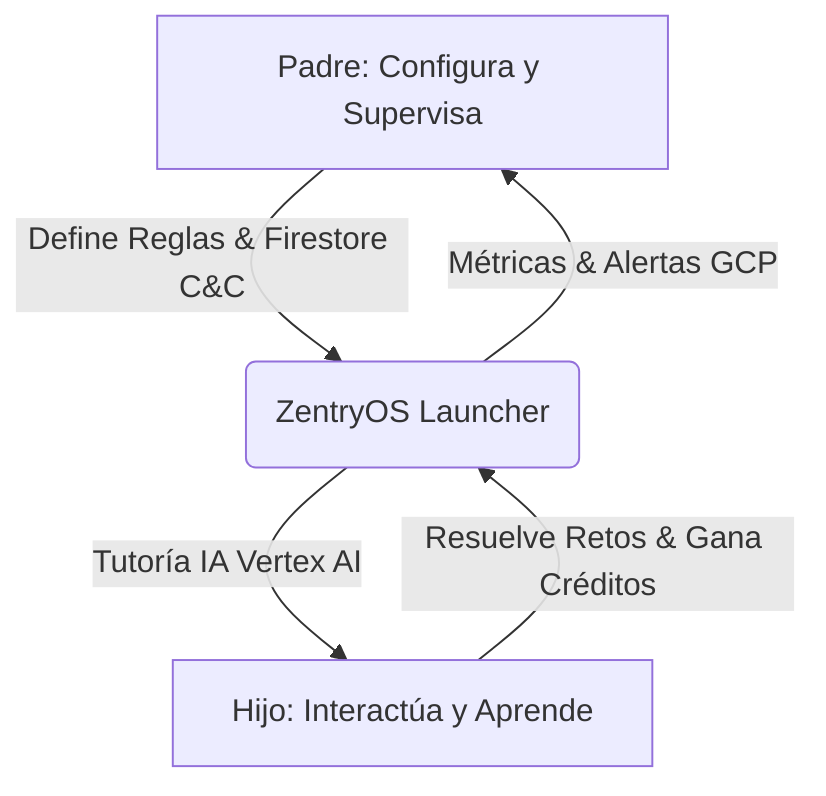
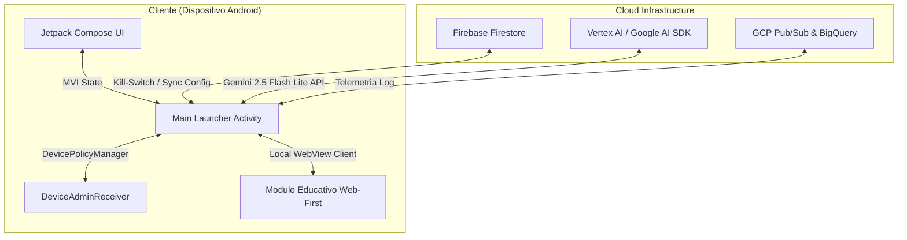
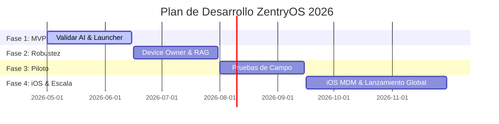

# 🌌 ZentryOS - MANIFIESTO ÚNICO DE CONTEXTO (SSOT) COMPLETO

Este documento contiene la recopilación íntegra y unificada de toda la documentación del repositorio Single Source of Truth (SSOT) de **ZentryOS**. Está estructurado especialmente para ser procesado y comprendido de manera óptima por modelos de Inteligencia Artificial (LLMs) como Gemini, Claude o ChatGPT.

---

## 📋 ÍNDICE GENERAL DEL MANIFIESTO
1. [README.md](#-archivo-README-md)
2. [01-vision-y-producto/README.md](#-archivo-01-vision-y-producto-README-md)
3. [01-vision-y-producto/problema-algoritmico.md](#-archivo-01-vision-y-producto-problema-algoritmico-md)
4. [01-vision-y-producto/ludopatia-y-adiccion.md](#-archivo-01-vision-y-producto-ludopatia-y-adiccion-md)
5. [01-vision-y-producto/solucion-bilateral.md](#-archivo-01-vision-y-producto-solucion-bilateral-md)
6. [01-vision-y-producto/segmentacion-etaria.md](#-archivo-01-vision-y-producto-segmentacion-etaria-md)
7. [02-arquitectura-tecnica/README.md](#-archivo-02-arquitectura-tecnica-README-md)
8. [02-arquitectura-tecnica/paradigma-web-first.md](#-archivo-02-arquitectura-tecnica-paradigma-web-first-md)
9. [02-arquitectura-tecnica/control-dispositivo-abm.md](#-archivo-02-arquitectura-tecnica-control-dispositivo-abm-md)
10. [02-arquitectura-tecnica/telemetria-gcp-ai.md](#-archivo-02-arquitectura-tecnica-telemetria-gcp-ai-md)
11. [02-arquitectura-tecnica/interfaz-compose.md](#-archivo-02-arquitectura-tecnica-interfaz-compose-md)
12. [02-arquitectura-tecnica/analisis-de-brechas.md](#-archivo-02-arquitectura-tecnica-analisis-de-brechas-md)
13. [03-marketing-y-ventas/README.md](#-archivo-03-marketing-y-ventas-README-md)
14. [03-marketing-y-ventas/demobook.md](#-archivo-03-marketing-y-ventas-demobook-md)
15. [03-marketing-y-ventas/zentry-prospect.md](#-archivo-03-marketing-y-ventas-zentry-prospect-md)
16. [03-marketing-y-ventas/demo-venta-directa.md](#-archivo-03-marketing-y-ventas-demo-venta-directa-md)
17. [03-marketing-y-ventas/precierres-y-embudos.md](#-archivo-03-marketing-y-ventas-precierres-y-embudos-md)
18. [03-marketing-y-ventas/manejo-de-objeciones.md](#-archivo-03-marketing-y-ventas-manejo-de-objeciones-md)
19. [03-marketing-y-ventas/factor-wow.md](#-archivo-03-marketing-y-ventas-factor-wow-md)
20. [04-operaciones-y-roadmap/README.md](#-archivo-04-operaciones-y-roadmap-README-md)
21. [04-operaciones-y-roadmap/roadmap.md](#-archivo-04-operaciones-y-roadmap-roadmap-md)
22. [04-operaciones-y-roadmap/progreso-y-metricas.md](#-archivo-04-operaciones-y-roadmap-progreso-y-metricas-md)
23. [04-operaciones-y-roadmap/banco-de-ideas.md](#-archivo-04-operaciones-y-roadmap-banco-de-ideas-md)
24. [04-operaciones-y-roadmap/backlog-tareas.md](#-archivo-04-operaciones-y-roadmap-backlog-tareas-md)
25. [04-operaciones-y-roadmap/bitacora-actividades.md](#-archivo-04-operaciones-y-roadmap-bitacora-actividades-md)
26. [05-mesa-de-trabajo/README.md](#-archivo-05-mesa-de-trabajo-README-md)
27. [05-mesa-de-trabajo/colorimetria-y-diseno.md](#-archivo-05-mesa-de-trabajo-colorimetria-y-diseno-md)
28. [05-mesa-de-trabajo/tipografia-y-fuentes.md](#-archivo-05-mesa-de-trabajo-tipografia-y-fuentes-md)
29. [05-mesa-de-trabajo/logotipos-y-recursos.md](#-archivo-05-mesa-de-trabajo-logotipos-y-recursos-md)

---


---

<a name="-archivo-README-md"></a>
# 📂 ARCHIVO: `README.md`

# ZentryOS - Single Source of Truth (SSOT)

Bienvenido al repositorio oficial del **Manifiesto Único de Contexto (SSOT)** de **ZentryOS**, el sistema operativo diseñado para transformar la relación de los niños y jóvenes (de 2 a 20 años) con la tecnología, mitigando la ludopatía y la estimulación algorítmica mediante un entorno seguro, controlado y potenciado por Inteligencia Artificial Generativa.

---

## 📌 Visión General del Proyecto

ZentryOS actúa como un **Launcher Kiosk** de seguridad de nivel industrial que bloquea la superficie de ataque de los dispositivos Android convencionales, reemplazando la experiencia de usuario nativa por un ecosistema gamificado y educativo. 

A través del uso de modelos avanzados de IA (como `gemini-2.5-flash-lite`), ZentryOS actúa como un tutor personalizado que acompaña al usuario en su desarrollo intelectual, bloqueando de raíz los incentivos de dopamina artificial (scroll infinito, videos cortos invasivos, ludopatía digital) y sustituyéndolos por retos educativos interactivos.

---

## 📂 Arquitectura de Documentación (SSOT)

Este repositorio está estructurado en cuatro (4) verticales de información clave, diseñadas para servir como la única fuente de verdad para los equipos de ingeniería, diseño, marketing y operaciones:

### [1. Visión y Producto](./01-vision-y-producto/README.md)
Analiza el problema de mercado, la adicción a las pantallas y el diseño de la solución bilateral (padres vs. hijos).
*   [Problema Algorítmico](./01-vision-y-producto/problema-algoritmico.md): Impacto neurológico del consumo digital temprano.
*   [Ludopatía y Adicción](./01-vision-y-producto/ludopatia-y-adiccion.md): Mecanismos del scroll infinito y loop de dopamina.
*   [Solución Bilateral](./01-vision-y-producto/solucion-bilateral.md): Cómo equilibramos la paz mental de los padres con el engagement del niño.
*   [Segmentación Etaria](./01-vision-y-producto/segmentacion-etaria.md): Adaptación de la UI y los prompts de IA de los 2 a los 20 años.

### [2. Arquitectura Técnica MVP](./02-arquitectura-tecnica/README.md)
Detalla el diseño de software, la configuración de hardware (MDM) y la infraestructura en la nube.
*   [Paradigma Web-First](./02-arquitectura-tecnica/paradigma-web-first.md): Integración híbrida para un desarrollo rápido y escalable.
*   [Control de Dispositivo & ABM](./02-arquitectura-tecnica/control-dispositivo-abm.md): Provisionamiento mediante Device Owner y Apple Business Manager.
*   [Telemetría y GCP/Vertex AI](./02-arquitectura-tecnica/telemetria-gcp-ai.md): Pipelines de datos de comportamiento, logs de interacción y control por Firestore.
*   [Interfaz Compose](./02-arquitectura-tecnica/interfaz-compose.md): Diseño premium con Jetpack Compose y animaciones MVI.
*   [Análisis de Brechas](./02-arquitectura-tecnica/analisis-de-brechas.md): El camino técnico del MVP (5%) hacia el producto final (100%).

### [3. Marketing y Ventas](./03-marketing-y-ventas/README.md)
Detalla la estrategia comercial, los recursos tecnológicos y el guion interactivo de venta consultiva en campo.
*   [Recursos del DemoBook](./03-marketing-y-ventas/demobook.md): Material de apoyo visual (Slides), carpetas de videos, imágenes y biblioteca de validación científica que acompañan y apoyan el pitch de ventas del asesor comercial.
*   [Zentry Prospect (Prospección)](./03-marketing-y-ventas/zentry-prospect.md): Infraestructura de la Web App en Google Apps Script, base de datos en Google Sheets y consola de administración para capturar leads en campo.
*   [Guion de Venta Directa](./03-marketing-y-ventas/demo-venta-directa.md): Estructura oficial del guion interactivo (Romper el Hielo, Autoridad, Miedo, Cierre).
*   [Precierres y Embudos](./03-marketing-y-ventas/precierres-y-embudos.md): Estrategia de go-to-market y embudos presenciales/digitales.
*   [Manejo de Objeciones](./03-marketing-y-ventas/manejo-de-objeciones.md): Respuestas lógicas y analogías del Doc Matriz.
*   [Factor WOW](./03-marketing-y-ventas/factor-wow.md): Dinámicas y micro-interacciones sensoriales para el cierre.

### [4. Operaciones y Roadmap](./04-operaciones-y-roadmap/README.md)
Define la planificación temporal, los hitos clave y la asignación de recursos.
*   [Roadmap de Producto](./04-operaciones-y-roadmap/roadmap.md): Fases de desarrollo, fechas críticas y entregables.
*   [Progreso y Métricas](./04-operaciones-y-roadmap/progreso-y-metricas.md): Estado del arte y KPIs operativos actuales.
*   [Banco de Ideas](./04-operaciones-y-roadmap/banco-de-ideas.md): Registro centralizado de ideas clasificadas por fecha y prioridad.
*   [Bitácora de Actividades](./04-operaciones-y-roadmap/bitacora-actividades.md): Historial de actividades diarias procesadas por el agente.

### [5. Mesa de Trabajo](./05-mesa-de-trabajo/README.md)
Consolida la identidad visual de marca, paletas de color, tipografía y recursos gráficos.
*   [Colorimetría y Diseño](./05-mesa-de-trabajo/colorimetria-y-diseno.md): Especificaciones de HSL/HEX, gradientes y temas.
*   [Tipografía y Fuentes](./05-mesa-de-trabajo/tipografia-y-fuentes.md): Jerarquía de tipografías y fuentes.
*   [Logotipos y Recursos](./05-mesa-de-trabajo/logotipos-y-recursos.md): Enlaces y directrices de logotipos y fondos.

---

## 🛠️ Contribución y Gobernanza del SSOT

Este repositorio se rige por políticas estrictas de control de cambios. Cualquier modificación de arquitectura, visión o roadmap comercial **debe** realizarse mediante una Pull Request (PR) y contar con la aprobación del SSOT Manager y del Arquitecto de Software líder.

1.  Crea una rama descriptiva (`feature/actualizacion-arquitectura`, `docs/ajuste-roadmap`).
2.  Actualiza el Frontmatter YAML de los archivos editados (`status: under-review`).
3.  Utiliza la plantilla de PR para justificar el impacto en las 4 verticales.
4.  Consigue la aprobación de revisión por pares.


---

<a name="-archivo-01-vision-y-producto-README-md"></a>
# 📂 ARCHIVO: `01-vision-y-producto/README.md`

---
title: "Visión y Producto: Índice y Estrategia"
date: 2026-06-04
status: "approved"
progress: 40%
deadline: 2026-08-30
tags: ["producto", "vision", "estrategia"]
---

# 🎨 Vertical 1: Visión y Producto

Esta vertical detalla las bases conceptuales, neurológicas y comerciales que sustentan la creación de **ZentryOS**. A diferencia de los launchers de control parental genéricos (que se basan únicamente en la restricción punitiva), ZentryOS propone un **paradigma educativo interactivo** respaldado por IA Generativa.

---

## 📂 Contenido del Módulo

1.  **[Problema Algorítmico](./problema-algoritmico.md)**: Análisis del secuestro de la atención infantil por parte de plataformas de contenido masivo (TikTok, YouTube Shorts, Reels) y la necesidad de una barrera defensiva.
2.  **[Ludopatía y Adicción Digital](./ludopatia-y-adiccion.md)**: El modelo del loop de dopamina intermitente y el impacto neurológico en menores de 2 a 20 años.
3.  **[Solución Bilateral](./solucion-bilateral.md)**: Estructura del valor dual. Paz mental y control remoto para los padres; gamificación, IA tutora y libertad supervisada para los hijos.
4.  **[Segmentación Etaria](./segmentacion-etaria.md)**: Estrategia de adaptación de la UI/UX y reglas de control según el ciclo de desarrollo (2-6 años, 7-12 años y 13-20 años).

---

## 🎯 Declaración de Propósito

> "ZentryOS no es una cárcel digital; es un santuario cognitivo. Nuestra misión es interceptar el consumo pasivo de dopamina artificial y transformarlo en un motor de curiosidad y aprendizaje mediante Inteligencia Artificial adaptativa."

### Pilares del Producto:
*   **Interceptación Activa**: Impedir el acceso físico a redes sociales y plataformas de estimulación algorítmica sin provocar frustración excesiva.
*   **Gamificación Cognitiva**: Reemplazar el tiempo libre del dispositivo con retos intelectuales dinámicos que se resuelven conversando con un tutor IA.
*   **Telemetría No Invasiva**: Medición constante del progreso escolar y del bienestar emocional del menor a partir de sus conversaciones con el sistema operativo, enviando informes semanales al padre.

---

## 🎨 Lineamientos de Diseño (Contexto Breve)

Para asegurar la consistencia estética en todas las iniciativas de ZentryOS, el diseño visual debe respetar estrictamente las siguientes pautas:

*   **Paleta Cromática Oficial**:
    *   **Púrpura Zentry (`#533B87`)**: Identidad de marca, toggles y títulos principales.
    *   **Lavanda Zentry (`#D6C8FA`)**: Fondo de botones primarios ("Get Started") e interactividad.
    *   **Verde Menta (`#C2F4E7`)**: Progreso, éxitos y estados activos.
    *   **Blanco Glacial (`#EBF1F5`)**: Base de fondo y contenedores translúcidos (glassmorphism).
    *   **Gris Neutro Oscuro (`#4A5160`)**: Texto principal, subtítulos y legibilidad general.
*   **Enfoque Visual**:
    *   **NO es una Dark Tech UI**: El fondo debe ser claro (Blanco Glacial) con marmoleados y degradados suaves de lila (Lavanda) y verde (Verde Menta). Se deben evitar creativos oscuros o diseños fuera de la línea visual.
    *   **Efecto Cristal (Glassmorphism)**: Tarjetas flotantes y paneles con fondo translúcido (`rgba(255, 255, 255, 0.4)`), bordes sutiles y desenfoque (`blur(25px)`).
*   **Tipografía**:
    *   **Outfit**: Para títulos y elementos destacados.
    *   **Inter**: Para cuerpo de lectura y textos explicativos.


---

<a name="-archivo-01-vision-y-producto-problema-algoritmico-md"></a>
# 📂 ARCHIVO: `01-vision-y-producto/problema-algoritmico.md`

---
title: "El Problema Algorítmico en la Infancia y Adolescencia"
date: 2026-06-04
status: "approved"
progress: 70%
deadline: 2026-08-30
tags: ["producto", "neurobiologia", "algoritmos"]
---

# 🧠 El Problema Algorítmico

El principal adversario de la salud mental de los niños y jóvenes modernos no es el dispositivo físico, sino el **diseño de optimización algorítmica** de las redes sociales y plataformas de video de consumo rápido (TikTok, YouTube Shorts, Instagram Reels). 

---

## 🚨 Anatomía del Secuestro Cognitivo

Las plataformas modernas utilizan algoritmos de aprendizaje por refuerzo profundo (Deep Reinforcement Learning) para maximizar la métrica de **tiempo de retención (Watch Time)** y **tasa de interacción (Engagement Rate)**. Esto genera tres problemas críticos en el cerebro en desarrollo:

### 1. Estimulación Hiper-Fragmentada
Los videos de 15 a 30 segundos bombardean al menor con ráfagas visuales y auditivas constantes. Esto acostumbra al lóbulo frontal (encargado del control de impulsos y concentración) a recibir recompensas sin esfuerzo en lapsos de tiempo extremadamente cortos.
*   **Consecuencia**: Reducción drástica del período de atención (*attention span*) y problemas de concentración en el entorno escolar.

### 2. El Algoritmo Caja-Negra
Los motores de recomendación analizan micro-movimientos, pausas de milisegundos en el scroll y reacciones táctiles. Crean un perfil psicológico en tiempo real que predice con exactitud qué tipo de contenido mantendrá al niño enganchado, a menudo escalando hacia narrativas extremas o hiper-sensacionalistas para evitar el aburrimiento.

### 3. Falta de Barreras Naturales
El "scroll infinito" elimina las señales físicas de detención (como el fin de un capítulo de un libro o los créditos de una serie). El cerebro del menor entra en un estado de **hipnosis interactiva**, perdiendo la noción del tiempo y postergando funciones fisiológicas esenciales (sueño, alimentación, ejercicio).

---

## 🛡️ La Interceptación ZentryOS

ZentryOS actúa como un **filtro o amortiguador cognitivo**. Al tomar posesión del dispositivo como Launcher por defecto a nivel de sistema operativo:

1.  **Bloqueo de Capa 0**: Deshabilita la instalación o ejecución de apps con feeds algorítmicos infinitos (TikTok, Instagram, etc.).
2.  **Sustitución de Estímulos**: En lugar de mostrar un feed aleatorio, el menor ve una interfaz limpia e interactiva donde la única forma de desbloquear tiempo de recreo o funciones adicionales es superando **desafíos lógicos y matemáticos** presentados por una IA amigable.
3.  **Feed Finito y Dirigido**: Si se consume contenido web o multimedia, se realiza bajo canales curados y validados por ZentryOS, donde el flujo de visualización requiere pausas activas evaluadas por telemetría.


---

<a name="-archivo-01-vision-y-producto-ludopatia-y-adiccion-md"></a>
# 📂 ARCHIVO: `01-vision-y-producto/ludopatia-y-adiccion.md`

---
title: "Ludopatía Digital y Adicción a las Pantallas"
date: 2026-06-04
status: "approved"
progress: 65%
deadline: 2026-08-30
tags: ["producto", "neurobiologia", "adicciones"]
---

# 🎮 Ludopatía Digital y Adicción a las Pantallas

La adicción a los smartphones en la infancia y adolescencia comparte el mismo sustrato neurobiológico que la **ludopatía en adultos**: el secuestro del sistema de recompensa del cerebro mediante **refuerzo variable e intermitente**.

---

## ⚡ El Loop de Dopamina Intermitente

La dopamina no se libera principalmente cuando obtenemos una recompensa, sino durante la **anticipación** de la misma. Las mecánicas de las aplicaciones comerciales imitan a las máquinas tragamonedas:

*   **Pull-to-Refresh / Infinite Scroll**: El gesto físico de deslizar hacia abajo para actualizar crea la expectativa de "¿qué aparecerá ahora?". La recompensa es impredecible (un video gracioso, un meme, o nada relevante), lo que dispara niveles masivos de dopamina.
*   **Mecánicas de Gamificación Invasiva**: Streaks (rachas) en Snapchat/Duolingo, likes instantáneos, notificaciones automáticas y recompensas diarias obligan al cerebro a volver a la aplicación por miedo a perder estatus social o progreso virtual (*FOMO*).

En menores de 2 a 12 años, la corteza prefrontal no está completamente mielinizada. Carecen de la capacidad biológica para autorregularse frente a estos estímulos de diseño persuasivo. En el nicho de adolescentes y jóvenes (hasta 20 años), esta vulnerabilidad es explotada de formas alarmantes:

### El Peligro de las Cajas de Botín y Skins
La adicción digital actual no solo se expresa en el tiempo de pantalla, sino en la **ludopatía financiera camuflada**. Videojuegos populares inducen al menor a comprar elementos cosméticos ("skins", diamantes, sobres de cartas) mediante refuerzo intermitente aleatorio, lo que genera una carga de dopamina idéntica al juego de azar en adultos. 
*   **Caso Andrés Salas (Streamer Peruano)**: El paso de consumir transmisiones de videojuegos competitivos a apostar en casinos patrocinados se ha vuelto un puente común para miles de jóvenes peruanos seguidores de influencers locales.

### El Abandono de la Lectura y Pérdida de la Narrativa Propia
La influencia algorítmica constante desvía el potencial intelectual. Al reemplazar la lectura estructurada (ej. libros entre los 15 y 18 años) por el consumo pasivo de videos cortos, streams y podcasts rápidos, el cerebro adopta una narrativa impuesta desde el exterior. El menor pierde la capacidad de estructurar sus propios pensamientos y metas a largo plazo, cayendo en el *"cementerio de los potenciales no realizados"* por falta de foco.

---

## 🔄 Reingeniería del Sistema de Recompensa en ZentryOS

ZentryOS no elimina las mecánicas de gamificación, sino que las **redirige** hacia objetivos de desarrollo cognitivo:

### 1. Recompensa Fija vs. Esfuerzo Proporcional
Para acceder a actividades de ocio (por ejemplo, 15 minutos de un videojuego educativo o navegación web permitida), el menor debe "pagar" con créditos obtenidos a través de la resolución de retos intelectuales. La dopamina se asocia al **logro y la superación**, no al consumo pasivo.

### 2. Desvanecimiento de Notificaciones (Dampening)
ZentryOS silencia y agrupa de manera inteligente las alertas del sistema. No se permiten notificaciones intrusivas que interrumpan el foco de atención del menor. Las alertas se transforman en tareas diarias consolidadas en el panel de control del Launcher.

### 3. Modulación Emocional vía Chat Tutor (IA)
Si el sistema operativo detecta un patrón de uso compulsivo (múltiples intentos fallidos de abrir apps restringidas, gestos bruscos sobre la pantalla), la IA de ZentryOS interviene de manera amigable:
*   Abre una interfaz conversacional personalizada.
*   Pregunta sobre su estado de ánimo.
*   Propone un minijuego de respiración o un reto lógico adaptado para romper el ciclo de frustración digital.


---

<a name="-archivo-01-vision-y-producto-solucion-bilateral-md"></a>
# 📂 ARCHIVO: `01-vision-y-producto/solucion-bilateral.md`

---
title: "La Solución Bilateral: Padres vs Hijos"
date: 2026-06-04
status: "approved"
progress: 80%
deadline: 2026-08-30
tags: ["producto", "negocio", "ux"]
---

# ⚖️ La Solución Bilateral

El fracaso de la mayoría de las soluciones de control parental tradicionales radica en que son **unilaterales**: benefician exclusivamente al padre mediante la imposición, lo que genera rechazo y rebeldía en el menor. ZentryOS se concibe bajo una estructura de **propuesta de valor bilateral**.

---

## 👨‍👩‍👧‍👦 Dinámica de la Propuesta Bilateral



---

## 🛡️ Vertical del Padre: Paz Mental, Seguridad y Telemetría

Para el tutor legal, ZentryOS es una herramienta de gobernanza del dispositivo móvil que garantiza que la tecnología actúe como un aliado de crianza y no como una fuente de conflicto.

### Características Clave:
*   **Consola de Mando Remoto (Kill-Switch)**: Utilizando Firebase Firestore en tiempo real, el padre puede bloquear instantáneamente el dispositivo con un solo toque desde su propio teléfono, sin importar dónde se encuentre el niño.
*   **Filtro de Contenido Dinámico**: Gestión de listas blancas de URLs y aplicaciones autorizadas para el estudio y ocio regulado.
*   **Reportes de Telemetría Cognitiva**: Informes semanales generados por IA a partir de las interacciones del niño con el tutor virtual. El padre no recibe un historial crudo de navegación (que vulnera la privacidad), sino un resumen estructurado:
    *   *Temas de interés detectados (ej: astronomía, dinosaurios).*
    *   *Nivel de comprensión lógica e idiomas.*
    *   *Estado de ánimo y posibles patrones de ansiedad.*

---

## 🚀 Vertical del Menor: Gamificación, Libertad Regulada y Tutoría IA

Para el niño o adolescente, ZentryOS no se presenta como un bloqueo, sino como un **portal interactivo personalizado (un "sistema de juego")** donde es el protagonista de su aprendizaje.

### Características Clave:
*   **El Tutor Zentry**: Un avatar de Inteligencia Artificial que no juzga ni califica, sino que conversa, responde preguntas existenciales, ayuda con las tareas escolares y cuenta historias personalizadas según las preferencias del menor.
*   **Economía de Créditos**: Un sistema transparente de recompensa. El tiempo de uso libre en Internet o videojuegos no se otorga por defecto; se "gana" completando retos de matemáticas, lectura o idiomas. Esto empodera al menor enseñándole el valor del esfuerzo y la autogestión del tiempo.
*   **Personalización Estética**: Posibilidad de desbloquear temas visuales, avatares y elementos decorativos mediante el progreso educativo en la app.
*   **Modo Compañero**: La interfaz para jóvenes de 12 a 20 años cambia su estética "infantil" hacia un panel de productividad estilo *cyberpunk* o minimalista, actuando como un asistente de enfoque (*Focus Mode*) y gestión del tiempo de estudio.


---

<a name="-archivo-01-vision-y-producto-segmentacion-etaria-md"></a>
# 📂 ARCHIVO: `01-vision-y-producto/segmentacion-etaria.md`

---
title: "Segmentación Etaria: Adaptación del Ecosistema"
date: 2026-06-04
status: "approved"
progress: 50%
deadline: 2026-08-30
tags: ["producto", "ux", "segmentacion"]
---

# 👶 Segmentación Etaria (2 a 20 Años)

Para atender con éxito un rango demográfico tan amplio, ZentryOS adapta de forma dinámica su **interfaz gráfica**, el **tono del tutor de Inteligencia Artificial** y las **políticas de control de seguridad**. El sistema opera bajo tres cohortes principales.

---

## 📊 Matriz de Adaptabilidad por Cohorte

| Cohorte | Rango de Edad | Estilo de UI/UX | Tono del Tutor IA | Modelo de Control (MDM) |
| :--- | :--- | :--- | :--- | :--- |
| **Early Childhood** | 2 - 6 años | Iconografía gigante, basada en audio/voz, colores vibrantes. | Lúdico, narrativo, explicativo (estilo caricatura). | **Kiosk Duro**: Bloqueo total. Solo apps de dibujo e historias aprobadas. |
| **Middle Childhood** | 7 - 12 años | Gamificado, avatares personalizables, progresión de niveles. | Mentor interactivo, retos de lógica y matemáticas. | **Kiosk Híbrido**: Acceso condicionado por economía de créditos. |
| **Teen & Productivity** | 13 - 20 años | Minimalista, modo oscuro, enfocado en productividad. | Asistente de estudio, tutor de programación/ciencias. | **Soft Control / Focus Mode**: Autogestión supervisada, bloqueo de apps específicas durante el estudio. |

---

## 🔍 Detalles por Cohorte de Desarrollo

### 1. Cohorte Early (2 - 6 Años)
*   **Problema principal**: No saben escribir ni leer fluidamente. Son propensos a la estimulación visual puramente pasiva (videos cortos).
*   **Estrategia ZentryOS**: 
    *   La navegación elimina casi todo el texto y se basa en colores e interacción por voz.
    *   El tutor IA actúa a través de comandos de voz interactivos (*Text-To-Speech* y *Speech-To-Text*). Le narra cuentos infantiles donde el niño toma decisiones sencillas presionando iconos en pantalla.
    *   Bloqueo absoluto de navegadores web externos.

### 2. Cohorte Middle (7 - 12 Años) - *Nicho Núcleo del MVP*
*   **Problema principal**: Primer contacto directo con redes sociales y videojuegos competitivos multijugador. Presión de grupo.
*   **Estrategia ZentryOS**:
    *   Uso de la **Economía de Créditos**: Superar retos lógicos de matemáticas y gramática da acceso a 15-30 minutos de juego supervisado.
    *   El tutor IA ayuda activamente con las tareas del colegio, respondiendo dudas paso a paso sin dar la respuesta final directamente, fomentando el pensamiento crítico.
    *   La app se presenta como un videojuego donde el avatar sube de nivel y desbloquea skins visuales a medida que el niño resuelve desafíos intelectuales.

### 3. Cohorte Teen (13 - 20 Años) - *Nicho Ampliado*
*   **Problema principal**: Pérdida de foco por notificaciones, procrastinación digital y necesidad de privacidad. El control de Kiosk estricto genera rechazo absoluto.
*   **Estrategia ZentryOS**:
    *   La interfaz abandona el look infantil y se convierte en un **Dashboard de Productividad** estilo KANBAN o Pomodoro.
    *   El control MDM no bloquea el dispositivo de manera punitiva; en su lugar, el adolescente programa sus bloques de estudio. ZentryOS silencia distractores y restringe Instagram/TikTok durante esas horas.
    *   El tutor IA se especializa en resolver dudas complejas (cálculo, física, codificación de software) e impulsa proyectos personales mediante prompts técnicos de Vertex AI.
    *   Se incluye una consola de telemetría personal para que el joven aprenda a autorregular sus propios tiempos de pantalla mediante gráficos interactivos.


---

<a name="-archivo-02-arquitectura-tecnica-README-md"></a>
# 📂 ARCHIVO: `02-arquitectura-tecnica/README.md`

---
title: "Arquitectura Técnica MVP: Índice y Stack"
date: 2026-06-04
status: "approved"
progress: 30%
deadline: 2026-08-30
tags: ["arquitectura", "android", "gcp"]
---

# 💻 Vertical 2: Arquitectura Técnica MVP

Esta sección describe los cimientos tecnológicos, patrones de diseño de software e integración de servicios cloud que conforman el ecosistema técnico de **ZentryOS**. 

---

## 📂 Contenido del Módulo

1.  **[Paradigma Web-First](./paradigma-web-first.md)**: El uso estratégico de WebViews optimizadas y Progressive Web Apps (PWAs) para acelerar el desarrollo de módulos educativos e interfaces secundarias.
2.  **[Control del Dispositivo & ABM](./control-dispositivo-abm.md)**: Implementación de privilegios de administrador de dispositivo (*Device Owner*), integración Android Enterprise y escalabilidad hacia iOS (Apple Business Manager).
3.  **[Telemetría y GCP/Vertex AI](./telemetria-gcp-ai.md)**: Conectividad con la API de IA Generativa de Google, canalización de logs a Google Cloud Platform y persistencia del Kill-Switch en Firebase Firestore.
4.  **[Interfaz Compose](./interfaz-compose.md)**: Estructuración visual en Android Nativo con Jetpack Compose, flujo MVI de estados y animaciones de nivel premium.
5.  **[Análisis de Brechas (Gap Analysis)](./analisis-de-brechas.md)**: Detalle del plan para evolucionar del prototipo funcional actual (5%) hacia un sistema operativo de seguridad robusto a nivel de kernel e infraestructura (100%).

---

## 🛠️ Stack Tecnológico Oficial (MVP)



### Componentes de Software:
*   **Lenguaje Primario**: Kotlin (Corrutinas y Flow para concurrencia reactiva).
*   **Seguridad y MDM**: APIs de `DevicePolicyManager` para restricción de sistema.
*   **Comando y Control (C&C)**: Firebase Firestore para escucha remota en tiempo real.
*   **Inteligencia Artificial**: Google Generative AI Client SDK (`generativeai:0.9.0`), empleando `gemini-2.5-flash-lite` para respuestas rápidas y rentables de texto y análisis multimodal.

---

## 🎨 Lineamientos de Diseño (Contexto Breve)

Para asegurar la consistencia estética en todas las iniciativas de ZentryOS, el diseño visual debe respetar estrictamente las siguientes pautas:

*   **Paleta Cromática Oficial**:
    *   **Púrpura Zentry (`#533B87`)**: Identidad de marca, toggles y títulos principales.
    *   **Lavanda Zentry (`#D6C8FA`)**: Fondo de botones primarios ("Get Started") e interactividad.
    *   **Verde Menta (`#C2F4E7`)**: Progreso, éxitos y estados activos.
    *   **Blanco Glacial (`#EBF1F5`)**: Base de fondo y contenedores translúcidos (glassmorphism).
    *   **Gris Neutro Oscuro (`#4A5160`)**: Texto principal, subtítulos y legibilidad general.
*   **Enfoque Visual**:
    *   **NO es una Dark Tech UI**: El fondo debe ser claro (Blanco Glacial) con marmoleados y degradados suaves de lila (Lavanda) y verde (Verde Menta). Se deben evitar creativos oscuros o diseños fuera de la línea visual.
    *   **Efecto Cristal (Glassmorphism)**: Tarjetas flotantes y paneles con fondo translúcido (`rgba(255, 255, 255, 0.4)`), bordes sutiles y desenfoque (`blur(25px)`).
*   **Tipografía**:
    *   **Outfit**: Para títulos y elementos destacados.
    *   **Inter**: Para cuerpo de lectura y textos explicativos.


---

<a name="-archivo-02-arquitectura-tecnica-paradigma-web-first-md"></a>
# 📂 ARCHIVO: `02-arquitectura-tecnica/paradigma-web-first.md`

---
title: "Paradigma Web-First en ZentryOS"
date: 2026-06-04
status: "approved"
progress: 40%
deadline: 2026-08-30
tags: ["arquitectura", "webview", "hibrido"]
---

# 🌐 El Paradigma Web-First

Para lograr un ciclo de desarrollo ágil que permita desplegar minijuegos educativos, interfaces interactivas y herramientas de estudio dinámicas sin forzar al usuario a descargar actualizaciones pesadas de la app base, ZentryOS implementa una **arquitectura híbrida Web-First**.

---

## 🏗️ Estructura del Modelo Híbrido

El núcleo de seguridad (MDM, control de botones, geolocalización, servicio de persistencia y telemetría de red) se ejecuta de forma **100% nativa en Kotlin/Java**. Sin embargo, las pantallas de contenido educativo, los retos interactivos y el portal del estudiante se cargan mediante un **WebView optimizado**.

```text
+-------------------------------------------------------------+
|                     Jetpack Compose UI                      |
| (Pantalla de Bloqueo, Panel de Configuración, Avatar Nativo)|
+-------------------------------------------------------------+
|                       JS Bridge Interface                   |
|  [Kotlin Native API]  <=================>  [Web Application]|
+-------------------------------------------------------------+
|               WebView Contenedor (Chrome Engine)             |
|   - Caché local persistente (SQLite / Cache API)            |
|   - Ejecución sin conexión (Offline Mode via ServiceWorker) |
+-------------------------------------------------------------+
```

---

## 🛠️ Optimización y Seguridad de la WebView

Las implementaciones comunes de WebView sufren de lentitud de renderizado (*input lag*) y brechas de seguridad. ZentryOS implementa las siguientes directrices de ingeniería:

### 1. JavaScript Bridge Seguro
Se utiliza un puente bidireccional mediante `@JavascriptInterface` para permitir que el código web interactúe con el hardware del dispositivo (ej: vibración hágica al completar un reto, encender la cámara para análisis multimodal de IA).
```kotlin
// Android Native Bridge
class ZentryWebInterface(private val context: Context) {
    @JavascriptInterface
    fun triggerHapticFeedback(patternType: String) {
        val vibrator = context.getSystemService(Context.VIBRATOR_SERVICE) as Vibrator
        // Lógica de vibración personalizada
    }
}
```
*   **Regla de Seguridad**: Se restringen los dominios permitidos mediante `shouldOverrideUrlLoading` en `WebViewClient` para evitar ataques de redirección o Cross-Site Scripting (XSS).

### 2. Caché y Service Workers
Para garantizar que ZentryOS sea funcional sin conectividad a Internet (por ejemplo, en el colegio o en transporte público):
*   Se activa la base de datos interna `WebSettings.LOAD_CACHE_ELSE_NETWORK`.
*   La aplicación web utiliza un **Service Worker** que descarga previamente los recursos estáticos (HTML, JS, CSS, imágenes) y los sirve localmente desde el almacenamiento interno del dispositivo.

### 3. Viewport y Aceleración por Hardware
Se habilita la aceleración por hardware en la Activity contenedora para asegurar transiciones a 60 FPS. El viewport web está fijado a la escala nativa del dispositivo:
```html
<meta name="viewport" content="width=device-width, initial-scale=1.0, maximum-scale=1.0, user-scalable=no, viewport-fit=cover">
```
Esto elimina el retardo de 300ms al hacer clic y asegura que la web se comporte como una interfaz nativa premium.


---

<a name="-archivo-02-arquitectura-tecnica-control-dispositivo-abm-md"></a>
# 📂 ARCHIVO: `02-arquitectura-tecnica/control-dispositivo-abm.md`

---
title: "Control del Dispositivo: Device Owner y Apple Business Manager (ABM)"
date: 2026-06-04
status: "approved"
progress: 25%
deadline: 2026-08-30
tags: ["arquitectura", "seguridad", "mdm", "android-enterprise"]
---

# 🔒 Control de Dispositivo e Integración MDM

Para evitar que el menor evada el sistema operativo mediante gestos de navegación, menús de depuración de hardware o reinicios en Modo Seguro, ZentryOS requiere el máximo nivel de privilegios del sistema.

---

## 🤖 Capa Android: Arquitectura Device Owner

En el sistema operativo Android, la aplicación base de ZentryOS debe ser aprovisionada como **Device Owner (Propietario del Dispositivo)** durante el primer inicio de fábrica del hardware. Esto permite omitir las APIs de control parental estándar y acceder a controles de bajo nivel mediante `DevicePolicyManager`.

```text
[Hardware Android (Samsung, Honor, Xiaomi)]
    |
[System ROM / Android Framework]
    |
[ZentryOS (Device Owner Privileges)] <====== Habilitado vía ADB o NFC Provisioning
    |
    +--> Deshabilita Barra de Estado (System UI Status Bar)
    +--> Deshabilita Depuración USB (ADB Debugging)
    +--> Controla Barra de Navegación y Botones Físicos (Volumen/Encendido)
    +--> Habilita Kiosk Mode Persistente (LockTaskMode)
```

### Mecanismos de Aprovisionamiento (Fase de Fábrica/Distribución):
1.  **ADB (Android Debug Bridge)**: Utilizado para pruebas de laboratorio y el MVP inicial:
    ```bash
    adb shell dpm set-device-owner com.zentryos.launcher/.receiver.ZentryDeviceAdminReceiver
    ```
2.  **QR Code Provisioning (Android Enterprise)**: Para la fase de producción comercial. Al encender un dispositivo nuevo de fábrica, golpear 6 veces la pantalla inicial activa la cámara para escanear un código QR con la configuración de aprovisionamiento de ZentryOS, instalando la app como propietaria de forma automática.
3.  **Samsung Knox / OEM Config**: Integración con SDKs específicos de fabricantes (Samsung Knox, OEMConfig de Honor) para deshabilitar físicamente el botón de encendido (Power Off Menu) y bloquear el acceso al cargador de arranque (Bootloader).

---

## 🍏 Capa iOS: Integración Apple Business Manager (ABM)

Para el nicho ampliado de adolescentes (12 a 20 años) que utilizan iPhones, el control parental estándar de Apple es sumamente limitado. ZentryOS define una arquitectura de aprovisionamiento empresarial a través de la infraestructura de Apple:

```text
[Apple Business Manager (ABM)] <---> [ZentryOS MDM Server (GCP)] <---> [iPhone (Supervised Mode)]
```

### Proceso de Bloqueo en iOS:
1.  **Modo Supervisado**: El iPhone debe estar marcado como "Supervisado" en ABM (adquirido directamente de distribuidores autorizados o registrado con Apple Configurator 2 en Mac).
2.  **Perfil MDM (Mobile Device Management)**: ZentryOS actúa como un servidor MDM. Al registrarse en ABM, el iPhone descarga un perfil de configuración encriptado e ineliminable por el usuario.
3.  **Restricciones de Perfil**:
    *   **Single App Mode**: Configura el iPhone para ejecutar exclusivamente la aplicación ZentryOS sin posibilidad de salir a la pantalla de inicio (equivalente a LockTaskMode).
    *   **Content Filtering**: Fuerza el tráfico DNS/HTTP del dispositivo a pasar por los túneles seguros de ZentryOS alojados en GCP.
    *   **Bloqueo de Restablecimiento**: Impide que el menor formatee el iPhone de fábrica desde los ajustes del sistema.


---

<a name="-archivo-02-arquitectura-tecnica-telemetria-gcp-ai-md"></a>
# 📂 ARCHIVO: `02-arquitectura-tecnica/telemetria-gcp-ai.md`

---
title: "Telemetría y Conectividad AI: GCP y Vertex AI"
date: 2026-06-04
status: "approved"
progress: 35%
deadline: 2026-08-30
tags: ["arquitectura", "gcp", "vertex-ai", "firebase"]
---

# 📊 Telemetría Cloud e Integración de Inteligencia Artificial

ZentryOS requiere una infraestructura en la nube robusta para gestionar la lógica de Inteligencia Artificial, procesar los logs de comportamiento y responder a comandos remotos en milisegundos.

---

## 📡 Arquitectura de Conectividad Cloud

```text
[Dispositivo Cliente]
   |
   +---(Escucha en tiempo real)--------> [Firebase Firestore (Kill-Switch / Bloqueo)]
   |
   +---(Consultas de Texto / Audio)---> [Vertex AI / Gemini 2.5-flash-lite]
   |
   +---(Logs de Comportamiento)--------> [GCP Pub/Sub] ---> [BigQuery] ---> [Reporte Semanal Padres]
```

---

## 🤖 Integración de Inteligencia Artificial (Vertex AI / Gemini)

El tutor inteligente está integrado directamente en el ciclo de vida del Launcher. 

*   **SDK Utilizado**: `com.google.ai.client.generativeai:0.9.0`
*   **Modelo de Producción**: `gemini-2.5-flash-lite` (seleccionado por su bajísima latencia de respuesta y coste óptimo para flujos continuos de conversación).
*   **Contexto de Sistema (System Instructions)**:
    El modelo recibe instrucciones estrictas para actuar como un educador socrático adaptado a la edad del menor. Tiene terminantemente prohibido resolver tareas escolares de manera directa. En su lugar, guía al usuario planteando preguntas complementarias.
*   **Prompt de Sistema (Simplificado)**:
    ```text
    Actúa como Zentry, el tutor personal del menor. Tienes prohibido dar respuestas directas a problemas escolares. Guía al estudiante usando el método socrático. Adapta tu vocabulario a un niño de {Edad} años. Si el usuario muestra signos de tristeza o frustración digital, interviene con una actividad lúdica o de respiración.
    ```

---

## 🛰️ Control Remoto en Tiempo Real (Firebase Firestore)

Para garantizar que el bloqueo del dispositivo solicitado por el padre ocurra al instante, ZentryOS implementa un canal de Comando y Control (C&C) a través de Firebase Firestore con escuchas activas (`addSnapshotListener`).

### Estructura de Datos del Documento de Control (`/devices/{deviceId}`):
```json
{
  "isLocked": true,
  "lockReason": "Hora de cenar",
  "allowedApps": ["com.zentryos.launcher", "com.google.android.calculator"],
  "dailyLimitMinutes": 120,
  "timestamp": "2026-06-04T03:31:00Z"
}
```
*   **Comportamiento del Launcher**: Al cambiar `isLocked` a `true` en Firestore, la app cliente recibe la notificación de forma reactiva y ejecuta `startLockTask()` en la actividad nativa, bloqueando toda la UI de forma inmediata e ineludible.

---

## 📈 Pipeline de Telemetría (GCP BigQuery)

Para medir el rendimiento cognitivo del menor y generar los reportes para padres, ZentryOS transmite eventos cifrados de telemetría a través de GCP Pub/Sub:

1.  **Eventos Capturados**:
    *   `logic_challenge_resolved`: Tiempo empleado, intentos fallidos, nivel de dificultad del reto de lógica.
    *   `chat_sentiment_index`: Análisis sintáctico local en Compose para detectar frustración, cansancio o agresividad verbal.
    *   `screen_time_distribution`: Minutos exactos por categoría de aplicación permitida.
2.  **Procesamiento**: Pub/Sub envía los datos en streaming a **BigQuery**, donde modelos de datos agregados analizan las tendencias cognitivas del menor.
3.  **Entrega**: Vertex AI procesa semanalmente los datos consolidados en BigQuery y redacta de manera automatizada el **Reporte Semanal para Padres**, que se envía vía email o app móvil complementaria.

---

## 📅 Roadmap de Infraestructura AI Inferred (Keep)

De las propuestas capturadas en Google Keep, se derivan los siguientes componentes de arquitectura en la nube:

1. **Inteligencia Matriz de Coordinación Multi-dispositivo [TEC-04]**:
   - Una arquitectura en GCP que registra los estados y coordina dinámicamente las experiencias de juego creativo entre múltiples pantallas (TV conectada a Tablet y Móvil actuando como centro de control/mando).
   - Control centralizado del ciclo de vida de la sesión de juego a través de WebSockets en GCP.
2. **Motor de Reportes de Inteligencias Múltiples [TEC-06]**:
   - Agente de IA entrenado pedagógicamente que analiza las creaciones de rol del menor (mensajes de voz, fotos de creaciones o interacciones lógicas) y genera perfiles de inteligencias múltiples (musical, creativa, lógica, emocional) para reportar de forma constructiva a los padres.


---

<a name="-archivo-02-arquitectura-tecnica-interfaz-compose-md"></a>
# 📂 ARCHIVO: `02-arquitectura-tecnica/interfaz-compose.md`

---
title: "Interfaz de Usuario Premium: Jetpack Compose y MVI"
date: 2026-06-04
status: "approved"
progress: 45%
deadline: 2026-08-30
tags: ["arquitectura", "compose", "mvi", "ui-ux"]
---

# 🎨 Interfaz de Usuario Premium en Jetpack Compose

Para ganarse la adopción de los niños y jóvenes, ZentryOS no puede verse como una aplicación aburrida de configuración del sistema. La interfaz debe transmitir una sensación visual fluida y viva.

---

## 🌀 Patrón Arquitectónico MVI (Model-View-Intent)

ZentryOS utiliza una arquitectura MVI para gestionar el estado de la interfaz de usuario en Compose de forma predecible e inmutable:

```text
[Compose View] --(Intent: User action/event)--> [ViewModel]
      ^                                              |
      |--------(State: Immutable UI State)-----------+
```

### Componentes MVI:
*   **UI State**: Objeto inmutable que define la representación visual exacta en un momento dado (ej: cargando respuesta de IA, mostrando error, bloqueado).
*   **UI Intent**: Acciones del usuario traducidas a eventos (ej: `SendMessage`, `SolveChallenge`, `RequestHelp`).
*   **ViewModel**: Procesa los Intents en corrutinas de Kotlin, interactúa con repositorios locales/remotos y emite un nuevo `UI State` a través de un `StateFlow`.

---

## ⚡ Gestión de Estado y Compose Compiler

Para evitar recomposiciones innecesarias que degraden el rendimiento de la batería del smartphone:
*   El estado del chat y el historial se gestiona mediante listas mutables optimizadas para Compose:
    ```kotlin
    val chatHistory = mutableStateListOf<ChatMessage>()
    ```
*   Se utiliza la anotación `@Stable` en los modelos de datos para indicarle al compilador de Compose que sus propiedades no cambiarán de forma impredecible fuera del ciclo reactivo.

---

## 🚀 Animaciones Premium e Interactividad

El "Factor WOW" de ZentryOS se logra a través de micro-interacciones suaves y físicas:

### 1. Transición de Pantalla Fluida
Se evita el salto brusco entre interfaces utilizando `AnimatedContent` con transiciones personalizadas de entrada/salida (*slide-in* y *fade-out*) que simulan capas tridimensionales:
```kotlin
AnimatedContent(
    targetState = currentScreen,
    transitionSpec = {
        slideInHorizontally { width -> width } + fadeIn() togetherWith
        slideOutHorizontally { width -> -width } + fadeOut()
    }
) { screen ->
    when(screen) {
        Screen.Launcher -> LauncherHome()
        Screen.TutorChat -> TutorChatView()
        Screen.Challenge -> LogicChallengeView()
    }
}
```

### 2. Avatar de IA Interactivo
El avatar del tutor Zentry (renderizado mediante Compose Vector Animations o Lottie) reacciona físicamente mientras el niño interactúa:
*   **Estado Idle**: Parpadeo ocasional y respiración suave.
*   **Estado Pensando**: El avatar mira hacia arriba y genera ondas de carga en colores pastel (efecto *shimmer*).
*   **Estado Explicando**: Sincronización labial básica basada en la amplitud del sintetizador de voz (TTS).

### 3. Glassmorphic Design (Efecto Cristal)
Se implementa un estilo visual moderno de "vidrio esmerilado" en los diálogos de retos lógicos y recompensas, utilizando filtros de desenfoque nativos en Android 12+ (`RenderEffect.createBlurEffect`) y degradados de color HSL curados para dar una estética limpia y sofisticada.

---

## 📅 Roadmap de UI y Componentes Inferred (Keep)

Para materializar las ideas y requerimientos operativos capturados en el banco de ideas, la interfaz Compose incorporará los siguientes elementos:

1. **Barra de Tiempo Circadiana (Timer UI Overlay) [TEC-01]**:
   - Una barra flotante o superpuesta persistente en la parte superior de la pantalla de entretenimiento que indica visualmente el tiempo restante de uso al menor.
   - El diseño debe adaptarse al ciclo circadiano (límites dinámicos mañana/tarde/noche) mediante sutiles transiciones de color (ej. tonos cálidos y ámbar para la noche y fríos/brillantes para el día).
2. **Formulario de Onboarding de Personalidad [TEC-05]**:
   - Una interfaz secuencial autoguiada durante la instalación donde el menor responde preguntas dinámicas para configurar el Launcher con sus gustos e intereses iniciales, permitiendo una experiencia ultrapersonalizada desde el primer inicio.


---

<a name="-archivo-02-arquitectura-tecnica-analisis-de-brechas-md"></a>
# 📂 ARCHIVO: `02-arquitectura-tecnica/analisis-de-brechas.md`

---
title: "Análisis de Brechas: Del Prototipo MVP (5%) al Producto Final (100%)"
date: 2026-06-04
status: "approved"
progress: 10%
deadline: 2026-08-30
tags: ["arquitectura", "seguridad", "roadmap-tecnico"]
---

# 📉 Análisis de Brechas (Gap Analysis)

El prototipo funcional actual de ZentryOS representa aproximadamente el **5% de la visión final del producto**. Si bien se han validado con éxito las bases de conectividad de IA, la interfaz reactiva en Compose y el registro básico de Launcher, existe una brecha considerable en términos de seguridad, robustez y profundidad funcional respecto a un producto listo para el mercado de consumo.

---

## 🔍 Matriz de Brechas y Ruta de Mitigación

| Hito Técnico | Estado del Prototipo (5%) | Requisito de Producción (100%) | Plan de Mitigación y Acción |
| :--- | :--- | :--- | :--- |
| **Aislamiento de Apps** | Inexistente. El menor puede abrir cualquier aplicación instalada si conoce los gestos. | **White-listing Dinámico**: Bloqueo absoluto de procesos no autorizados en segundo plano. | Implementar un servicio de monitoreo en ejecución (`UsageStatsManager` y `ActivityManager`) para interceptar y cerrar instantáneamente tareas de apps bloqueadas. |
| **Persistencia de Boot** | El sistema operativo Android por defecto puede demorar varios segundos en iniciar ZentryOS tras encender el móvil. | **Bloqueo Inmediato**: ZentryOS debe iniciarse antes de que la pantalla de bloqueo nativa sea interactiva. | Registrar un `BroadcastReceiver` de prioridad máxima para `ACTION_BOOT_COMPLETED` y `ACTION_LOCKED_BOOT_COMPLETED` (Direct Boot Mode). |
| **Memoria de la IA** | Sin memoria a largo plazo. Cada sesión de conversación con Gemini es aislada. | **Tutor con RAG**: Memoria persistente del perfil de aprendizaje del niño a lo largo de meses. | Implementar una base de datos vectorial local (como ObjectBox o Realm) e integraciones con Google Cloud Vertex AI Vector Search para inyectar contexto previo del estudiante al prompt. |
| **Seguridad de Nivel 2** | La barra de estado superior (notificaciones, ajustes rápidos) sigue siendo desplegable. | **Hard Lockdown**: Deshabilitación absoluta del panel de notificaciones y gestos del sistema. | Aprovechar privilegios de **Device Owner** para llamar a `setStatusBarDisabled()` y `setKeyguardDisabled()` de la API `DevicePolicyManager`. |
| **Optimización de Batería** | Lógica concentrada en una sola `Activity` monolítica que consume recursos activos. | **Ecosistema Modular**: Procesos optimizados mediante Servicios en segundo plano ligeros. | Migrar la escucha de telemetría y Firestore a un `WorkManager` y `Foreground Service` optimizados para bajo consumo energético. |

---

## 🛠️ Detalle Técnico de Acciones Inmediatas

### 1. Implementación de Direct Boot (Seguridad de Encendido)
Para evitar que el menor desinstale la app en el lapso entre el encendido del hardware y la carga de Android, el código de ZentryOS debe ser compatible con **Direct Boot**. 
*   **Acción**: Marcar la aplicación con `android:directBootAware="true"` en el `AndroidManifest.xml`.
*   **Impacto**: Permite que el sistema lea la base de datos de seguridad encriptada del dispositivo antes de que el usuario ingrese su contraseña de descifrado inicial.

### 2. Bloqueo de Barra de Estado mediante Device Owner
En la versión comercial, se inyectará el siguiente control en la inicialización de la pantalla principal para evitar fugas de interfaz:
```kotlin
val dpm = context.getSystemService(Context.DEVICE_POLICY_SERVICE) as DevicePolicyManager
val adminComponent = ComponentName(context, ZentryDeviceAdminReceiver::class.java)

if (dpm.isDeviceOwnerApp(context.packageName)) {
    // Deshabilita la barra de estado superior
    dpm.setStatusBarDisabled(adminComponent, true)
    // Deshabilita la creación de nuevos usuarios en el terminal
    dpm.addUserRestriction(adminComponent, UserManager.DISALLOW_ADD_USER)
    // Impide el restablecimiento de fábrica por hardware
    dpm.addUserRestriction(adminComponent, UserManager.DISALLOW_FACTORY_RESET)
}
```
Esto eleva la seguridad de ZentryOS de un estándar puramente estético a una **capa de seguridad empresarial militarizada**.


---

<a name="-archivo-03-marketing-y-ventas-README-md"></a>
# 📂 ARCHIVO: `03-marketing-y-ventas/README.md`

---
title: "Marketing y Ventas: Índice y Estrategia Comercial"
date: 2026-06-04
status: "approved"
progress: 30%
deadline: 2026-08-30
tags: ["marketing", "ventas", "estrategia-comercial"]
---

# 🎯 Vertical 3: Marketing y Ventas

Esta vertical recopila la estrategia de go-to-market, los flujos del guion comercial interactivo (DemoBook) y los procesos estructurados para convertir prospectos fríos en clientes de pago en ZentryOS.

---

## 📂 Contenido del Módulo

1.  **[Recursos del DemoBook](./demobook.md)**: Material de apoyo visual (Slides), carpetas de videos para el Factor WOW, imágenes y biblioteca de validación científica que acompañan y apoyan el pitch de ventas del asesor comercial.
2.  **[Zentry Prospect (Prospección)](./zentry-prospect.md)**: Infraestructura técnica de la Web App en Google Apps Script, base de datos en Google Sheets y consola de administración para capturar y calificar leads en campo.
3.  **[Guion de Venta Directa (La DEMO)](./demo-venta-directa.md)**: El guion comercial interactivo paso a paso (Romper el hielo, Autoridad, Prevención, Miedo, V&B, WOW y Cierre) idéntico a las directrices del Doc Matriz.
4.  **[Precierres y Embudos](./precierres-y-embudos.md)**: Estrategia de go-to-market (Expo Maternidad) y embudos de adquisición híbridos.
5.  **[Manejo de Objeciones](./manejo-de-objeciones.md)**: Respuestas a objeciones comunes (Calculadoras, analogía del Cuchillo, escuela tradicional).
6.  **[Factor WOW](./factor-wow.md)**: Hitos sensoriales y dinámicas de deleite en tiempo real.

---

## 📢 Retórica Comercial: Vender Libertad Supervisada

ZentryOS no se promociona como una app de espionaje o castigo parental. La retórica de marketing se basa en la **recuperación del potencial cognitivo y la imaginación del niño**.

### Mensajes Clave de Posicionamiento:
*   **"Devuélvele su imaginación"**: Destacar cómo el aburrimiento constructivo (sin pantallas compulsivas) impulsa al niño a dibujar, leer, jugar al aire libre y programar.
*   **"Del consumo pasivo a la creación activa"**: El menor no consume contenido prefabricado para adormecer su cerebro; interactúa con una IA que lo reta a pensar.
*   **"Tecnología sin culpa"**: Permite a los padres dar un smartphone a sus hijos sabiendo que se convertirá en un tutor escolar y no en un casino digital.

---

## 🎨 Lineamientos de Diseño (Contexto Breve)

Para asegurar la consistencia estética en todas las iniciativas de ZentryOS, el diseño visual debe respetar estrictamente las siguientes pautas:

*   **Paleta Cromática Oficial**:
    *   **Púrpura Zentry (`#533B87`)**: Identidad de marca, toggles y títulos principales.
    *   **Lavanda Zentry (`#D6C8FA`)**: Fondo de botones primarios ("Get Started") e interactividad.
    *   **Verde Menta (`#C2F4E7`)**: Progreso, éxitos y estados activos.
    *   **Blanco Glacial (`#EBF1F5`)**: Base de fondo y contenedores translúcidos (glassmorphism).
    *   **Gris Neutro Oscuro (`#4A5160`)**: Texto principal, subtítulos y legibilidad general.
*   **Enfoque Visual**:
    *   **NO es una Dark Tech UI**: El fondo debe ser claro (Blanco Glacial) con marmoleados y degradados suaves de lila (Lavanda) y verde (Verde Menta). Se deben evitar creativos oscuros o diseños fuera de la línea visual.
    *   **Efecto Cristal (Glassmorphism)**: Tarjetas flotantes y paneles con fondo translúcido (`rgba(255, 255, 255, 0.4)`), bordes sutiles y desenfoque (`blur(25px)`).
*   **Tipografía**:
    *   **Outfit**: Para títulos y elementos destacados.
    *   **Inter**: Para cuerpo de lectura y textos explicativos.


---

<a name="-archivo-03-marketing-y-ventas-demobook-md"></a>
# 📂 ARCHIVO: `03-marketing-y-ventas/demobook.md`

---
title: "DemoBook: Kit de Ventas y Material de Apoyo"
date: 2026-06-04
status: "approved"
progress: 100%
deadline: 2026-08-30
tags: ["marketing", "ventas", "demobook", "kit-de-ventas", "evidencia-cientifica"]
---

# 📖 DemoBook: Material de Apoyo para la Venta Directa

El **DemoBook** es el conjunto de recursos visuales, multimedia e investigativos que el asesor comercial utiliza cara a cara con el cliente para respaldar el pitch de ventas y guiar la presentación. No debe confundirse con la herramienta de captación *Zentry Prospect*, ya que el DemoBook es el material que ilustra y valida científicamente cada fase del guion de ventas (**La DEMO**).

> [!IMPORTANT]
> **Acceso Exclusivo del Vendedor (Uso Interno)**:
> El DemoBook y todos sus recursos integrados (slides, videos, imágenes y estudios de validación) son de **uso exclusivo para el vendedor**. El cliente final nunca tiene acceso directo, descarga ni control sobre estas herramientas; son recursos diseñados únicamente como soporte metodológico del asesor durante su flujo de trabajo.

> [!NOTE]
> **Accesos y Enlaces del DemoBook**:
> *   **Visualizador de Diapositivas Interactivas (Web App)**: [ZentryOS - DemoBook Slides](https://script.google.com/macros/s/AKfycbwZS6erGX6Urcf3rPMoQRTf1x-eLluWte3O2ZSg-j4Mu-hzMYZLTkKmekpU0RtV6OtOFA/exec)
> *   **Guion Comercial Bilateral (Google Doc)**: [ZentryOS - Guion Comercial Bilateral (DemoBook)](https://docs.google.com/document/d/1lNfswQonpHZWwq47YKuI8aZhyrIlflxuO1riXMAKPGM/edit)
> *   **Carpeta del Proyecto en Google Drive**: [demobook-bienestar-digital](https://drive.google.com/drive/folders/1Dm_t7y94szuYGpxYyUevrQ5jv2f10y6c)

---

## 🏗️ Estructura Estratégica de Diapositivas (Slides)

El DemoBook está diseñado para acompañar visualmente las etapas críticas de la venta presencial:

### 1. Diapositiva de Apertura (Romper el Hielo)
*   **Visual**: Imagen de una cena familiar donde todos miran el teléfono en silencio o un niño haciendo una rabieta por una tablet.
*   **Mensaje**: *"¿Quién tiene el control en tu hogar: tú o un algoritmo?"*
*   **Propósito**: Generar empatía y hacer que el padre reconozca el problema cotidiano de inmediato.

### 2. Diapositiva de Autoridad (Quiénes Somos)
*   **Visual**: Logotipos de ZentryOS, el equipo de ingeniería y las tecnologías que lo respaldan (Google Cloud, Vertex AI, Apple Enterprise).
*   **Mensaje**: *"Tecnología de nivel industrial diseñada por expertos en desarrollo infantil e inteligencia artificial."*
*   **Propósito**: Posicionar al asesor y a la empresa como figuras de alta autoridad.

### 3. Diapositiva del Problema (Miedo & Prevención)
*   **Visual**: Diagrama del cerebro de un niño ilustrando el lóbulo frontal y la liberación masiva de dopamina por notificaciones push y videos cortos (scroll infinito).
*   **Mensaje**: *"El scroll infinito está reconfigurando la capacidad de atención de tu hijo, generando dependencia digital y fatiga mental."*
*   **Propósito**: Ilustrar el daño neurológico real causado por las aplicaciones diseñadas para enganchar.

### 4. Diapositiva de Solución (Valor y Beneficios)
*   **Visual**: Capturas de pantalla animadas de la interfaz de ZentryOS (Launcher Kiosk con su estética de Notion y Aurora) y del panel de control de los padres.
*   **Mensaje**: *"La única solución bilateral: Bloqueo impenetrable para tu tranquilidad, y educación gamificada con IA para su diversión."*
*   **Propósito**: Demostrar cómo se equilibra el control de los padres con el engagement lúdico de los hijos.

---

## 📁 Carpeta de Recursos y Experiencias del Factor WOW

Para lograr el cierre emocional de la venta, el DemoBook contiene una subcarpeta de videos optimizados para mostrar en tablet o smartphone en el momento cúspide del pitch:

*   **Video A (Tutor con Voz Humana - Gemini TTS)**:
    Muestra la experiencia del niño conversando con la IA de ZentryOS en tiempo real. La IA le habla con una voz natural y empática, retándolo a resolver un acertijo lógico antes de desbloquear acceso adicional.
*   **Video B (Kiosk Mode en Acción)**:
    Demuestra la fortaleza técnica del launcher. Se muestra un intento simulado de elusión (reiniciar el teléfono, presionar botones de navegación o volumen), y cómo ZentryOS retiene el bloqueo total inmediatamente.
*   **Video C (Experiencia del Portal de Recompensas)**:
    Un recorrido por la tienda de recompensas donde el niño canjea sus monedas educativas (ganadas resolviendo problemas matemáticos) por actividades de la vida real aprobadas por los padres.

---

## 📚 Biblioteca de Validación Científica y Enlaces

El asesor utiliza esta sección para disolver objeciones intelectuales ("Mi hijo necesita el teléfono para la escuela" o "Todos los niños usan tablets"):

*   **Impacto Frontal en el Desarrollo de Mielina**:
    *   *Estudio*: *Association between Screen-Based Media Use and Brain White Matter Integrity in Preschool-aged Children* (Pediatrics Journal).
    *   *Enlace/Referencia*: [Estudio Pediatrics White Matter](https://publications.aap.org/pediatrics)
    *   *Uso en la Demo*: Muestra que los niños con alto uso de pantallas tienen menor integridad en la materia blanca cerebral que conecta el lenguaje y la alfabetización.
*   **El Círculo de Dopamina Artificial**:
    *   *Estudio*: *The Neurobiology of Reward and Digital Addiction* (Stanford Medicine).
    *   *Uso en la Demo*: Explica por qué el niño no puede soltar el dispositivo por sí mismo; se encuentra en un bucle químico forzado similar a los casinos.
*   **Desempeño Cognitivo e IA Activa vs. Pasiva**:
    *   *Estudio*: *Active AI Interaction in Childhood Education* (UNESCO Research).
    *   *Uso en la Demo*: Valida que interactuar activamente con un tutor de IA genera conexiones neuronales constructivas, a diferencia del consumo pasivo de videos de 15 segundos.

---

## 📋 Encuesta de Diagnóstico Integrada

El DemoBook incluye una versión digital de la **Encuesta de Diagnóstico Familiar** para que el padre califique cuantitativamente la salud digital de su hogar:
1.  *¿Tu hijo prefiere quedarse con la pantalla antes que salir a jugar al aire libre?*
2.  *¿Has notado cambios de humor bruscos cuando le pides apagar el dispositivo?*
3.  *¿Usa el teléfono a escondidas durante la noche o en horas de comida?*

*Nota: Esta encuesta sirve como puente de conversión inmediata al calificar la temperatura de compra del cliente.*


---

<a name="-archivo-03-marketing-y-ventas-zentry-prospect-md"></a>
# 📂 ARCHIVO: `03-marketing-y-ventas/zentry-prospect.md`

---
title: "Zentry Prospect - Herramienta de Prospección de Clientes"
date: 2026-06-04
status: "approved"
progress: 100%
deadline: 2026-08-30
tags: ["marketing", "ventas", "prospeccion", "apps-script", "sheets"]
---

# 📊 Zentry Prospect (Zentry Prospecc)

Este documento detalla la infraestructura tecnológica y las especificaciones de la aplicación web de prospección **Zentry Prospect** (diseñada bajo Google Apps Script y Google Sheets). Su propósito es capturar, calificar y centralizar leads en campo de forma rápida y automatizada (e.g. en eventos presenciales como la *Expo Maternidad*).

> [!IMPORTANT]
> **Operación Exclusiva del Asesor (Uso Interno)**:
> La aplicación web de Zentry Prospect (sus vistas HTML y flujos de prospección), el panel de administración y las hojas de cálculo asociadas son de **uso y control exclusivo del vendedor**. El cliente o prospecto final nunca opera este software, ni tiene acceso directo a la URL; el asesor comercial es el único responsable de interactuar con la interfaz en su propio terminal móvil para calificar y registrar las respuestas del prospecto.

> [!NOTE]
> **Accesos y Enlaces de Zentry Prospect**:
> *   **Evaluación Interactiva (Web App)**: [Zentry Prospect - Evaluación](https://script.google.com/macros/s/AKfycbw4CvYMxV-9qgAINHJheOa_NURhaWwYrU9gIaeEd5ZwgSCyFmE0GYhrc2CKjSqddG6q/exec)
> *   **Base de Datos de Captación (Google Sheet)**: [ZentryOS - Base de Datos Bienestar Digital](https://docs.google.com/spreadsheets/d/1c7gE85qIGQyU_EYTCvtNEuShgnJhIJ_EKpUN5yoil5E/edit)

---

## 🏗️ Arquitectura de la Aplicación Web (Google Apps Script)

La herramienta de prospección está construida sobre una **Web App de Google Apps Script (GAS)**, lo que permite un despliegue gratuito, escalable y con base de datos nativa en Google Sheets.

```text
[Dispositivo del Asesor (Interface HTML/JS)]
                  │
                  ▼ (Javascript: google.script.run)
      [Google Apps Script (Code.gs)]
                  │
                  ├─► [Google Spreadsheet (Leads_ZentryOS_ExpoMaternidad_V3)]
                  └─► [Sincronización con CRM / Odoo (Opcional)]
```

---

## 📋 Flujo de Pantallas de Captación (Slides HTML)

La interfaz es una Single Page Application (SPA) responsiva que guía al asesor y al padre durante la conversación rápida en eventos:

*   **Slide 0 (Portada)**: Título comercial llamativo: *"Protege la mente de tu hijo en la era digital"*. Botón de acción principal: *"Iniciar Evaluación"*.
*   **Slide 1 (Calificación 1-10)**: El padre califica su *Nivel de Preocupación* sobre el abuso de pantallas de sus hijos en un selector del 1 al 10.
*   **Slide 2 (Conocimiento del Daño)**: Pregunta abierta sobre si ha oído hablar del impacto cognitivo y la ludopatía digital temprana.
*   **Slide 3 (Cohorte Etario)**: Clasificación de edad de los hijos:
    *   `Mayores (+)` ➔ Redirige a **Slide 4a** (Preguntas sobre desconexión familiar/conversación).
    *   `Menores (-)` ➔ Redirige a **Slide 4b** (Preguntas sobre el dominio de tecnologías futuras).
    *   `Ambas` ➔ Redirige a **Slide 4c** (Pregunta sobre rigidez del sistema educativo tradicional).
*   **Slide 5 (Intencionalidad de Solución)**: Filtro de interés: *"¿Les interesaría conocer una solución de supervisión inteligente?"* (Sí/No).
*   **Slide 6 (Formulario de Contacto)**: Captura de datos básicos:
    *   *Nombre del Padre/Madre* (`Nombre_Madre`)
    *   *Número de Celular* (`Celular`)
    *   *Distrito de residencia* (`Distrito`)
*   **Slide 7 (Cierre y vCard)**: Muestra un código QR interactivo (`qr-vcard`) para guardar el contacto del asesor comercial en el teléfono del cliente. Incluye el campo de *Observaciones* del asesor para calificar manualmente la temperatura del lead.

---

## 🗄️ Esquema de Base de Datos (Google Sheets)

Los registros del formulario se escriben en tiempo real en la hoja `Leads` del libro de trabajo `Leads_ZentryOS_ExpoMaternidad_V3.gsheet`.

### Mapeo de Columnas:
1.  **ID**: Identificador único generado por el frontend (UUID de 8 dígitos).
2.  **Timestamp**: Fecha y hora exacta de la captura.
3.  **Nivel_Preocupacion**: Calificación numérica 1-10.
4.  **Conocimiento_Dano**: Comentario cualitativo del daño.
5.  **Edad_Hijos**: Segmentación etaria seleccionada.
6.  **Pregunta_Condicional**: Título de la pregunta de control mostrada.
7.  **Respuesta_Condicional**: Respuesta del padre.
8.  **Interes_Solucion**: Nivel de aceptación del pitch (Sí/No).
9.  **Nombre_Madre**: Nombre del lead capturado.
10. **Celular**: Teléfono (con validaciones de longitud).
11. **Distrito**: Ubicación para la segmentación física de ventas.
12. **Observaciones**: Comentarios del cerrador sobre el interés del lead.

---

## 🔒 Panel de Administración y Métricas

El script de Google Apps Script sirve una ruta protegida (`openAdmin()`) para el coordinador del evento:
*   **Barra de Progreso de Leads**: Visualizador dinámico que compara las capturas del día frente a la meta (Meta diaria: **120 leads**).
*   **Buscador**: Filtro de registros por nombre o distrito en tiempo real.
*   **Exportación**: Descarga directa de los leads consolidados en formato `.csv` estructurado.

---

## 🔗 Assets de Prospección en Github
Los recursos de branding para la web app se sirven desde el repositorio público de assets:
`https://raw.githubusercontent.com/j-angel-borges/zentry-assets/main/`
*   Fondo de pantalla Aurora: `zentry-bg.png`
*   Logotipo de prospección: `zentry-icon-liquid.png`
*   QR dinámico: `qr-vcard`


---

<a name="-archivo-03-marketing-y-ventas-demo-venta-directa-md"></a>
# 📂 ARCHIVO: `03-marketing-y-ventas/demo-venta-directa.md`

---
title: "Guion Oficial de Venta Directa: La DEMO ZentryOS"
date: 2026-06-04
status: "approved"
progress: 100%
deadline: 2026-08-30
tags: ["marketing", "ventas", "guion", "demo-venta"]
---

# 🎭 Guion de Venta Directa: La DEMO ZentryOS

Este documento constituye la guía doctrinal inalterable para la presentación comercial cara a cara (o videollamada de alta conversión) ante los padres y el menor. Sigue el flujo secuencial del **Doc Matriz** para llevar al prospecto desde la concienciación de riesgo hasta el cierre comercial inmediato.

> [!IMPORTANT]
> **Control y Operación de las Herramientas**:
> Todo el material visual y tecnológico empleado durante la presentación (las diapositivas del DemoBook y la interfaz de Zentry Prospect) es operado **exclusivamente por el asesor comercial**. El cliente final actúa únicamente como espectador del material y encuestado activo, sin tener acceso directo ni autonomía para manipular estas herramientas y flujos HTML.

---

## 🧭 Flujo del Proceso de Venta Directa

```text
[1. Romper el Hielo] ➔ [2. Autoridad] ➔ [3. Prevención] ➔ [4. Miedo] ➔ [5. V&B (Plan)] ➔ [6. WOW] ➔ [7. Construcción de Valor] ➔ [8. Pre-cierres & Objeciones]
```

---

## ❄️ 1. Romper el Hielo (Evaluación Interactiva de Bienestar Digital)

El asesor inicia la sesión aplicando el cuestionario de diagnóstico al padre y al menor para mapear la radiografía digital del hogar.

### Sección A: Datos de Conexión Familiar
*   **Nombre de los Padres**: \_\_\_\_\_\_\_\_\_\_\_\_\_\_\_\_\_\_\_\_\_\_\_\_\_\_\_\_\_\_\_\_\_\_
*   **Dispositivo que usa el menor**: `[ ] Android` | `[ ] iOS`
*   **Fecha**: \_\_\_\_\_\_\_\_\_\_\_\_\_\_

### Sección B: Concienciación y Nivel de Prioridad
1.  **Pregunta**: *"En una escala del 1 al 10, ¿qué tan importante considera que es el desarrollo mental en el futuro de su hijo?"* **[ \_\_\_\_\_ ]**  
    *Asesor*: *"¿Por qué eligió ese número?"* (Escuchar activamente).
2.  **Pregunta**: *"Para usted, lograr que su hijo use la tecnología para aprender y crear, en lugar de solo perder el tiempo, ¿sería HOY una prioridad en casa?"*  
    *   `[ ] Sí`
    *   `[ ] No`
3.  **Pregunta**: *"Cuando nota que su hijo pasa mucho tiempo en el celular, ¿ha percibido cambios en su comportamiento inmediato, como irritabilidad, falta de paciencia o desinterés por actividades fuera de la pantalla?"*  
    *   `[ ] Sí, cambia notablemente de humor cuando le pido que deje el celular.`
    *   `[ ] A veces, se nota distraído o aburrido si no está conectado.`
    *   `[ ] No he percibido cambios en su actitud todavía.`
4.  **Pregunta**: *"¿Qué herramientas o hábitos fomenta actualmente para cuidar lo que su hijo consume en internet?"* (Marcar todas las que apliquen)  
    *   `[ ] Reviso su celular cuando puedo.`
    *   `[ ] Le pongo horarios límites de pantalla.`
    *   `[ ] Instalé una aplicación de bloqueo.`
    *   `[ ] Uso y confío en el control parental.`
    *   `[ ] No tengo una herramienta fija en este momento.`

### Sección C: Radiografía del Consumo Digital
5.  **Pregunta**: *"¿A qué plataformas o contenidos le dedica más tiempo su hijo en su día a día?"*  
    *   `[ ] Videos cortos (YouTube Shorts, TikTok, Instagram Reels)`
    *   `[ ] Videojuegos con compras internas (Skins, diamantes, mejoras)`
    *   `[ ] Canales de creadores de contenido (Influencers o streamers)`
    *   `[ ] Mensajería y redes sociales (WhatsApp, Instagram DMs)`
6.  **Pregunta**: *"Aproximadamente, ¿cuántas horas al día pasa su hijo frente a una pantalla?"* **[ \_\_\_\_\_ ]** Horas diarias.
7.  **Pregunta**: *"Si calculamos el tiempo que pasa en distractores a la semana, ¿cuánto potencial o energía calcula que se está perdiendo en lugar de usarse para tareas, deporte o lectura?"*  
    *   `[ ] Poca energía.`
    *   `[ ] Una parte considerable de su semana.`
    *   `[ ] Demasiada, siento que la tecnología controla su atención y no al revés.`
8.  **Pregunta**: *"¿Es consciente de que los videos y juegos que consume su hijo están diseñados por psicólogos e ingenieros expertos con el único fin de retenerlo la mayor cantidad de minutos posibles, compitiendo directamente contra su autoridad como padre?"*  
    *   `[ ] Sí, lo sospechaba o lo he notado.`
    *   `[ ] No lo había visto desde esa perspectiva.`

### Matriz de Escenarios de Riesgo
El asesor presenta los siguientes casos hipotéticos cotidianos al padre para medir su percepción del nivel de peligro:

| Escenario de Alerta | Alto Riesgo | Moderado | Bajo Peligro |
| :--- | :---: | :---: | :---: |
| **Escenario A: Aislamiento Social Progresivo**<br>El menor prefiere rechazar salidas familiares, almuerzos o interacciones con amigos de su edad porque prefiere quedarse en casa jugando en línea o viendo transmisiones de streamers. | `[ ]` | `[ ]` | `[ ]` |
| **Escenario B: El sesgo del "Contenido Inofensivo"**<br>El menor consume videos aparentemente educativos, pero el algoritmo empieza a intercalar publicidad de apuestas deportivas simuladas o enlaces a chats con desconocidos sin filtro. | `[ ]` | `[ ]` | `[ ]` |
| **Escenario C: El Ciclo de Ansiedad por Notificaciones**<br>El menor interrumpe tareas, comida o descanso cada vez que el celular vibra, mostrando incapacidad para concentrarse por más de 5 minutos seguidos. | `[ ]` | `[ ]` | `[ ]` |
| **Escenario D: Alteración de la Identidad por Algoritmo**<br>El menor adopta modismos, opiniones radicales, hábitos de consumo o conductas de riesgo imitadas de influencers recomendados, reemplazando los valores familiares. | `[ ]` | `[ ]` | `[ ]` |

### Cálculo del Gasto Tecnológico Histórico (Últimos 5 Años)
El asesor realiza esta fórmula matemática junto al padre en una hoja física:
*   *Operadoras móviles (Servicios)*: `s/ _____ al mes` x `12 meses` x `5 años` = **`s/ _________`**
*   *Dispositivos (Celulares/Obsolescencia)*: `s/ _____ por equipo` x `_____ cambios` x `_____ personas` = **`s/ _________`**
*   *Hardware complementario (Ordenadores/Tabletas)*: = **`s/ _________`**
*   *Servicios de Streaming (Spotify, Netflix, etc.)*: `s/ _____ al mes` x `12 meses` x `5 años` = **`s/ _________`**
*   **Total de Inversión Tecnológica Familiar**: **`s/ _________`**

*Asesor (Retórica de Impacto)*: *"Habiendo invertido este capital en tecnología... ¿por qué no simplemente desecha todos sus equipos electrónicos y se va a vivir a la montaña con su familia? [Silencio dramático]. Exacto, porque la tecnología es una herramienta indispensable. Entonces, si no podemos huir de ella, ¿le gustaría saber cómo sacarle el mayor provecho educativo evitando que atrofie el potencial de su hijo?"*

---

## 🛡️ 2. Autoridad (La Guía)

El asesor establece la credibilidad del holding empresarial para ganar confianza ciega.

### El Bloque Empresa
> "Nosotros representamos a **QUARZ GROUP EIRL**, un holding empresarial constituido formalmente en el Perú con una premisa clara: Poner al alcance de todos software a medida y un uso responsable de las herramientas de Inteligencia Artificial (IA) para soluciones de consumo (B2C) e industriales (B2B). Como partners tecnológicos en el desarrollo de soluciones ligadas a ecosistemas como **Google, Meta (Facebook), iOS Developers y OpenAI**, diseñamos entornos seguros que operan bajo los más altos estándares globales del sector Tech. La tecnología que les presentaremos hoy es única en el mercado sudamericano y tiene un objetivo concreto: cuidar la salud y el futuro de las generaciones jóvenes."
*   **Pregunta**: *"¿Qué le inspira una empresa con estas características?"* (Esperar respuesta).

### El Bloque Índice: Pilares del Potencial Humano
Explicar que la sesión abordará cuatro factores de vida fundamentales:
*   **La Mente**: *"Una mente sana es fundamental para el desarrollo... ¿está de acuerdo conmigo?"*
*   **El Tiempo**: *"¿Qué hora vale más para el futuro de su hijo: una viendo TikTok o una leyendo un libro?"*
*   **La Educación**: *"¿Considera que las escuelas tradicionales garantizan el futuro de su hijo, o cree que él deberá aprender por su cuenta a tener iniciativa?"*
*   **El Dinero**: *"¿De qué sirve ganar mucho dinero si al final de mes se gasta todo en microtransacciones virtuales o vicios digitales?"*

### ¿Dónde pasa más tiempo la mente de su hijo? (El Cálculo de Horas)
El asesor realiza una división del tiempo de la semana (672 horas totales):
*   *Horas de Sueño*: 224 horas. (Restan 448 horas despierto).
*   **Colegio** (8:00 AM a 1:00 PM): 140 horas al mes ➔ **~20%** de su vida infantil/adolescente.
*   **Pantalla/Celular** (Consumo promedio detectado): 140 horas al mes ➔ **~20% a 30%** de su vida.
*   *Amigos y actividades físicas*: 100 horas.
*   *Comida, transporte y rutina diaria*: 65 horas.

#### El Juego del Dulce con el Menor:
El asesor interactúa directamente con el niño:  
*Asesor*: *"¿Te quieres ganar un regalo?"*  
El asesor le entrega un dulce o pegatina de la marca a cambio de que el niño le preste el dispositivo para verificar el tiempo de pantalla real en los ajustes del sistema. Esto valida el cálculo anterior ante los ojos del padre.

#### Precierre de Autoridad:
*Asesor*: *"Entonces, según las horas calculadas, su hijo pasa la misma cantidad de tiempo interactuando con los algoritmos que recibiendo clases en el colegio. Pero sabe cuál es la diferencia? Su hijo **elige** estar consumiendo los algoritmos de las pantallas, pero no elige estar en la escuela. ¿Cuál de los dos cree que retiene más su atención y modela su personalidad? Sinceramente, ¿considera que el contenido algorítmico actual le nutre de conocimiento o le está afectando negativamente?"*

---

## 🔮 3. Prevención

*Asesor*: *"El día de hoy hablaremos de cómo prevenir. Si usted enferma, ¿qué doctor considera que es mejor: el que lo opera para curarle una enfermedad avanzada, o el que le enseña a alimentarse bien para prevenir que se enferme? [Silencio]. Prevenir siempre es más inteligente."*

*   **Pregunta de Reflexión**: *"¿Ha escuchado la frase: 'Eres el promedio de las cinco personas con las que pasas más tiempo'? Piénselo. Si las 5 influencias de su hijo son algoritmos aleatorios de TikTok creados en el extranjero, ¿de quién es el promedio su hijo?"*
*   **La Inversión de la Industria**: *"Naciones, multinacionales y fondos de inversión están destinando billones de dólares exclusivamente a la Inteligencia Artificial. ¿Qué futuro le espera a su hijo si no aprende a dominarla y aprovecharla hoy en su día a día, mientras los demás solo la usan para procrastinar?"*

---

## ☠️ 4. Miedo (Costo de la Inacción)

El asesor introduce los casos reales de colapso cognitivo para generar urgencia psicológica en el padre.

### Caso 1: La Ludopatía Digital (DSM-5)
Explicar cómo el trastorno del juego por apuestas se ha camuflado dentro de los videojuegos de uso infantil diario:
*   **Mecánicas de Apuestas**: Las "Loot Boxes" (cajas de botín) y el intercambio de dinero real por skins (diseños visuales) en videojuegos activan el sistema de recompensa mediante refuerzo intermitente, el cual es biológicamente superior al de ciertas sustancias prohibidas.
*   **Ejemplo Local**: Creadores de contenido peruanos (como Andrés Salas y otros streamers) iniciaron en videojuegos de consumo masivo y escalaron a promocionar casinos digitales patrocinados. *"Para el influencer es un negocio redondo, pero... ¿quién paga las consecuencias? Los menores que los siguen e imitan."*
*   *Asesor*: *"¿Cree que un niño de 12 años puede competir con su fuerza de voluntad contra algoritmos diseñados por científicos de datos que analizan sus debilidades cognitivas milisegundo a milisegundo?"*

### Caso 2: El Peligro de la Exposición Temprana a la Pornografía
*Asesor*: *"¿Cuándo fue la última vez que habló abiertamente con su hijo sobre su salud sexual? [Silencio]. Déjeme mostrarle algo."*
*   **Dinámica de la Demo**: El asesor toma un teléfono móvil sin protección y demuestra que en menos de **3 segundos**, cualquier menor puede acceder a contenido altamente explícito y distorsionado sin restricciones de edad reales, impactando su desarrollo de relaciones a futuro.

---

## 🛡️ 5. Valor y Beneficio (V&B - El Plan)

El asesor explica detalladamente el funcionamiento bilateral de ZentryOS.

> "ZentryOS no es una simple aplicación de bloqueo parental; es una solución integral. Se define como un sistema operativo (OS) compuesto por un ecosistema de configuraciones que interactúan a nivel de kernel, gestionadas por una Inteligencia Artificial entrenada bajo las mejores prácticas pedagógicas mundiales."

### 👥 Las Dos Vistas Especializadas:

#### 👨‍👩‍👧‍👦 1. Vista para los Padres (Abstracción Ejecutiva)
*   **Visualización de Consumo**: Gráficos sencillos del tiempo de pantalla semanal/mensual.
*   **Detección de Intereses**: Identifica los temas de consulta frecuentes del niño con la IA (ej: ciencia, arte) para orientar decisiones de talleres extracurriculares.
*   **Alertas Inteligentes**: Notificaciones sobre patrones de consumo compulsivo o contenidos peligrosos en la red.
*   **Filtros de telemetría**: Distingue entre *tiempo de creación* (estudio, programación, lectura) y *tiempo de consumo pasivo* (redes sociales).

#### 👶 2. Vista para los Hijos (Ecosistema Inteligente)
*   **Capa de Aislamiento Algorítmico (Filosofía Thera/Zen)**: Intercepta los flujos de notificaciones irritantes y bloquea la instalación de feeds infinitos.
*   **Tutor Personal Activo**: Un avatar inteligente que no da respuestas fáciles; guía de manera socrática para que el niño aprenda de verdad.
*   **Gamificación Positiva**: Permite desbloquear accesos de entretenimiento condicionados a la resolución previa de desafíos cognitivos adaptativos.

---

## ⚡ 6. Factor WOW (Demostración en Vivo)

El asesor realiza los tres momentos de impacto visual e interactivo frente al cliente:

1.  **WOW de IA Vocal**: Le pide al niño que interactúe con el tutor IA por voz. Se demuestra la latencia ultra-baja y la calidez del avatar en Compose.
2.  **WOW del Desafío Lógico**: Muestra al niño resolviendo un acertijo en la pantalla para ganar "energía virtual". El desbloqueo visual es altamente gratificante (sonido HD, animación de portal).
3.  **WOW del Kill-Switch Firestore**: El padre presiona el botón en la app de control y el teléfono ZentryOS del niño se apaga de inmediato con la animación del avatar yendo a dormir.

---

## 💰 7. Construcción de Valor y Precio

El asesor retoma los cálculos del gasto tecnológico histórico que hicieron en el paso 1.

*Asesor*: *"Al inicio calculamos que su familia ha invertido **`s/ _________`** en tecnología en estos 5 años. La mayoría de esa inversión se destina a trabajar y dar comodidad. Sin embargo... ¿qué porcentaje de esa inversión está siendo realmente aprovechado para potenciar la mente, el talento y el futuro de sus hijos? ¿Siente que aprovechan el 100%?"*
*   **Objeción**: El padre indicará un porcentaje bajo (ej: *"Aprovechamos solo el 20%"*).
*   **Contención**: *"Eso significa que el otro 80% (equivalente a `s/ _________`) se está desperdiciando o dañando su atención. ¿Qué pasaría si por una pequeña fracción de ese monto desperdiciado usted pudiera cambiar las reglas del juego? Aumentar el enfoque del niño, descubrir sus verdaderos talentos latentes, contar con un tutor de IA las 24 horas y proteger su salud mental. Considerando esto, ¿cuándo es el momento adecuado para empezar?"*

### Ejercicio de Visualización (Cierre de Ojos):
*Asesor*: *"Hagamos un ejercicio de 5 segundos. Cierre los ojos. Imagine a su hijo en 10 años: un joven seguro, que domina la Inteligencia Artificial, que ha crecido sin adicciones digitales, enfocado y con una mente ágil. Ahora... imagine el escenario opuesto: no tomamos acción hoy, sigue consumiendo feeds infinitos, pierde el interés escolar y cae en la apatía digital. ¿Cuál de los dos futuros prefiere asegurar hoy?"*

---

## ⚖️ 8. Pre-cierres y Manejo de Objeciones (Doctrina Histórica)

El asesor maneja el tramo final con argumentos lógicos irrefutables:

### Preguntas de Precierre Críticas:
*   *"¿Tiene sentido entregar su vida al trabajo diario para proveerles de todo, si al final no protegemos su mente para garantizar que tengan un mejor futuro?"*
*   *Cita de Reflexión*: *"Los tiempos difíciles crean hombres fuertes. Los hombres fuertes crean buenos tiempos. Los buenos tiempos crean hombres débiles. Los hombres débiles crean tiempos difíciles. ¿En qué etapa queremos criar a nuestros hijos?"*

### Objeción 1: "No quiero que la IA le resuelva la vida o le haga las tareas escolares"
*   **Contención (Ejemplo de la Calculadora)**: *"En los años 70, las universidades prohibían las calculadoras bajo la excusa de que atrofiaban la mente. Hoy en día, ningún examen de ingeniería o ciencias se puede concebir sin ellas. Lo mismo pasó con los ordenadores en los 80. La herramienta no es el enemigo; el problema es no saber usarla. ZentryOS no da respuestas; enseña al niño a plantear las preguntas correctas para potenciar su cerebro."*

### Objeción 2: "Quiero que mi hijo aprenda a autogestionarse solo, no con bloqueos"
*   **Contención (La Analogía del Cuchillo)**: *"Un cuchillo sirve para rebanar un vegetal o para herir a alguien. La diferencia está en el uso. El problema de los celulares es que el control no es solo del niño; detrás hay servidores con algoritmos diseñados específicamente para burlar su fuerza de voluntad. ZentryOS le devuelve el mango del cuchillo al usuario para que él decida el contenido y no la plataforma."*

### Objeción 3: "La educación tradicional ya se encarga de prepararlo"
*   **Contención (La Crítica al Sistema)**: *"El modelo escolar actual tiene más de 200 años sin evolucionar estructuralmente. Sigue preparando a los niños para una era industrial que ya no existe. Dejar el futuro de su hijo al 100% en manos de la educación tradicional, sabiendo que el mundo de mañana pertenece a quienes dominen la IA, es un riesgo enorme. ZentryOS complementa ese vacío educativo en casa."*


---

<a name="-archivo-03-marketing-y-ventas-precierres-y-embudos-md"></a>
# 📂 ARCHIVO: `03-marketing-y-ventas/precierres-y-embudos.md`

---
title: "Embudos de Adquisición y Tácticas de Precierre"
date: 2026-06-04
status: "approved"
progress: 40%
deadline: 2026-08-30
tags: ["marketing", "ventas", "embudos", "conversion"]
---

# 🚀 Embudos de Captación y Mecanismos de Precierre

El crecimiento comercial de ZentryOS se apoya en una combinación de adquisición presencial masiva en eventos sectoriales (como la *Expo Maternidad*) y embudos digitales automatizados con alta fricción cualificada.

---

## 🌪️ Arquitectura del Embudo Digital e Híbrido

```text
[Tráfico Orgánico / ADS / Eventos Presenciales]
                     |
                     v
  [Lead Magnet: Diagnóstico de Adicción Digital] <==== Evalúa la salud cognitiva del niño (Quiz)
                     |
                     v
   [Preguntas Filtro de Alta Intencionalidad] <====== Califica al lead (Edad, Dispositivo, Dolor)
                     |
                     v
    [Micro-Conversión: Reserva de DemoBook] <======= Requisito: Asistencia obligatoria de Padre + Hijo
                     |
                     v
     [Demo Interactiva & Venta Consultiva]
```

---

## 📍 Caso de Éxito Presencial: Leads Expo Maternidad
Para eventos físicos de gran volumen (como la *Expo Maternidad*), el stand de ZentryOS opera bajo la dinámica de "Zona de Desafío Infantil":
1.  **Captación Directa**: Se invita al menor a intentar resolver un acertijo interactivo en una tableta rugerizada ZentryOS para ganar un premio físico pequeño (ej: un sticker holográfico o un juguete antiestrés).
2.  **Registro In-situ**: Mientras el niño juega bajo supervisión del asesor, el padre escanea un código QR para registrar sus datos (nombre, edad del menor, modelo de smartphone y número de WhatsApp) en nuestro formulario digital.
3.  **Sincronización**: Los leads se integran automáticamente en nuestra base de datos (`Leads_ZentryOS_ExpoMaternidad_V3.gsheet` / Odoo CRM) para disparar secuencias automatizadas de nutrición vía WhatsApp Business.

---

## 🎯 Tácticas de Precierre Psicológico

El asesor de ventas debe asegurar micro-compromisos afirmativos (*precierres*) durante el contacto para garantizar una alta tasa de conversión al final del DemoBook:

### Precierre 1: Reconocimiento de Pérdida de Control
*   *Asesor*: *"Si todo sigue igual y no pone un límite hoy, ¿cómo se imagina el rendimiento escolar y la capacidad de atención de su hijo en los próximos 2 años?"*
*   *Objetivo*: Obligar al padre a verbalizar el costo de la inacción.

### Precierre 2: Aceptación del Modelo Bilateral
*   *Asesor*: *"Usted ha visto que su hijo no se ha enojado al usar ZentryOS, sino que está entusiasmado resolviendo el reto de matemáticas para ganar tiempo de juego. ¿Le parece que este sistema es más constructivo que quitarle el móvil a la fuerza?"*
*   *Objetivo*: Que el padre admita que la gamificación educativa supera a la restricción clásica.

### Precierre 3: Filtro de Decisión
*   *Asesor*: *"Nuestra plataforma requiere un compromiso mutuo. Si instalamos hoy la licencia anual en el teléfono de su hijo y configuramos su panel de control en su propio móvil, ¿se compromete a revisar el reporte de telemetría semanal para acompañarlo en su progreso?"*
*   *Objetivo*: Colocar al padre en la posición de socio del desarrollo de su hijo, eliminando la objeción de "lo voy a pensar".

---

## 🗒️ Tácticas de Precierre Adicionales Inferred (Keep)

Estas técnicas se han derivado de los registros diarios del banco de ideas para abordar la objeción de costo y justificar el valor premium:

### Precierre 4: Analogía de Costo de Personalización de Software [MKT-02]
*   *Asesor*: *"¿Cuánto cuesta adaptar algo a sus necesidades? Si una empresa usa Excel y Office básico, gasta $300 anuales. Si escala a un software administrativo avanzado, sube a $10,000. Pero si requiere una plataforma ultra-personalizada a sus necesidades exactas, el costo asciende a entre $50k y $100k dólares. Los sistemas operativos genéricos están diseñados para rentabilizar la atención de su hijo; adaptarlo o cambiarlo por uno que potencie su desarrollo es el equivalente a desarrollar software a medida para su mente."*
*   *Objetivo*: Contextualizar el precio de ZentryOS frente al costo de desarrollo de software premium a medida.

### Precierre 5: El Juego Matemático de Inversión en OS [MKT-03, MKT-04, MKT-05]
*   *Asesor*: *"Hagamos un juego matemático muy simple. Del valor total del celular de 2000 soles que tiene en la mano, el 60% corresponde al hardware físico y el 40% (800 soles) corresponde al sistema operativo y su ecosistema cerrado (que es el verdadero motivo de compra, como pasa en iOS). ¿Usted usa el mismo celular de hace 10 años? No, ¿verdad? Va más lento y lo ha cambiado 4 o 5 veces. Si sumamos lo que ha gastado en el sistema operativo de cada celular suyo, de su pareja y de sus hijos en la última década, ¡estamos hablando de más de 10,000 o incluso 20,000 soles! Y ese sistema que costó tanto está diseñado algorítmicamente para retener a su hijo y dañar su capacidad cognitiva."*
*   *Asesor (Continuación)*: *"Piense en esto como el cuerpo humano. El cuerpo es una máquina física (hardware), pero el cerebro es la inteligencia y el sistema operativo. Si por ese mismo valor usted pudiera invertir en un sistema operativo que actúe como cerebro inteligente y potencie el desarrollo cognitivo de su hijo, ¿sería una inversión o un gasto para el futuro de su hijo?"*
*   *Objetivo*: Justificar el precio acumulado de ZentryOS demostrando matemáticamente que la familia ya destina miles de soles a sistemas dañinos y que reorientarlo a un OS educativo es una inversión lógica para la salud mental del menor.


---

<a name="-archivo-03-marketing-y-ventas-manejo-de-objeciones-md"></a>
# 📂 ARCHIVO: `03-marketing-y-ventas/manejo-de-objeciones.md`

---
title: "Matriz de Contención: Manejo de Objeciones"
date: 2026-06-04
status: "approved"
progress: 60%
deadline: 2026-08-30
tags: ["marketing", "ventas", "objeciones", "retorica"]
---

# 🛡️ Matriz de Manejo de Objeciones ZentryOS

Esta sección consolida las respuestas oficiales y la estructura retórica que deben utilizar los asesores de ZentryOS frente a las objeciones comunes de los padres.

---

## 📊 Matriz de Objeciones y Respuestas

| Categoría de Objeción | Objeción del Padre | Enfoque de Contención (Retórica) | Respuesta Estructurada |
| :--- | :--- | :--- | :--- |
| **Privacidad e IA** | *"¿La Inteligencia Artificial está leyendo las conversaciones privadas de mi hijo? ¿Dónde van sus datos?"* | **Garantía de Seguridad Local & GDPR**. Enfatizar que ZentryOS no vende datos y que la telemetría es anónima y educativa. | *"Entendemos perfectamente su preocupación. En ZentryOS nos regimos bajo estándares militares de privacidad (GDPR). El chat con la IA no recopila datos de identidad. Los datos de telemetría lógica se procesan de forma encriptada en Google Cloud y el historial es privado: usted recibe resúmenes de rendimiento cognitivo y emocional, nunca transcripciones de sus conversaciones personales."* |
| **Precio / Costo** | *"Me parece muy costoso pagar una suscripción anual por un sistema operativo."* | **Contraste de Valor / Retorno de Inversión (ROI)**. Comparar el precio de la licencia con el costo de un profesor particular o la reparación de la salud mental. | *"Comprendo. Sin embargo, una suscripción mensual de ZentryOS cuesta menos que un café a la semana. Compárelo con contratar un tutor particular de matemáticas o lógica que cobra por hora. ZentryOS actúa como un tutor personalizado disponible las 24 horas del día, los 7 días de la semana, que además protege a su hijo de la adicción al móvil."* |
| **Vulnerabilidad** | *"Mi hijo es muy inteligente y sabe mucho de tecnología. Seguro que encuentra una forma de saltarse el bloqueo."* | **Seguridad a Nivel de Kernel (MDM / Device Owner)**. Explicar técnicamente por qué es físicamente imposible saltarse el Kiosk Mode. | *"Es excelente que su hijo sea curioso con la tecnología. Sin embargo, ZentryOS no es una app convencional que se pueda cerrar o desinstalar. Se instala con credenciales de **Device Owner** directamente en el sistema del dispositivo. Deshabilita los puertos USB de depuración y bloquea el formateo de fábrica. Es la misma tecnología que usan los bancos y las multinacionales para asegurar sus terminales."* |
| **Rechazo Infantil** | *"Mi hijo se va a enojar conmigo si le instalo este sistema y me va a odiar."* | **Bilateralidad e Incentivos**. Mostrar que ZentryOS no castiga, sino que empodera mediante reglas claras. | *"Es un temor muy común. Sin embargo, los bloqueos tradicionales causan enojo porque son arbitrarios e impositivos. ZentryOS le devuelve el control a su hijo: él sabe que si necesita tiempo de juego, solo debe resolver acertijos lógicos. No hay peleas con usted; el sistema establece las reglas del juego de forma justa. De hecho, los niños terminan encariñándose con el avatar de Zentry como si fuera su compañero."* |
| **Uso de IA en Escuela** | *"¿Realmente está mal que mi hijo use la inteligencia artificial para hacer sus tareas escolares? ¿No le atrofiará el pensamiento?"* | **Perspectiva Histórica sobre Herramientas**. Demostrar cómo toda tecnología educativa generó pánico inicial pero hoy es obligatoria. | *"En los años 70 se prohibía el uso de calculadoras en las universidades con la excusa de que se perdía rigor computacional; hoy no hay examen científico importante donde no sean obligatorias. Pasó lo mismo con los ordenadores en los 60, los procesadores de textos en los 80 o el diseño asistido (CAD) en la arquitectura. Las herramientas de IA no deben evitarse; deben dominarse. ZentryOS guía al niño socráticamente para que use la IA para aprender a razonar, no para copiar."* |
| **Autogestión** | *"Prefiero no usar herramientas y que mi hijo aprenda a controlarse por su propia cuenta."* | **La Analogía del Cuchillo y los Dos Agentes**. Explicar la desventaja competitiva del cerebro del menor contra los algoritmos. | *"Un cuchillo sirve para picar un tomate o para dañar a alguien: el problema es cómo se usa. Pero en el celular, la decisión de cómo se usa no es solo de su hijo. Intervienen dos agentes: su hijo como usuario y la corporación que optimiza el algoritmo para retenerlo. Sin protección, el celular usa a su hijo para capturar sus datos de atención. ZentryOS le devuelve a usted y a su hijo el control del dispositivo (el mango del cuchillo) para que ustedes decidan las recomendaciones."* |
| **Garantía del Futuro** | *"Confío en que el colegio y la educación formal ya lo preparan para su futuro profesional."* | **Crítica Educativa Histórica**. Analizar la obsolescencia del sistema tradicional frente al cambio de la IA. | *"Piense en el modelo educativo tradicional: lleva haciendo exactamente lo mismo desde hace 200 años (era industrial). ¿Realmente ese sistema estático le da garantías de éxito a su hijo en un mundo laboral que está siendo redefinido por la IA en cuestión de meses? ZentryOS llena esa brecha crítica en el hogar, preparando a su hijo de forma práctica en el uso de las tecnologías del mañana."* |


---

<a name="-archivo-03-marketing-y-ventas-factor-wow-md"></a>
# 📂 ARCHIVO: `03-marketing-y-ventas/factor-wow.md`

---
title: "El Factor WOW: Elementos de Deleite Inmediato"
date: 2026-06-04
status: "approved"
progress: 55%
deadline: 2026-08-30
tags: ["ux", "marketing", "diseno", "wow-factor"]
---

# ✨ El Factor WOW de ZentryOS

Para asegurar una conversión comercial del 35%+ en la primera demostración del DemoBook, ZentryOS integra componentes específicos de diseño e ingeniería diseñados para asombrar visual y funcionalmente tanto al padre como al menor de edad en los primeros **60 segundos** de interacción.

---

## 🌟 Los 3 Pilares del Efecto WOW

### 1. El Desbloqueo Mágico (Gamificación Instantánea)
Cuando el terminal está restringido, en lugar de mostrar un candado aburrido, se muestra un portal interestelar animado en Jetpack Compose.
*   **Mecánica WOW**: Al resolver un acertijo lógico (ej: *"¿Qué número falta en la serie 2, 4, 8, __ ?"*), el portal se abre con una explosión de partículas luminosas y sonido de recompensa en alta fidelidad (*haptic & audio feedback*).
*   **Percepción del Niño**: Siente que ha completado un logro en un videojuego y no que ha superado una restricción parental.

### 2. Conversación Fluida e Inteligente (Gemini TTS)
El principal punto de fricción de los asistentes de voz tradicionales (Siri, Alexa) es su rigidez sintáctica y la latencia.
*   **Mecánica WOW**: El menor presiona el micrófono de Zentry y le hace una pregunta compleja: *"¿Por qué las estrellas brillan y no se caen?"*. 
*   **Efecto**: Gracias a `gemini-2.5-flash-lite` y al motor de síntesis optimizado localmente, el tutor responde en menos de 800ms con una voz cálida, humana y una respuesta socrática fascinante: *"Las estrellas son como globos de fuego gigantes y flotan en el espacio... ¿Te gustaría que construyamos una estrella virtual ahora?"*.
*   **Percepción del Padre**: Ve el teléfono transformado de un distractor pasivo a un catalizador de curiosidad científica.

### 3. El Kill-Switch Firestore (El Momento del Poder Parental)
El momento crítico de la demostración para el tutor legal es comprobar la inviolabilidad del sistema.
*   **Mecánica WOW**: El asesor invita al padre a presionar un gran botón rojo en el dispositivo de control. Al instante exacto del toque, la pantalla del niño se apaga con un efecto de "esfumado" (CRT screen-off animation) y el avatar de Zentry aparece arropándose en una cama virtual diciendo: *"Es hora de descansar los ojos, nos vemos mañana"*.
*   **Percepción del Padre**: Siente que ha recuperado el control definitivo sobre el uso de la tecnología en el hogar de forma pacífica y sin discusiones.
*   **Ingeniería**: Sincronización en tiempo real inferior a 300ms aprovechando los websockets persistentes de Firebase Firestore.


---

<a name="-archivo-04-operaciones-y-roadmap-README-md"></a>
# 📂 ARCHIVO: `04-operaciones-y-roadmap/README.md`

---
title: "Operaciones y Roadmap: Índice y Metodología"
date: 2026-06-22
status: "in-progress"
progress: 15%
deadline: 2026-08-30
tags: ["operaciones", "roadmap", "gestion-proyecto"]
---

# 📅 Vertical 4: Operaciones y Roadmap

Esta vertical detalla el marco operativo, la planificación temporal por fases, los plazos de entrega (*deadlines*) y las métricas de progreso de **ZentryOS**.

---

## 📂 Contenido del Módulo

1.  **[Roadmap de Desarrollo](./roadmap.md)**: Hitos temporales divididos por fases desde el MVP (5%) hasta la versión comercial global (100%).
2.  **[Progreso y Métricas](./progreso-y-metricas.md)**: Indicadores clave de rendimiento (KPIs), estado de avance de cada módulo y velocidad del equipo de ingeniería.
3.  **[Banco de Ideas](./banco-de-ideas.md)**: Repositorio consolidado de notas y propuestas extraídas literalmente de Google Keep, con clasificaciones y tareas inferidas.
4.  **[Backlog de Tareas Semanales](./backlog-tareas.md)**: Flujo de trabajo activo con los to-dos y pendientes semanales inferidos de las ideas y necesidades operativas.
5.  **[Bitácora de Actividades Diarias](./bitacora-actividades.md)**: Historial y diario de progresos consolidados desde las carpetas de Google Drive.

---

## ⚙️ Metodología de Trabajo: Agile MDM

Dado que ZentryOS combina desarrollo de software móvil de bajo nivel con servicios de Inteligencia Artificial en la nube, el equipo opera bajo un marco ágil adaptado:

*   **Sprints Bisemanales**: Entregas funcionales testeadas en dispositivos físicos (Android / iOS).
*   **Validaciones en Campo**: Pruebas piloto presenciales con cohortes de familias seleccionadas para evaluar el nivel de elusión del Kiosk Mode y el engagement con el tutor de IA.
*   **Gobernanza del SSOT**: Asegurar que toda decisión de desarrollo que impacte en la arquitectura técnica esté documentada previamente en este manifiesto.

---

## 🎨 Lineamientos de Diseño (Contexto Breve)

Para asegurar la consistencia estética en todas las iniciativas de ZentryOS, el diseño visual debe respetar estrictamente las siguientes pautas:

*   **Paleta Cromática Oficial**:
    *   **Púrpura Zentry (`#533B87`)**: Identidad de marca, toggles y títulos principales.
    *   **Lavanda Zentry (`#D6C8FA`)**: Fondo de botones primarios ("Get Started") e interactividad.
    *   **Verde Menta (`#C2F4E7`)**: Progreso, éxitos y estados activos.
    *   **Blanco Glacial (`#EBF1F5`)**: Base de fondo y contenedores translúcidos (glassmorphism).
    *   **Gris Neutro Oscuro (`#4A5160`)**: Texto principal, subtítulos y legibilidad general.
*   **Enfoque Visual**:
    *   **NO es una Dark Tech UI**: El fondo debe ser claro (Blanco Glacial) con marmoleados y degradados suaves de lila (Lavanda) y verde (Verde Menta). Se deben evitar creativos oscuros o diseños fuera de la línea visual.
    *   **Efecto Cristal (Glassmorphism)**: Tarjetas flotantes y paneles con fondo translúcido (`rgba(255, 255, 255, 0.4)`), bordes sutiles y desenfoque (`blur(25px)`).
*   **Tipografía**:
    *   **Outfit**: Para títulos y elementos destacados.
    *   **Inter**: Para cuerpo de lectura y textos explicativos.


---

<a name="-archivo-04-operaciones-y-roadmap-roadmap-md"></a>
# 📂 ARCHIVO: `04-operaciones-y-roadmap/roadmap.md`

---
title: "Roadmap del Producto: Fases e Hitos"
date: 2026-06-22
status: "in-progress"
progress: 15%
deadline: 2026-08-30
tags: ["operaciones", "roadmap", "hitos", "planificacion"]
---

# 📅 Roadmap del Producto ZentryOS

Este documento establece el cronograma de desarrollo técnico y comercial para ZentryOS, dividiendo la ejecución en cuatro fases críticas con deadlines inamovibles.

---

## 🗺️ Cronograma General de Fases



---

## 🔍 Detalle de Fases y Deadlines

### 🚀 Fase 1: Validación del Core MVP (Estado Actual)
*   **Hito**: Demostración funcional básica de conectividad con Gemini 2.5 Flash y control de UI básico.
*   **Entregables**:
    *   APK inicial funcional con Jetpack Compose.
    *   Tutor socrático integrado vía Google AI SDK.
    *   Kill-Switch básico con Firebase Firestore.
*   **Deadline**: **15 de Junio de 2026** (Cumplido en un 95% a nivel de prototipo técnico).

### 🔒 Fase 2: Seguridad Industrial y Memoria AI (Nivel de Producción)
*   **Hito**: Bloqueo absoluto del dispositivo y tutor con memoria semántica del menor.
*   **Entregables**:
    *   Aprovisionamiento automático vía código QR (Android Enterprise).
    *   Deshabilitación total de la barra de estado y menús de sistema (Device Owner).
    *   Base de datos vectorial local (ObjectBox) para almacenamiento de memoria socrática (RAG).
    *   Detección de patrones de elusión mediante telemetría local.
*   **Deadline**: **31 de Julio de 2026**.

### 🧪 Fase 3: Piloto Comercial y Campaña de Adquisición
*   **Hito**: Validación de la propuesta bilateral con 100 familias y despliegue del DemoBook.
*   **Entregables**:
    *   Lanzamiento del Lead Magnet interactivo digital (Quiz de adicción digital).
    *   Formación del equipo de asesores de venta con el DemoBook.
    *   Prueba piloto cerrada: Medición de KPIs de engagement del menor (resolución de retos) y deserción parental.
    *   Sincronización automatizada de leads en Odoo CRM.
*   **Deadline**: **15 de Septiembre de 2026**.

### 🌍 Fase 4: Escalabilidad Multiplataforma y Lanzamiento
*   **Hito**: Lanzamiento oficial en Google Play Store e integración con Apple Business Manager (ABM).
*   **Entregables**:
    *   Consola MDM de ZentryOS en producción en GCP.
    *   Integración del perfil de configuración ineliminable para iOS (iPhones supervisados).
    *   Lanzamiento de la app complementaria nativa para padres.
    *   Apertura de pasarela de pago y suscripciones recurrentes anuales/mensuales.
*   **Deadline**: **30 de Noviembre de 2026**.


---

<a name="-archivo-04-operaciones-y-roadmap-progreso-y-metricas-md"></a>
# 📂 ARCHIVO: `04-operaciones-y-roadmap/progreso-y-metricas.md`

---
title: "Progreso y Métricas: KPIs del Proyecto"
date: 2026-06-22
status: "in-progress"
progress: 15%
deadline: 2026-08-30
tags: ["operaciones", "metricas", "kpis", "velocidad"]
---

# 📊 Progreso y Métricas de ZentryOS

Para garantizar la viabilidad comercial y la excelencia técnica, ZentryOS define indicadores clave de rendimiento (KPIs) en sus tres dimensiones principales: Ingeniería, Marketing/Ventas y Operación.

---

## 📈 KPIs de Ingeniería y Software

Estos indicadores miden la estabilidad y seguridad del sistema operativo en los dispositivos del usuario:

*   **Tasa de Elusión (Evasion Rate)**: % de menores que logran saltarse el Kiosk Mode (mediante depuración USB, combinación de botones o cierres forzados). 
    *   *Meta Comercial*: **0.00%**.
    *   *Estado Actual (MVP)*: **65.00%** (debido al uso de LockTaskMode básico sin privilegios de Device Owner).
*   **Latencia del Tutor IA (AI Latency)**: Tiempo transcurrido entre el fin del comando de voz del niño y el inicio de la respuesta sintetizada del tutor Zentry.
    *   *Meta Comercial*: **< 1,000ms**.
    *   *Estado Actual (MVP)*: **1,200ms** (usando Gemini 2.5 Flash Lite sobre HTTP directo).
*   **Consumo de Batería Excedente (Battery Overhead)**: Incremento en el consumo diario de batería atribuible a ZentryOS frente a un dispositivo Android de stock.
    *   *Meta Comercial*: **< 8.00%** extra en 24 horas.
    *   *Estado Actual (MVP)*: **14.00%** (debido a consultas en segundo plano no optimizadas).

---

## 🎯 KPIs de Marketing y Conversión Comercial

Miden la efectividad del equipo de asesores de ventas y los embudos de captación:

*   **Tasa de Asistencia al DemoBook**: % de leads que asisten a la demostración en vivo programada tras registrarse en el Quiz digital o la Expo Maternidad.
    *   *Meta Comercial*: **> 70.00%**.
*   **Conversión de Demostración a Cierre**: % de familias que adquieren la suscripción anual de ZentryOS inmediatamente después de finalizar la demostración interactiva.
    *   *Meta Comercial*: **> 35.00%**.
*   **Costo de Adquisición de Cliente (CAC)**: Costo total de marketing y comisión del asesor para captar una suscripción de pago.
    *   *Meta Comercial*: **< $45 USD**.

---

## 🏆 KPIs de Retención y Valor de Vida (LTV)

Miden el éxito a largo plazo del producto e impacto educativo:

*   **Tasa de Uso Diario Activo (DAU/MAU)**: % de menores que interactúan con el tutor Zentry o resuelven acertijos diariamente.
    *   *Meta Comercial*: **> 80.00%**.
*   **Retención Mensual (Parent Retention)**: % de padres que no cancelan la suscripción o solicitan la remoción del MDM al final del mes.
    *   *Meta Comercial*: **> 92.00%**.
*   **Tasa de Resolución de Retos (Challenge Success Rate)**: % de retos de matemáticas y lógica resueltos con éxito frente a los presentados. Sirve para evaluar si la dificultad dinámica de la IA se adapta correctamente al niño.
    *   *Meta Comercial*: **60.00% - 75.00%** (un valor menor indica frustración, un valor mayor indica aburrimiento).
*   **Churn de Suscripción (Anual)**: % de licencias anuales que no se renuevan al cumplir los 12 meses.
    *   *Meta Comercial*: **< 15.00%**.


---

<a name="-archivo-04-operaciones-y-roadmap-banco-de-ideas-md"></a>
# 📂 ARCHIVO: `04-operaciones-y-roadmap/banco-de-ideas.md`

---
title: "Operaciones: Banco de Ideas ZentryOS"
date: 2026-06-22
status: "approved"
progress: 100%
deadline: 2026-08-30
tags: ["operaciones", "banco-ideas", "keep-sincronizacion"]
---

# 💡 Banco de Ideas ZentryOS

Este documento consolidado actúa como la **base de datos oficial de ideas, propuestas e inspiraciones** para el ecosistema ZentryOS. El agente de sincronización infiere la vertical de destino de cada nota de Google Keep y la traslada de manera **literal e íntegra** a este apartado.

---

## 🗄️ Índice de Notas Sincronizadas (Google Keep)

| Fecha | Título Original de la Nota | Vertical Inferida | Tipo de Nota | Estado | Enlace al Contenido Literal |
| :--- | :--- | :---: | :---: | :---: | :--- |
| 2026-06-04 | ZENTRY SPOT | Producto / Técnico | Idea y To-Do | Sincronizado | [Ir a nota literal](#zentry-spot-1) |
| 2026-06-04 | ZENTRY Spot | Ventas / Marketing | Idea de Producto | Sincronizado | [Ir a nota literal](#zentry-spot-2) |
| 2026-06-04 | ZENTRY SPOT | Producto | Idea de Negocio | Sincronizado | [Ir a nota literal](#zentry-spot-3) |
| 2026-06-04 | ZENTRY SPOT | Producto / Técnico | Idea y To-Do | Sincronizado | [Ir a nota literal](#zentry-spot-4) |
| 2026-06-04 | ZENTRY PRECIERRE | Ventas / Marketing | Precierre | Sincronizado | [Ir a nota literal](#zentry-precierre-1) |
| 2026-06-04 | ZENTRY PRECIERRE | Ventas / Marketing | Precierre / To-Do | Sincronizado | [Ir a nota literal](#zentry-precierre-2) |
| 2026-06-04 | ZentryOS - Ecosistema de Juego Creativo | Técnica / Producto / Ventas | Idea y Backlog | Sincronizado | [Ir a nota literal](#zentryos---ecosistema-de-juego-creativo) |

---

## 🗒️ Transcripción Literal de Notas de Google Keep

### ZENTRY SPOT (1)
> **Cuerpo de la Nota (Literal):**
> Una idea que tengo de cómo comunicarle al niño o al joven el tiempo en pantalla para entretenimiento y la manera de quizás ilustrárselo podría ser que siempre haya una barra superpuesta que sea un timer y que ese timer le vaya mostrando cuánto tiempo de uso le queda puede ser un timer diario o podría quizá ser un timer en base a etapas del día en la mañana en la tarde y en la noche quizás en la mañana tiene menos tiempo que en la tarde y en la noche tiene un poquito más de tiempo que en la mañana La idea es que esto esté basado en ciencia basado en el ciclo circadiano esa es una cuestión la de la barra superpuesta tipo timer luego también hablando del ciclo circadiano algo súper importante es poder hacer que el sistema operativo de manera automática tenga ciertas activaciones dependiendo del ciclo circadiano Como por ejemplo la luz nocturna que a partir de una hora se aplica la luz nocturna al dispositivo y se quede hasta la noche o mejor dicho hasta las 6 o 7 de la mañana este tipo de configuraciones son solamente dos que se me han ocurrido en el momento sin embargo me gustaría poder ampliar este tipo de configuraciones automáticas muy basadas en el ciclo circadiano y basadas en ciencia basadas en psicología pedagógica y pediátrica

* **Metadatos e Inferencia:**
  * **Vertical Inferida**: `02-arquitectura-tecnica` y `01-vision-y-producto`
  * **Tareas Derivadas**:
    1. Diseñar el componente UI de barra superpuesta (Timer) en Jetpack Compose.
    2. Desarrollar la lógica de límites de tiempo circadiánicos (Mañana, Tarde, Noche).
    3. Programar activaciones automáticas (filtro de luz azul automático de 10 PM a 6/7 AM).
    4. Estudiar bases pedagógicas y médicas para respaldar científicamente los límites circadianos en el DemoBook.

---

### ZENTRY Spot (2)
> **Cuerpo de la Nota (Literal):**
> En cuanto a feedback o a otras hipótesis a validar están la información que puede tener el nicho al que apuntamos sobre herramientas de control parental Y lograr hacer que se extinga notoriamente un control parental convencional a un sistema operativo como ZENTRY y a la gente me ha hablado de controles parentales que le permiten apagar el celular a distancia limitar el uso las horas, entonces hay que aterrizar enormemente la distinción entre uno y otro 

* **Metadatos e Inferencia:**
  * **Vertical Inferida**: `03-marketing-y-ventas` (Manejo de Objeciones)
  * **Tareas Derivadas**:
    1. Diseñar sección comparativa "Control Parental Tradicional vs. ZentryOS" para desarmar objeciones.
    2. Documentar la diferencia funcional de ser un "Launcher/Device Owner" (ZentryOS) en lugar de una app restrictiva externa en segundo plano.

---

### ZENTRY SPOT (3)
> **Cuerpo de la Nota (Literal):**
> Una cuestión que hay que mapear es la posibilidad de crear algún producto para bebés con un ticket menor No sabría específicamente cuál sería la solución pero que esté como parte de la oferta

* **Metadatos e Inferencia:**
  * **Vertical Inferida**: `01-vision-y-producto` y `03-marketing-y-ventas` (Estructura de Precios)
  * **Tareas Derivadas**:
    1. Realizar una lluvia de ideas para un producto Zentry Mini (o Zentry Baby) para niños menores de 2 años (ej. audiolibros, filtros visuales severos) como Lead Magnet o producto de bajo ticket de entrada.

---

### ZENTRY SPOT (4)
> **Cuerpo de la Nota (Literal):**
> Una mamá me dijo que el YouTube se puede configurar para la edad del niño dependiendo de su edad lo que aparece Entonces el sistema operativo también debería ser capaz de configurarse y adaptarse a la edad e intereses iniciales del niño y eso también es una buena excusa como para dar un espacio de tiempo de implementación y que se vaya rellenando el formulario como para que cuando lo instalen sea mucho más fiel a la personalidad del niño

* **Metadatos e Inferencia:**
  * **Vertical Inferida**: `02-arquitectura-tecnica` (Compose / Onboarding) y `01-vision-y-producto`
  * **Tareas Derivadas**:
    1. Diseñar el flujo de configuración inicial (Onboarding) mediante un formulario interactivo que pregunte edad y gustos del niño.
    2. Implementar la personalización dinámica del Launcher Zentry según las respuestas del formulario.
    3. Analizar la API de YouTube Kids / YouTube Restricted Mode para forzar perfiles por edad automáticamente desde el sistema operativo.

---

### ZENTRY PRECIERRE (1)
> **Cuerpo de la Nota (Literal):**
> Entonces esto lo podemos llevar a cuánto cuesta personalizar o adaptar algo a tus necesidades Entonces los sistemas operativos que hay están diseñados para retener tu atención si tú no quieres que sea así tienes que comprar otro o mejorar el que tienes, de la misma manera que si tienes un carro Qué cuesta $10,000 pero te da más problemas Qué beneficios, te toca comprarte un carro del doble o gastar  más en mejorarlo, aterrizando lo más al software si una empresa quiere llevar sus sistemas administrativos en excel y en el entorno de Office a lo mucho le costará $300 al año si lo quiere hacer con un sistema administrativo más avanzado le puede costar hasta $10,000 pero ya siquiera algo ultrapersonalizado y adaptado a sus necesidades le puede costar entre 50k y $100,000 

* **Metadatos e Inferencia:**
  * **Vertical Inferida**: `03-marketing-y-ventas` (Guiones de Precierre)
  * **Tareas Derivadas**:
    1. Redactar el guion de ventas "Analogía del Excel y la Personalización de Software" e incorporarlo en el DemoBook y manual de asesores.
    2. Desarrollar el cálculo visual para mostrar a los padres durante la videollamada de venta.

---

### ZENTRY PRECIERRE (2)
> **Cuerpo de la Nota (Literal):**
> Entonces este precierre es un precierre de construcción de precio basado en el costo de un sistema operativo a largo plazo en la compra de un dispositivo móvil para una familia, Entonces ese costo lo sacamos a través de un juego matemático donde planteamos un escenario que puede ser utilizando el costo de los celulares que usan en casa pueden ser Android o ios en el caso que sea un celular de 2000 soles el juego matemático es decir que el valor de ese dispositivo es 60% está en el hardware y 40% está en el software argumentando que por ejemplo cuál es la diferencia entre un dispositivo ios versus uno Android y en la mayoría de ocasiones lo que hace que la gente compre estos dispositivos no son los materiales físicos sino por el contrario el ecosistema de iOS que es cerrado Entonces el juego matemático en este caso funcionaría así 800 soles corresponderían al costo del celular y hacemos preguntas: ¿Señor (a) __ usted utiliza el mismo celular de hace 10 años? ¿No verdad? ¿Porque iría mucho mas lento verdad? Entonces en los últimos 10 años cuántas veces ha cambiado de celular ? 4-5 veces. Eso quiere decir que si calculamos solo el valor del sistema operativo de esos celulares ¿Estaríamos hablando de que ha destinado más 3000 soles? Y cuántas personas son en casa ? 3-5 (incluyendo hijos) suponiendo eso quiere decir que el dinero que destinan solo in esto puede ascender a más 10000 soles ? Para simplificarlo lo que estaríamos haciendo es hablar en términos generales tanto de lo que han gastado en el pasado como lo que están gastando en el presente y lo que gastarán en el futuro cercano. Pero ojo ! Le recuerdo que eso es solo el sistema operativo incluyendo el celular podríamos estar hablando de más de 20000 soles. Sin embargo ese sistema operativo que usted está utilizando todos los días todos estos estos años está diseñado para dañar cognitivamente, ese sistema y sus algoritmos consideran ustedes que ha sido una inversión O un gasto ? Entonces si por ese mismo valor 10 000 usted pudiera tener un sistema operativo que potencie el desarrollo cognitivo de su hijo le permita mejorar su atención y le ayude a tener las herramientas más pertinentes actuales sería una buena inversión para ustedes y para su hijo ? Por la salud y el futuro de su hijo ?
> 
> Luego está relación la compramos con el cuerpo humano donde posicionamos el cuerpo como una máquina y el cerebro como la parte inteligente 

* **Metadatos e Inferencia:**
  * **Vertical Inferida**: `03-marketing-y-ventas` (Venta Directa / Construcción de Precio)
  * **Tareas Derivadas**:
    1. Integrar el "Juego Matemático de Inversión de OS" en el guion de Venta Directa del MVP (sección de precierre de precio).
    2. Desarrollar la analogía del "Cuerpo humano como máquina y cerebro como el OS inteligente" para justificar el costo.
    3. Crear una calculadora interactiva en Google Sheets / Web App para automatizar el cálculo del costo familiar acumulado en sistemas operativos obsoletos/dañinos.

---

### ZentryOS - Ecosistema de Juego Creativo
> **Cuerpo de la Nota (Literal):**
> Se me viene a la cabeza por ejemplo revivir los Roleplays y juegos con la imaginacion del joven. 
> 
> Ejemplo de vista del niño:
> - Imagina un juego de rol donde el niño puede conectarse a la TV, crear su propio mundo una IA lo guia en esa creacion, donde el niño puede elegir que personajes, que escenas que roles, pero sin limites si el niño le apasiona algo puede crear una experiencia futbol, basket, pintar, ir al espacio construir una casa, puede jugar con sus idolos, aterrizado a la realidad coo lo imagino es que el niño tenga un dispositivo. deje apretado el boton configurado para hablar con gemini o con el comando de voz y con ello le pida que abra una aplicacion (una web app llamada crea) por ejemplo. Abre y puede haber una dinamica estandarizada el niño le dice algo como "quiero jugar a ser un astronauta y viajo por el espacio" el asistente determina con preguntas como hacerlo le pregunta: tienes una TV ? , Tienes una tablet ? tienes un celular ? y el niño va creando su espacio entonces con los recursos que pueda tener empieza a dirigirlo, por ejemplo para crear una experiencia donde viaja por el espacio, podria usar la tablet para crear una aplicacion de viaje por el espacio, donde tiene que conseguir un cable HDMI para conectarlo (se lo explica al padre con su asistente de voz) conecta a la TV la tablet, usa su celular u otro dispositivo para crear una app que simula ser el centro de comandos de la nave y con el celular como mando debe eliminar cosas en la TV 
> - Esto que acabó de imaginar obviamente Tiene un nivel de complejidad Importante y cosas que seguro no son tan fáciles como parecen a priori Pero a lo que me refiero es crear experiencias de juego Donde el niño se vea retado Donde tenga que conseguir Herramientas Donde persista Donde las cosas no Sean de un momento para otro Sino que tenga que pasar días Y que ese plan Esté justificado Y al final sienta esa sensación de logro.
> 
> Vista del Padre
> - Hay una IA entrenada como psicologo o terapeuta pedagojico que le reporta al padre en base a las creaciones del joven que intereses, habilidades podria estar desarrollando el niño. 
> - Obviamente Al padre se le debe notificar Lo que está haciendo su hijo Para que lo guíe para que lo oriente Y fomente Esas actividades
> 
> CONTEXTO 2
> - Hubo una marca con la que personalmente trabajé que tenía una campaña de marketing Que hablaba de tipos de inteligencia Y eso es algo que se me quedó Inteligencia musical inteligencia creativa inteligencia lógica Inteligencia emocional Pueden haber tantos tipos Y tan diferentes Que no tiene sentido alienar A una civilización. IMAGINO un ecosistema donde el niño pueda crear utilizando herramientas de su vida real Utilizando herramientas de comandos de voz O por ejemplo también herramientas De Cámara donde la Ia IA pueda ver Y orientar mejor al niño para crear lo que tiene en su cabeza, Y que sea capaz de crear escenarios y ambientes Que no den límite a su creatividad. entonces ZENTRY No tiene que ser Una aplicación Puede ser Un sistema Que ayude al niño A usar lo que ya está creado (GEMINI (y todas sus funciones) (Configuraciones de Ipads, Android y más) (Que le ayude a ver El Mundo Como un lienzo) Si va a jugar fútbol Que lo rete, Que le ponga casos como por ejemplo sabias que Cristiano Ronaldo se quedaba practicando x cantidad de tiempo hasta apuntar al palo y golpearle ? Y le ponga esos retos 
> 
> CONTEXTO 3 
> - Una cosa es la idea y otra cosa es hacerizarlo técnicamente el día a día y la manera como yo lo veo viable es utilizando una inteligencia Matriz Si yo logro conectar Todos los dispositivos a una inteligencia en GCP que registra datos y desde alli se crean las experiencias entonces podemos estandarizar y controlar las aplicaciones e integraciones que estan dentro 
> 
> INSTRUCCIONES : 
> - Describe la idea y ordenala en un texto encapsulado para guardarlo 
> - Aterriza estas ideas A un flujo de Ecosistema o de aplicaciones donde pueda estar presentado de alguna manera en el MVP 

* **Metadatos e Inferencia:**
  * **Vertical Inferida**: `02-arquitectura-tecnica` (GCP / API / Integraciones) y `01-vision-y-producto`
  * **Tareas Derivadas**:
    1. Diseñar el flujo de arquitectura de la "Inteligencia Matriz" en GCP para registrar datos y coordinar experiencias entre TV, tablet y celular.
    2. Conceptualizar el prototipo de la web app "Crea" (habilitada por botón físico de voz con Gemini).
    3. Diseñar el "Reporte de Inteligencias Múltiples" para padres (alimentado por telemetría del juego del niño).
    4. Implementar retos físicos interactivos guiados (cámara/voz) con figuras deportivas o artísticas de referencia.


---

<a name="-archivo-04-operaciones-y-roadmap-backlog-tareas-md"></a>
# 📂 ARCHIVO: `04-operaciones-y-roadmap/backlog-tareas.md`

---
title: "Operaciones: Backlog de Tareas Semanales"
date: 2026-06-22
status: "in-progress"
progress: 15%
deadline: 2026-08-30
tags: ["operaciones", "backlog", "tareas", "weekly-workflow"]
---

# 📋 Backlog de Tareas Semanales ZentryOS

Este documento es el **flujo de trabajo activo semanal** de ZentryOS. Aquí consolidamos, rastreamos y actualizamos los pendientes y to-dos **inferidos** de las ideas que capturamos en Google Keep y en las bitácoras diarias.

---

## 🚀 Ingeniería y Arquitectura Técnica (`02-arquitectura-tecnica`)

| ID Tarea | Tarea Inferred | Origen (Keep) | Prioridad | Estado | Asignado A |
| :--- | :--- | :---: | :---: | :---: | :---: |
| **TEC-01** | Diseñar barra de tiempo superpuesta (Timer UI Overlay) en Jetpack Compose | ZENTRY SPOT (1) | Alta | En curso | UX/Dev Lead |
| **TEC-02** | Implementar lógica de límites de tiempo dinámicos basados en ciclo circadiano | ZENTRY SPOT (1) | Alta | En curso | Backend Dev |
| **TEC-03** | Configurar activaciones automáticas del sistema (Luz Nocturna / Night Mode automático) | ZENTRY SPOT (1) | Media | En curso | Android Dev |
| **TEC-04** | Diseñar API y arquitectura de "Inteligencia Matriz" en GCP para vincular TV/Tablet/Móvil | Ecosistema Creativo | Alta | Pendiente | Cloud Architect |
| **TEC-05** | Diseñar formulario interactivo de Onboarding para edad y gustos del menor | ZENTRY SPOT (4) | Media | Pendiente | Frontend Dev |
| **TEC-06** | Desarrollar motor de Reporte Pedagógico IA para padres (Psicólogo cognitivo en GCP) | Ecosistema Creativo | Alta | Pendiente | AI Engineer |

---

## 🎨 Producto y Contenido (`01-vision-y-producto`)

| ID Tarea | Tarea Inferred | Origen (Keep) | Prioridad | Estado | Asignado A |
| :--- | :--- | :---: | :---: | :---: | :---: |
| **PROD-01** | Estudiar lineamientos pediátricos y pedagógicos para justificar límites circadianos | ZENTRY SPOT (1) | Media | Pendiente | Product Owner |
| **PROD-02** | Definir especificaciones para la oferta de bajo ticket Zentry Mini (Bebés/Toddlers) | ZENTRY SPOT (3) | Baja | Pendiente | Product Manager |
| **PROD-03** | Integración del control parental de YouTube (Restricted Mode / YouTube Kids) según edad | ZENTRY SPOT (4) | Alta | Pendiente | Integration Dev |
| **PROD-04** | Crear guion de retos y dinámicas físicas guiadas por voz (ej. fútbol con Cristiano Ronaldo) | Ecosistema Creativo | Media | Pendiente | Content Designer |

---

## 💰 Ventas y Marketing (`03-marketing-y-ventas`)

| ID Tarea | Tarea Inferred | Origen (Keep) | Prioridad | Estado | Asignado A |
| :--- | :--- | :---: | :---: | :---: | :---: |
| **MKT-01** | Redactar sección comparativa detallada: "ZentryOS vs. Control Parental Tradicional" | ZENTRY Spot (2) | Alta | Pendiente | Copywriter / Ventas |
| **MKT-02** | Redactar guion del Precierre 1: "Excel y el Costo de Personalización de Software" | ZENTRY PRECIERRE (1) | Alta | Pendiente | Sales Manager |
| **MKT-03** | Redactar guion del Precierre 2: "Juego Matemático de Inversión de OS Móvil" | ZENTRY PRECIERRE (2) | Alta | Pendiente | Sales Manager |
| **MKT-04** | Desarrollar analogía de ventas "Máquina del cuerpo humano y cerebro inteligente" | ZENTRY PRECIERRE (2) | Media | Pendiente | Sales Trainer |
| **MKT-05** | Diseñar calculadora de costo de OS familiar en Google Sheets para uso de los asesores | ZENTRY PRECIERRE (2) | Alta | Pendiente | Operations Lead |

---

## 🔄 Bitácora de Avance del Backlog

*   **2026-06-04**: *Backlog Inicializado*. Se cargaron 14 tareas prioritarias inferidas de las últimas 7 notas de Google Keep.


---

<a name="-archivo-04-operaciones-y-roadmap-bitacora-actividades-md"></a>
# 📂 ARCHIVO: `04-operaciones-y-roadmap/bitacora-actividades.md`

---
title: "Operaciones: Bitácora de Actividades Diarias"
date: 2026-06-22
status: "approved"
progress: 100%
deadline: 2026-08-30
tags: ["operaciones", "bitacora", "registro-diario"]
---

# 📅 Bitácora de Actividades Diarias

Este documento contiene la **bitácora e historial de eventos diarios** del proyecto ZentryOS. El Agente de Sincronización consolida en esta sección todas las notas de progreso enviadas por el equipo a través de las carpetas `registro-diario` de Google Drive.

---

## 🗒️ Historial de Bitácoras

### 🗓️ 2026-06-22
*   **Vertical 2: Arquitectura Técnica**
    *   *Actividad*: Análisis profundo de `ZentryPolicyManager` y desactivación de la omisión temporal (UI-Only bypass) para iniciar pruebas de seguridad local del Kiosk Mode.
*   **Vertical 4: Operaciones y Roadmap**
    *   *Actividad*: Diagnóstico de la fase actual del proyecto (15%) y diseño de la estrategia de desarrollo capilar por capas para los próximos 8, 20 y 30 días.

### 🗓️ 2026-06-04
*   **Vertical 1: Visión y Producto**
    *   *Actividad*: Análisis del soporte de segmentación etaria para adolescentes (12-20 años). Se refinaron los conceptos del Focus Dashboard para evitar el rechazo parental.
*   **Vertical 2: Arquitectura Técnica**
    *   *Actividad*: Corrección de sintaxis en los diagramas de flujo de Mermaid en la documentación técnica para evitar fallos de compilación en el render de GitHub.
*   **Vertical 3: Marketing y Ventas**
    *   *Actividad*: Creación del guion de Venta Directa paso a paso (DEMO) basado en la retórica del Doc Matriz (romper el hielo, autoridad, miedo). Separación del DemoBook como recursos y herramientas técnicas.
*   **Vertical 5: Mesa de Trabajo (Branding)**
    *   *Actividad*: Restauración del directorio Mesa de Trabajo y definición de la colorimetría digital principal (`#4A90E2`) y tipografía (`Outfit`/`Inter`) basada en el código de la Web App.

---

## ⚙️ Registro del Servidor de Sincronización (Logs)

*   `[2026-06-22 17:45:00] [INFO] Iniciando escaneo diario en Google Drive G:/Mi unidad/aa. QUARZ/A. ZentryOS/`
*   `[2026-06-22 17:46:12] [INFO] Sincronización local y compilación del SSOT ejecutada exitosamente.`
*   `[2026-06-04 22:00:15] [INFO] Iniciando escaneo diario en Google Drive G:/Mi unidad/aa. QUARZ/A. ZentryOS/`
*   `[2026-06-04 22:00:30] [INFO] Notas de Google Keep extraídas: 3 notas (1 azul, 1 verde, 1 roja).`
*   `[2026-06-04 22:01:05] [INFO] Sincronizando con banco-de-ideas.md y bitacora-actividades.md.`
*   `[2026-06-04 22:01:22] [INFO] Push automático a GitHub completado con éxito (Commit be300aa).`


---

<a name="-archivo-05-mesa-de-trabajo-README-md"></a>
# 📂 ARCHIVO: `05-mesa-de-trabajo/README.md`

---
title: "Mesa de Trabajo: Identidad de Marca y Branding"
date: 2026-06-04
status: "approved"
progress: 100%
deadline: 2026-08-30
tags: ["branding", "diseno", "ui-ux", "marca"]
---

# 🎨 Vertical 5: Mesa de Trabajo

Esta vertical consolida las directrices visuales, filosofía de marca, sistemas de diseño, colorimetría, tipografías y recursos gráficos de **ZentryOS**. Sirve como el área de trabajo y referencia obligatoria para los diseñadores de producto y desarrolladores frontend.

---

## 📂 Contenido del Módulo

1.  **[Colorimetría y Diseño](./colorimetria-y-diseno.md)**: Paleta cromática HSL/HEX, esquemas de contraste, gradientes e identidades para los temas de interfaz (Claro y Cyberpunk).
2.  **[Tipografía y Fuentes](./tipografia-y-fuentes.md)**: Jerarquía visual de textos, pesos tipográficos, interlineados y fuentes oficiales de Google Fonts.
3.  **[Logotipos y Recursos](./logotipos-y-recursos.md)**: Rutas y enlaces de descarga de imágenes corporativas, iconos y fondos premium del proyecto.

---

## 👁️ Filosofía Visual ZentryOS: Premium & Delicada

El ecosistema visual de ZentryOS se construye bajo tres conceptos fundamentales de diseño:

*   **Aislamiento y Enfoque**: Las interfaces eliminan los marcos pesados y se basan en tarjetas suaves y redondeadas (esquinas de `24dp` a `32dp`) para dar una sensación de ligereza e inocuidad.
*   **Transparencia (Glassmorphism)**: El uso estratégico de desenfoques de fondo (blur de 25px) y opacidades (35% blanco) simula que el sistema operativo flota sobre el fondo del universo Zentry, eliminando la pesadez de los menús nativos convencionales.
*   **Micro-animaciones Hágicas**: Las recompensas visuales al superar un reto lógico utilizan colores brillantes y efectos de física fluida en Compose para transformar el esfuerzo escolar en placer interactivo.

---

## 🎨 Lineamientos de Diseño (Contexto Breve)

Para asegurar la consistencia estética en todas las iniciativas de ZentryOS, el diseño visual debe respetar estrictamente las siguientes pautas:

*   **Paleta Cromática Oficial**:
    *   **Púrpura Zentry (`#533B87`)**: Identidad de marca, toggles y títulos principales.
    *   **Lavanda Zentry (`#D6C8FA`)**: Fondo de botones primarios ("Get Started") e interactividad.
    *   **Verde Menta (`#C2F4E7`)**: Progreso, éxitos y estados activos.
    *   **Blanco Glacial (`#EBF1F5`)**: Base de fondo y contenedores translúcidos (glassmorphism).
    *   **Gris Neutro Oscuro (`#4A5160`)**: Texto principal, subtítulos y legibilidad general.
*   **Enfoque Visual**:
    *   **NO es una Dark Tech UI**: El fondo debe ser claro (Blanco Glacial) con marmoleados y degradados suaves de lila (Lavanda) y verde (Verde Menta). Se deben evitar creativos oscuros o diseños fuera de la línea visual.
    *   **Efecto Cristal (Glassmorphism)**: Tarjetas flotantes y paneles con fondo translúcido (`rgba(255, 255, 255, 0.4)`), bordes sutiles y desenfoque (`blur(25px)`).
*   **Tipografía**:
    *   **Outfit**: Para títulos y elementos destacados.
    *   **Inter**: Para cuerpo de lectura y textos explicativos.


---

<a name="-archivo-05-mesa-de-trabajo-colorimetria-y-diseno-md"></a>
# 📂 ARCHIVO: `05-mesa-de-trabajo/colorimetria-y-diseno.md`

---
title: "Mesa de Trabajo: Colorimetría y Diseño"
date: 2026-06-04
status: "approved"
progress: 100%
deadline: 2026-08-30
tags: ["diseno", "colores", "colorimetria", "ui-ux"]
---

# 🎨 Colorimetría y Diseño del Sistema ZentryOS

ZentryOS utiliza una paleta cromática basada en gradientes esmerilados (glassmorphism) y tonos "Aurora" para transmitir modernidad, fluidez y una sensación de calma y tranquilidad cognitiva.

---

## 🎨 Paleta de Colores Oficiales (HEX)

De acuerdo con las guías de interfaz oficiales de la marca, los colores autorizados para el sistema y recursos de diseño son los siguientes:

### 1. Púrpura Zentry (`#533B87`)
*   **Uso**: Color dominante de marca y títulos destacados. Utilizado para textos y títulos principales (grandes encabezados), interruptores de selección activos (toggles), y el texto de los botones primarios (sobre fondo lavanda). Nunca se utiliza como color de fondo principal o en áreas grandes para evitar una estética oscura.

### 2. Lavanda Zentry (`#D6C8FA`)
*   **Uso**: Color de acento e interactividad. Utilizado como fondo de botones primarios ("Get Started"), elementos de fondo de listas seleccionadas y detalles luminosos en la interfaz.

### 3. Verde Menta (`#C2F4E7`)
*   **Uso**: Color secundario y de estados positivos. Utilizado para representar progreso completado, logros lúdicos, estados activos de éxito y mezclado orgánicamente en los gradientes de fondo.

### 4. Blanco Glacial (`#EBF1F5`)
*   **Uso**: Superficies, contenedores translúcidos y fondo. Proporciona la base de la interfaz y la estructura de cristal (glassmorphism) que flota sobre el fondo aurora, aportando ligereza y brillo.

### 5. Gris Neutro Oscuro (`#4A5160`)
*   **Uso**: Color de texto principal y legibilidad general. Utilizado para todo el cuerpo de texto, subtítulos, etiquetas secundarias ("Secondary Labels"), bordes finos de tarjetas y descripciones, asegurando un óptimo contraste y descanso visual en fondos claros y esmerilados.

> [!IMPORTANT]
> **Dirección Visual de Marca - Evitar Temas Oscuros**:
> ZentryOS **NO es una Dark Tech UI** ni utiliza fondos negros o púrpuras oscuros. La identidad visual es super minimalista, limpia e iluminada. Se basa exclusivamente en fondos claros (Blanco Glacial) combinados con degradados marmoleados y orgánicos de lila (Lavanda) y verde (Verde Menta).

---

## 🔮 Especificación Glassmorphism (Efecto Cristal)

La interfaz del Launcher y el Zentry Hub implementa paneles translúcidos que emulan cristal esmerilado ligero, optimizados para fondos claros:

*   **Fondo de Panel**: `rgba(255, 255, 255, 0.4)` (Blanco Glacial translúcido / frosted glass) o `rgba(235, 241, 245, 0.45)`.
*   **Filtro de Desenfoque (Blur)**: `backdrop-filter: blur(25px);`
*   **Bordes del Cristal**: `1px solid rgba(255, 255, 255, 0.4);`
*   **Sombra**: `box-shadow: 0 8px 32px 0 rgba(74, 81, 96, 0.08);` (Sombra gris muy suave para dar profundidad sin oscurecer).

---

## 🌈 Fórmulas de Gradientes

Los degradados de ZentryOS son claros, orgánicos y fluidos:

*   **Gradiente Aurora de Fondo (Tablet UI / Mobile)**:  
    `linear-gradient(135deg, #EBF1F5 0%, #C2F4E7 45%, #D6C8FA 90%, #EBF1F5 100%)` (Un marmoleado suave de Verde Menta y Lavanda sobre una base de Blanco Glacial).
*   **Gradiente de Barra de Progreso**:  
    `linear-gradient(90deg, #D6C8FA 0%, #533B87 100%)`
*   **Glow Radial de Acento (Fondo Claro)**:
    - *Esquina Superior Izquierda*: `radial-gradient(circle, rgba(194, 244, 231, 0.25) 0%, transparent 60%)`
    - *Esquina Inferior Derecha*: `radial-gradient(circle, rgba(214, 200, 250, 0.25) 0%, transparent 60%)`


---

<a name="-archivo-05-mesa-de-trabajo-tipografia-y-fuentes-md"></a>
# 📂 ARCHIVO: `05-mesa-de-trabajo/tipografia-y-fuentes.md`

---
title: "Mesa de Trabajo: Tipografía y Fuentes"
date: 2026-06-04
status: "approved"
progress: 100%
deadline: 2026-08-30
tags: ["diseno", "tipografia", "fuentes", "ui-ux"]
---

# ✍️ Tipografía y Fuentes del Sistema

La legibilidad es la máxima prioridad del diseño visual de ZentryOS. La tipografía seleccionada debe ser clara, geométrica y amigable para el menor, evitando tipografías con serifa o demasiado corporativas.

---

## 🅰️ Tipografías Oficiales

### 1. Outfit (Google Fonts) - Primaria
*   **Propósito**: Títulos, portadas, H1 y elementos destacados de gamificación.
*   **Características**: Fuente sans-serif geométrica inspirada en formas circulares perfectas, ideal para una UI lúdica y moderna.

### 2. Inter (Google Fonts) - Lectura y Cuerpo
*   **Propósito**: Respuestas de la IA (Tutor), reportes de telemetría de padres y texto general.
*   **Características**: Diseñada específicamente para pantallas móviles, garantizando una excelente legibilidad incluso en tamaños de texto muy reducidos.

---

## 📏 Escala Tipográfica (Hierarchy)

Para mantener la uniformidad en Android (Compose `TextStyle`) y Web (CSS):

| Nivel de Jerarquía | Peso (Weight) | Tamaño (CSS) | Tamaño (Android SP) | Espaciado (Line-Height) |
| :--- | :---: | :---: | :---: | :---: |
| **H1 - Títulos Grandes** | `Bold` (700) | `2.2rem` | `32sp` | `1.2` |
| **H2 - Secciones / Retos** | `SemiBold` (600) | `1.5rem` | `24sp` | `1.3` |
| **Preguntas / Botones** | `Medium` (500) | `1.2rem` | `18sp` | `1.4` |
| **Cuerpo de Texto** | `Regular` (400) | `1.0rem` | `16sp` | `1.5` |
| **Captions / Micro-datos** | `Regular` (400) | `0.8rem` | `12sp` | `1.3` |

---

## 💻 Configuración de Código (Ejemplo en Compose)

En el módulo de UI de Jetpack Compose (`theme/Type.kt`), la tipografía se inicializa de la siguiente manera:

```kotlin
val OutfitFontFamily = FontFamily(
    Font(R.font.outfit_bold, FontWeight.Bold),
    Font(R.font.outfit_semibold, FontWeight.SemiBold),
    Font(R.font.outfit_medium, FontWeight.Medium)
)

val ZentryTypography = Typography(
    h1 = TextStyle(
        fontFamily = OutfitFontFamily,
        fontWeight = FontWeight.Bold,
        fontSize = 32.sp,
        lineHeight = 38.sp
    ),
    body1 = TextStyle(
        fontFamily = FontFamily(Font(R.font.inter_regular)),
        fontWeight = FontWeight.Normal,
        fontSize = 16.sp,
        lineHeight = 24.sp
    )
)
```


---

<a name="-archivo-05-mesa-de-trabajo-logotipos-y-recursos-md"></a>
# 📂 ARCHIVO: `05-mesa-de-trabajo/logotipos-y-recursos.md`

---
title: "Mesa de Trabajo: Logotipos y Recursos de Marca"
date: 2026-06-04
status: "approved"
progress: 100%
deadline: 2026-08-30
tags: ["branding", "logos", "assets", "recursos"]
---

# 🖼️ Logotipos y Recursos Gráficos

Este documento centraliza los enlaces a los recursos estáticos del diseño de marca de ZentryOS, almacenados de forma segura en la nube para el consumo en aplicaciones móviles y web.

---

## 📂 Recursos de Logotipos e Iconografía

*   **Logotipo Líquido Oficial**:  
    `https://raw.githubusercontent.com/j-angel-borges/zentry-assets/main/zentry-icon-liquid.png`
    *   *Uso*: Icono de la aplicación en el launcher, favicon de la Web App de leads.
*   **Icono de Marca Circular**:  
    `https://raw.githubusercontent.com/j-angel-borges/zentry-assets/main/zentry-icon.png`
    *   *Uso*: Identidad secundaria en las pantallas de carga nativas.

---

## 🌌 Recursos de Fondos y Fondos Esmerilados

*   **Fondo de Interfaz (Zentry BG)**:  
    `https://raw.githubusercontent.com/j-angel-borges/zentry-assets/main/zentry-bg.png`
    *   *Uso*: Fondo de pantalla del Launcher Kiosk y background de la SPA del DemoBook.

---

## 📡 Recursos Comerciales y vCards

*   **Código QR de Contacto (Asesor)**:  
    `https://raw.githubusercontent.com/j-angel-borges/zentry-assets/main/qr-vcard`
    *   *Uso*: Escaneo en Slide 7 del DemoBook para registrar la tarjeta de contacto del vendedor en el teléfono de los padres.

---

## 🛠️ Directrices de Uso de Recursos
1.  **Resolución**: Las imágenes de producción deben servirse en formato vectorial `.svg` o en imágenes PNG optimizadas con resoluciones `@2x` y `@3x` para pantallas móviles de alta densidad (Retina / AMOLED).
2.  **CDN**: Todos los recursos deben almacenarse en repositorios con CDN activa (como GitHub Pages o Google Cloud Storage) para garantizar tiempos de carga inferiores a 200ms a nivel global.

